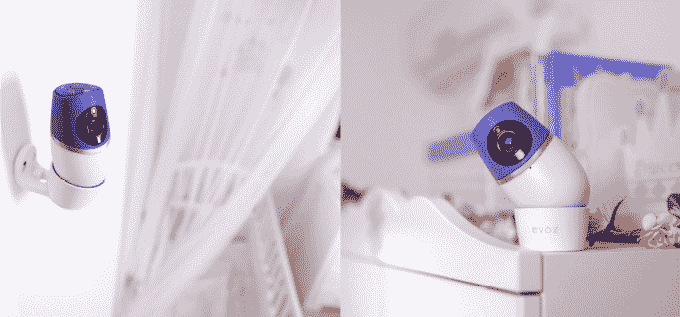

# Evoz 首次推出“互联”显示器，提供婴儿数据跟踪、哭闹警报等功能 

> 原文：<https://web.archive.org/web/https://techcrunch.com/2015/02/17/evoz-debuts-a-connected-monitor-offering-baby-data-tracking-cry-alerts-and-more/>

最早的[智能手机联网婴儿监控系统](https://web.archive.org/web/20221207012616/https://beta.techcrunch.com/2011/04/01/evoz-baby-monitoring-2-0-comes-of-age/)背后的公司 Evoz ，现在推出了新产品 [Evoz 育儿监控器](https://web.archive.org/web/20221207012616/https://www.indiegogo.com/projects/evoz-smartest-monitor-toolbox-for-modern-parents)，它不仅仅是捕捉视频并分享到你的手机或平板电脑上。相反，该公司表示，这款新显示器更像是父母的工具箱，可以播放音乐，充当夜灯，录制音频、照片和视频，发出“哭声”和室温警报，跟踪睡眠和醒来时间等“婴儿数据”等等。

它甚至包括访问育儿专家和应用程序中的其他提示。

Evoz Baby 的创始人 Avishai Shoham 解释说，该公司在意识到需要“更新、最先进的技术”来使其系统对父母更有价值后，多年来一直在发展其产品线。

“当时——四年前——摄像机技术并没有真正准备好支持该公司想要创造的所有功能和服务，包括今天(Evoz 拥有的)完整的育儿解决方案，”他说。

他指出，Evoz 将继续支持其旧产品，但由于育儿监视器是该公司的主要产品，它们将不再发货。

新设备本身包括一个高清摄像头，一个温度传感器，一个扬声器，麦克风，USB 电源插头，八个用于夜视视频的红外发光二极管，以及各种按钮来打开或关闭摇篮曲和夜灯等。Evoz 指出，与此同时，相机的电子设备包括 Wi-Fi 模块和视频处理芯片 Ambarella A5，该芯片与 GoPro 产品中的芯片属于同一家族。

然而，繁重的工作是由 Evoz 的云连接软件完成的，该软件从婴儿的房间收集数据，包括温度、哭声、按钮、网络状态等信息。

得益于近五年来从早期产品中收集的数据，Evoz 现在已经监测了超过 150，000 名婴儿，并发出了 650 万次哭闹警报。它利用这些数据开发了自己的算法，该系统现在可以准确识别婴儿何时哭泣，然后通过推送通知、短信或电子邮件向父母发送警报。

实际的音频和视频监控功能可以使用免费的 Evoz 移动应用程序从智能手机或平板电脑上运行。但是，如果您需要将您的设备用于其他用途，您可以选择只让音频在后台运行，并退出视频视图。如果父母听到婴儿的哭声，只需按下按钮，他们就可以通过监控系统与婴儿交谈，让他或她安静下来……当然，在极少数情况下，只有父母的声音才能安抚婴儿。(然而，音频功能也可以用于与房间中的其他人交流，例如保姆或保姆。)

该应用程序还可以帮助跟踪婴儿的睡眠周期，自动创建睡眠/醒来日志，可以帮助父母尝试睡眠训练他们的孩子。

更有趣的是，Evoz 的软件旨在搜索正在收集的数据中的模式，并可以为父母提供如何改善婴儿睡眠的建议。此外，育儿工具箱包括访问专家视频、帖子和提示，并将父母与经金·韦斯特培训和认证的专家直接联系起来，金·韦斯特是《晚安，睡个好觉》一书的作者，这是她开发的一种睡眠方法。

Shoham 表示，这些功能只是 Evoz 互联系统所能提供的功能的开始，并指出其他个性化服务将随着时间的推移而增加。这包括一个“隐藏时刻”功能，它可以检测父母不在房间时发生的可爱或有趣的事件，并为您将剪辑放入数字剪贴簿，以及一个针对幼儿的语言课功能，例如，将利用系统的扬声器。

该公司现在正在 [Indiegogo](https://web.archive.org/web/20221207012616/https://www.indiegogo.com/projects/evoz-smartest-monitor-toolbox-for-modern-parents) 上众筹新的 Evoz 育儿工具箱，那里还有一些价格为 149 美元的单元。(下一步是 169 美元)。当该产品进入零售分销时，它将提供两个等级——一些服务 169 美元，其他服务按菜单添加，完整的服务捆绑包 199 美元。

Evoz 表示，其显示器将于 4 月开始发货。