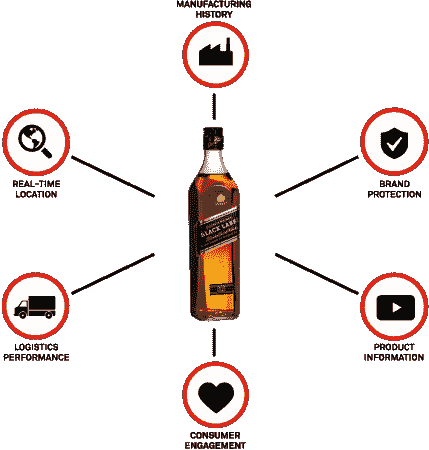

# 面向“智能产品”的物联网平台 Evrythng 获得 2480 万美元的 B 轮 

> 原文：<https://web.archive.org/web/https://techcrunch.com/2017/03/14/evrythng-series-b/>

物联网(IoT)智能产品平台 Evrythng 已经结束了 2480 万美元的 B 轮融资，该平台可以为任何物理对象提供所谓的“数字身份”。

[轮](https://web.archive.org/web/20230130234101/https://www.crunchbase.com/funding-round/5fa77dd399ba0ccb868108568ae15ce5)由旧金山的 Sway Ventures 牵头，还包括多伦多的 Generation Ventures 和伦敦的 Bloc Ventures。他们加入了 T4 现有的支持者，如思科投资、三星、BHLP、Atomico、Dawn Capital 和 Advance Vixeid Partners。

Evrythng 成立于 2011 年，提供了一个以企业为中心的物联网平台，用于管理产品的“智能软件身份”，这些产品通过 QR 码等智能标签、NFC、BLE、RFID 或直接连接到互联网的任何东西变得智能。换句话说，这是那些希望将物联网趋势作为其数字化转型战略一部分的公司所需要的数据层。

在一次电话会议中，Evrythng 联合创始人兼首席执行官 Niall Murphy 告诉我，该公司的客户和用例大致分为三个阵营:通过供应链跟踪产品，通过智能包装直接面向消费者的应用程序，这可能会引发新类型的体验，以及直接连接的智能家居产品(即消费者传统上可能认为的物联网)。

在过去的 12 个月里，Evrythng 宣布与全球领先的包装公司 Avery Dennison Retail Branding、Information Solutions (RBIS)、Crown Holdings 和 WestRock 建立合作伙伴关系，这表明该公司已经取得了长足的进步。

例如，Avery Dennison 是服装标签、品牌和包装解决方案的主要参与者，其客户包括领先的零售商、服装和鞋类品牌。同样，Crown Holdings 和 WestRock 被描述为消费品包装市场的市场领导者，为全球品牌包装数百亿份食品、饮料和家居用品。

但是，你可能会问，为什么一个产品的包装需要智能或暂时连接到互联网？好处是，由于它通过 Evrythng 平台拥有数字身份，因此可以在整个供应链中进行适当的跟踪，例如，包括其行踪、真实性和产品召回。

在消费者方面，这些数字身份也可以连接到一个应用程序，以实现更多的产品信息和各种数字体验，或者像重新订购一个非常特定的产品 SKU 这样简单的事情。

与此同时，我被告知，新的 B 轮融资将通过额外的合作伙伴关系、团队的扩张和平台的进一步发展来支持 Evrythng 的增长。