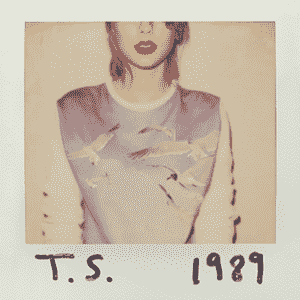
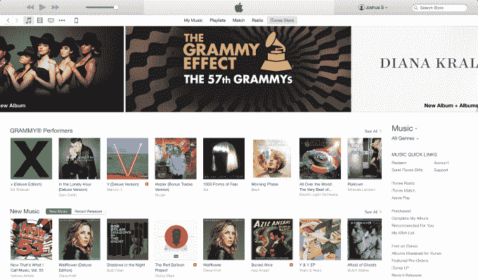
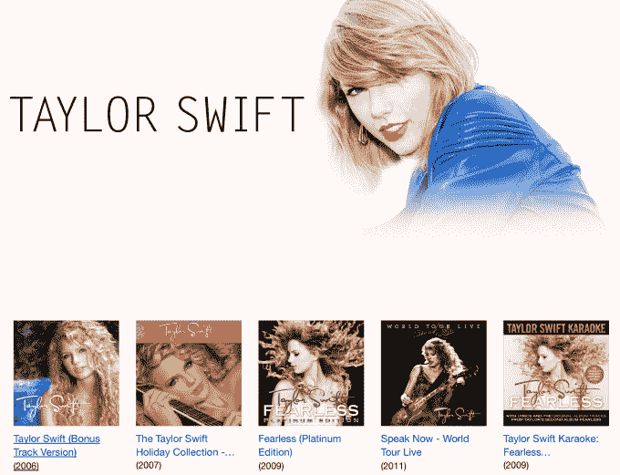

# 苹果，唱片公司？

> 原文：<https://web.archive.org/web/http://techcrunch.com/2015/02/08/exclusive-streaming/>

你最好相信，当苹果的流媒体音乐服务在今年晚些时候推出时，它会变得很难。苹果的 MO 将姗姗来迟，但拥有超强的火力，就像它对 iPhone 和即将推出的 Apple Watch 一样。这对它寻求压倒 Spotify、Google Play、Deezer 和流媒体领域的所有其他公司意味着什么？我敢打赌，其中一部分将是大独家，提供你不能在其他任何地方流音乐。

苹果否认了毫无根据的传言，即它将在本周末收购泰勒·斯威夫特的标签大机器，但这一想法似乎并不那么牵强。是的，甲壳虫乐队的厂牌碰巧叫做苹果唱片公司，但是如果苹果电脑进入了拥有音乐本身的业务会怎么样呢？

 Swifty 已经是 iTunes 的忠实盟友。众所周知，去年她从 Spotify 撤下了自己的目录，因为[她不同意他们的版税支付结构](https://web.archive.org/web/20221224124335/https://techcrunch.com/2014/11/07/taylor-swift-explains-why-she-knew-spotify-was-trouble/)，同时设法让她的新专辑 *1989* 在 iTunes 上销售。我听说这实际上给了 Spotify 大量的主流媒体曝光率，类似于“等等，除了泰勒·斯威夫特，还有免费的方法可以听所有的音乐？我加入。”

但如果 Spotify 面临竞争对手流媒体服务，人们可以在重复播放时摆脱它，这种情况对 Spotify 来说会更糟糕。泰勒·斯威夫特今晚因为格莱美而变得更加受欢迎。

Spotify 和其他现有的流媒体服务将很难与苹果的 play 竞争。据说 iTunes 上有超过 8 亿张信用卡，在近 150 个国家都可以使用。相比之下，Spotify 拥有 1500 万付费用户和大约 60 个国家的业务。

哦，还有那 10 亿台售出的 iOS 设备。如果 iTunes 的流媒体应用预装在下一代 iPhones 和 iPads 中，它可能会在一夜之间超越 Spotify 的用户群。

一向消息灵通的马克·古尔曼表示，新的苹果流媒体服务将深入整合到 iOS、iTunes 和 Apple TV 中，并且将在 Android 上提供。古尔曼表示，考虑中的价格点是每月 7.99 美元，这让竞争对手更加难以承受，这将低于 Google Play Music 和 Spotify 付费层每月 9.99 美元的价格。

## 只给你听

然后是独家报道的可能性。音乐高管告诉我，艺人经理和唱片公司不断试图向 iTunes 推销独家交易，以换取在 iTunes 商店中出现。他们也会这样做，以便在苹果的流媒体服务中得到突出显示。

问题是苹果会在这个策略上有多激进。它会购买艺术家、他们的原声唱片或整个唱片公司来排挤竞争对手吗？风险在于，其他艺人或唱片公司可能会认为苹果在偏袒与它有交易的人。但可以说，苹果已经在应用程序领域这样做了，在 iOS 上预装了自己的媒体和生产力应用程序，并在可能的情况下进行推广。

想象一下，如果苹果公司能够与泰勒·斯威夫特或酷玩乐队，这两位它过去非常亲密的艺术家，或者它自己的员工德瑞医生达成独家流媒体协议，会怎么样？苹果已经和甲壳虫乐队达成了 iTunes 独家数字销售协议。如果苹果能说服他们的代表让 iTunes 成为第一个也是唯一一个播放四人组杰作的网站，这将大大吸引主流听众。

幸运的是，苹果有音乐产业传奇和超级接头人吉米·艾奥文来说服艺术家这是最明智的举动。该公司还配备了许多前唱片公司高管，作为这些音乐人的唯一渠道，可以吸引大量粉丝使用点播 iTunes 服务。

Spotify 已经使用了类似的策略来吸引摇滚乐迷。它达成协议，在其平台上获得像齐柏林飞船、[讨厌 Napster 的 Metallica](https://web.archive.org/web/20221224124335/https://techcrunch.com/2012/12/06/lars-ulrich-the-notorious-napster-destroyer-announces-his-band-metallicas-music-is-coming-to-spotify/) 这样的流媒体顽固分子。也许它会更进一步，签下艺人。Spotify 培养一批处于流行风口浪尖的独立艺术家似乎是合理的。[为了抵御苹果，Spotify 将不得不](https://web.archive.org/web/20221224124335/https://techcrunch.com/2014/10/19/the-sonic-mad-scientists/)依靠其免费的广告支持层，专注于[产品和个性化](https://web.archive.org/web/20221224124335/https://techcrunch.com/2015/01/10/music-is-a-mobile-linchpin/)，以及依托其合法音乐订阅的[第三方应用](https://web.archive.org/web/20221224124335/https://techcrunch.com/2014/10/19/the-sonic-mad-scientists/)的新兴生态系统。

尽管有其优势，苹果可能将不得不应对同时提供音乐下载销售和流媒体服务的复杂性。对于许多更随意的听众来说，他们慢慢积累的 MP3 收藏在无限的流媒体面前会突然贬值的想法将是一个冲击。它在 iTunes Radio 上的努力并不成功，部分原因是向老狗听众传授新技巧并不容易。音乐欣赏也是一个巨大的市场，因此可能会有不同关注点的多个参与者的空间，如目录、产品功能和吸引不同细分市场的策展。

尽管如此，苹果通过 iTunes 的歌曲点菜模式彻底改变了音乐行业，不管是好是坏，它有能力再次做到这一点。

## 标签上的应用

唱片公司提供的价值正在减少。他们提供的最后两项关键服务是向实体店配送和调频广播促销。如今，艺术家需要这两者来成为超级明星，但这些渠道的在线替代品正在迅速增长。

这使得围绕唱片音乐的更多价值创造掌握在红光和时代精神等全栈管理机构手中。他们处理商品、巡演、数字和品牌赞助，当录制的音乐成为其他收入来源的促销工具时，他们就可以赚到大钱。

唱片公司角色的转变可能会让艺术家更愿意尝试这样的想法，比如直接与流媒体服务签约，或者让他们的唱片公司与一家流媒体服务公司达成重大的独家或收购协议。

苹果可以从音乐游戏中大把花钱，而相对较小的私营 Spotify 缺乏资金，谷歌似乎也缺乏跟上的意愿。很多人开玩笑说，苹果可以用它巨大的财宝箱买下所有录制的音乐。但要赢得流媒体，它可能只需要控制其中的一小部分。