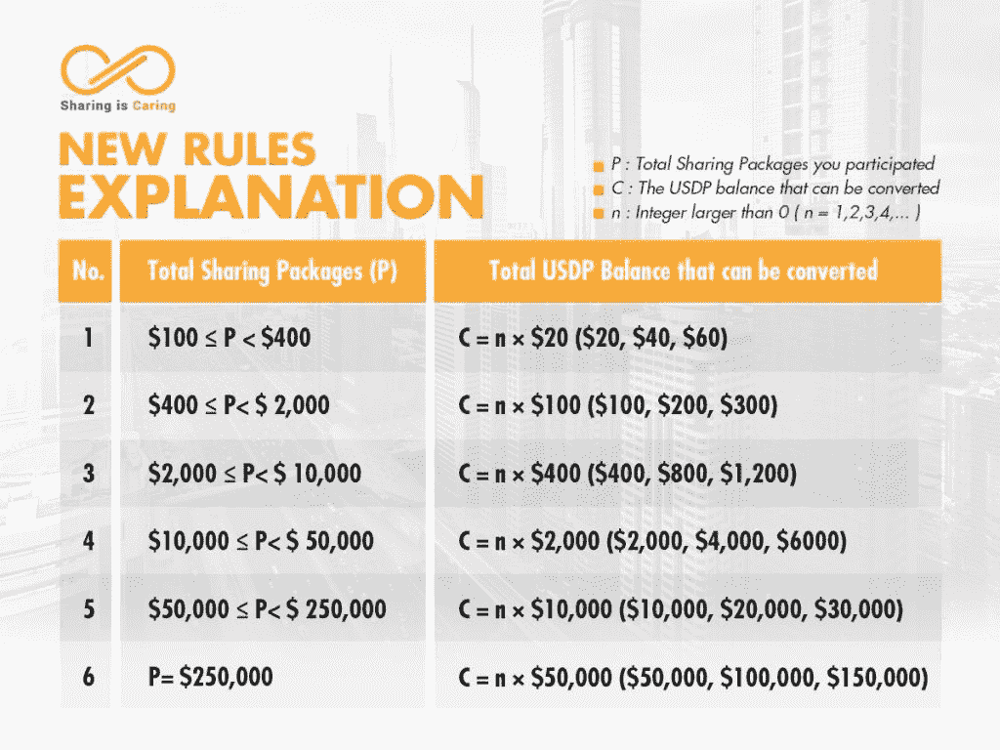
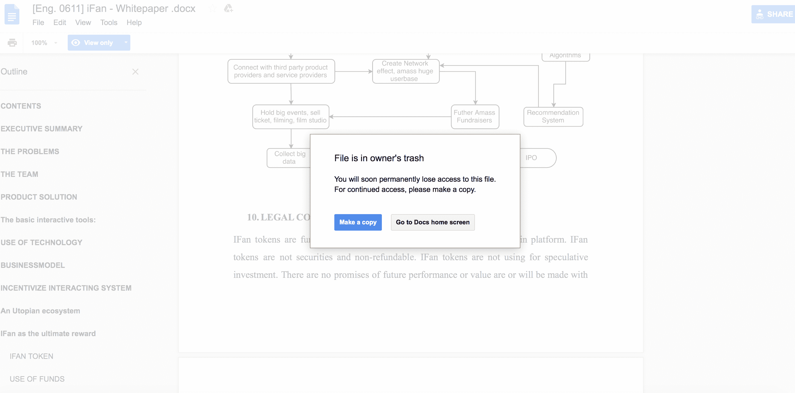

# 退出骗子带着 6.6 亿美元的 ICO 收入跑路 

> 原文：<https://web.archive.org/web/https://techcrunch.com/2018/04/13/exit-scammers-run-off-with-660-million-in-ico-earnings/>

# 出境诈骗者带着 6.6 亿美元的 ICO 收入跑路了

一家越南加密货币公司 Modern Tech 为其 [Pincoin token](https://web.archive.org/web/20221218064610/https://pincoin.io/) 推出了 ICO，从大约 3.2 万人那里筹集了 6.6 亿美元。该公司首先运行 Pincoin ICO，向投资者承诺恒定的回报，然后推出另一个令牌 iFan(名人的社交网络令牌)。Picoin 投资者首先从他们的投资中获得现金，然后团队开始用 iFan 代币向 pinoin 投资者支付奖励。

然后队伍就消失了。

这种所谓退出骗局可能是近年来最大的骗局，也预示着 ICO 领域将会发生什么。当被骗的投资者聚集在该公司的旧总部外时，由七名越南人组成的团队似乎已经离开了该国。

来自[图伊特瑞的消息](https://web.archive.org/web/20221218064610/https://tuoitrenews.vn/news/business/20180409/vietnamese-cryptocurrency-scam-allegedly-deceives-thousands-to-swindle-660mn/45001.html):

> 事实上，这些项目背后的真正策划者是一个由七名越南国民组成的团队，他们在河内、胡志明市甚至偏远地区举行了不同的会议，以吸引投资者。
> 
> 投资者被告知，他们将享受每月 48%的初始投资利润率，并在四个月后收回所有投资。人们还可以从他们介绍给网络的每一个新成员中获得百分之八的佣金。

Pincoin 的特别之处在于，它为吸引其他人加入该项目提供奖金，这种策略听起来可能很熟悉。骗子们用现金支付，直到一月份他们开始发送 iFan 代币。然后，上个月，这个团队搬离了他们华丽的办公室，只留下了一个制作精良(如果不完整的话)的网站。仔细看看[网站](https://web.archive.org/web/20221218064610/https://pincoin.io/#principle)，我们发现了一个混淆的模型。这项任务——“PIN 项目是关于为全球社区建立一个在线协作消费平台，基于共享经济、区块链技术和加密货币的原则”——似乎与其他不切实际的解决方案不相上下，但没有提到任何创始人或顾问，甚至他们的[花哨的多语言白皮书](https://web.archive.org/web/20221218064610/https://drive.google.com/file/d/1DFlVDArLGi5bWtMlIsnJS-iODPd8o6px/edit)也没有明确的创始人信息。简而言之，这个团队花了很多钱买了一个非常好的网站，并让成千上万的人相信它是合法的。

据 Viet Bao 称，一个由 Bui Thi My Ngoc、Ho Phu Ty、Ho Xuan Van、Luong Huynh Quoc Huy、Luu Trong Tuan、Nguyen Duc Trong、Nguyen Trung Hieu 和 Vu Huu Loi 组成的团队在几个月内将 Pincoin 和 iFan 从零发展到数百万，同时声称他们代理新加坡和印度的产品。“为了使经营模式正规化，ifan 和 Pincoin 授权他们的公司作为越南的法定代表，税务代码为 0314707223。现代科技随后在胡志明市和河内举办了活动，从投资者那里筹集资金。

一个有趣的骗局是这个来自 iFan 页面的屏幕。在页面中间附近，我们发现了令牌基于以太坊平台的信息。该页面显示了加密货币的价格和评级，表明以太坊与 iFan 价格直接相关。

当我浏览这个项目的白皮书时，这突然出现了:

我们再次发现，当前不受监管的 ICO 市场是近代史上最有趣的将傻瓜和他们的钱分开的系统。