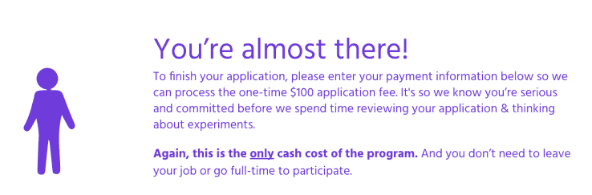
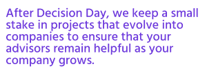
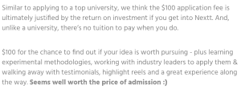

# 向申请加速器的初创公司收费是剥削和愚蠢的

> 原文：<https://web.archive.org/web/https://techcrunch.com/2016/07/29/exploiting-startups-101/>

昨天，一只小鸟告诉了我关于 [Nextt](https://web.archive.org/web/20221221154004/https://nex.tt/) 的事情，这是一个为早期创意阶段的初创公司设立的加速器(可能更准确地称为孵化器)。这个想法是把一个餐巾阶段的想法在六周内变成一个 MVP。这不是一个拙劣的想法，但阴险的是，Nextt 对每个想法收费 100 美元。请注意，不是参与，而是提出申请。

## 创意是廉价的

Nextt 网站似乎非常令人愉快。冷静点，小伙子，你会累坏的。

创业很难。令人望而生畏。尤其是如果你没有经历过几次磨砺，你真的很难知道从哪里开始。当然，这一切都始于一个想法的火花，但如果你曾经在一个满是企业家的房间里，你会知道任何一个中等聪明的人都可以在早餐前提出 50 个值得解决的问题和 15 个可行的商业想法。

我想说的是想法是廉价的。或者说，他们曾经是，直到 Nextt 染指他们。

显然是针对第一次创业和第一次尝试创业的人，Nextt 的网站给人的印象是一个沥青甲板工厂。

他们写道，这个项目的结果将会给参与者留下“一个精彩的精彩片段”，一个“与风投接触的机会”，以及一些“来自你的项目顾问的证明”

“我们的顾问社区由设计师、数据科学家、开发人员和律师组成，”Nextt 加速器的创始人 Ajay Rajani 说。“这些顾问分析数据，编写代码，设计模型，并为该计划投入大量时间，以便为潜在的企业家提供机会，以经济高效的方式验证他们的想法。”

## “一种更公平、更容易实现的项目融资方式”

我不想贬低这个项目的可交付成果。毫无疑问，所有这些对创业公司来说都有巨大的价值。我的问题是，这似乎不确定。创业世界应该是一个有经验的企业家照顾新来者的地方，而不是在这个过程中剥削他们。

> 如果你是 87%的创业者中的一员，很难说你的钱花得值。

Rajani 说:“(100 美元的申请费)表明申请人对他们的想法是认真的，并对他们的想法以及我们的专家团队和顾问社区做出了承诺。”。“我们认为申请费是资助我们项目的一种公平且更容易获得的方式，我们项目的潜在价值客观上呈指数增长。”

Nextt 的创始人告诉我，该公司在接受 4 家公司(19%)之前，收到了第一批受邀者的 21 份申请。对于第二批，它收到了 42 份申请，并接受了另外 4 份申请(10.5%)。目前，该公司正试图为 9 月份的毕业生再招募 5-15 名成功申请者。

## 但是…即使你不付钱，Nextt 也能看到这个想法

一个麻烦的方面是[申请表格](https://web.archive.org/web/20221221154004/https://nex.tt/apply/form)是一个以[形式](https://web.archive.org/web/20221221154004/https://www.typeform.com/)的三步流程。当我第一次听说这个项目时，我的第一个目的地是近距离观察加速器向参与者提出的问题。我点击了菜单中的提交想法链接，然后是跳转到表单按钮。

在第一页，我同意 Nextt 不会签署 NDA。在第二页，我填写了我的想法的所有细节，它解决的问题和竞争对手的分析。在第三页，我惊讶于一张付款表格。

这是在你已经填写了关于你的想法的所有细节之后出现在你面前的屏幕。

我同意，或许我应该在推介我的下一个无人机创业公司之前更仔细地阅读，但令人担忧的是，通过网站的几种方式(包括我采取的方式)，你不会看到这是一个付费应用程序的警告，直到你点击应用程序表格的支付部分。你已经同意不签署 NDA，但是第二页的数据——你分享创业想法的地方——被保存了。如果你决定不付钱，Nextt 仍然可以访问你的想法。

Nextt 在成功的项目中持有“少量股份”,但我在它的网站上找不到这意味着什么。最显而易见的地方——公司的条款和条件——似乎并不存在。

如果你感到恐慌，不知道你的想法在那一点上发生了什么，发现公司的条款和条件链接不起作用不是特别令人放心；[它只是指向网站的主页](https://web.archive.org/web/20221221154004/https://techcrunch.com/wp-content/uploads/2016/07/screen-shot-2016-07-29-at-10-12-36.png)。

正如我在本文开头提到的，创意是廉价的，所以获得一家初创公司的创意不一定是一件大事……但问题是*这无关紧要*，因为目标受众——非常新的企业家——不知道这一点；他们认为他们的想法在打印机墨水方面是值得的。我认为这意味着他们比大多数人更有可能掏出钱包掏出 100 美元。

Rajani 说:“默认情况下，Typeform 从所有表单参与者那里收集数据，包括那些没有完全完成申请流程的人。他声称，在收取费用之前，Nextt“不会深入审查申请”。

“如果你进入 Nextt，投资回报会证明这是合理的”——但没有说如果你不进入会发生什么。

在网站上， [Nextt 指出](https://web.archive.org/web/20221221154004/https://nex.tt/fee)它选择收取申请费，以确保创始人的承诺。该公司声称这很便宜，如果你被该项目接受，完全值得。

我完全同意——如果 Nextt 实现了它承诺的一切，100 美元是一笔真正的交易，但前提是你被选中参与。如果你是 87%的创业者中的一员，很难说你的钱花得值。

“如果一个想法没有被接受，Nextt 会向申请人提供他们想法的优缺点总结，”Rajani 向我解释道，澄清了加速器在这件事上的立场。加速器还提供反馈和建议，告诉申请人下一步可以尝试什么。

## 某种付费入场的比赛？

向申请加速器的人收费——不参与，只是为了*申请*——感觉真的是剥削。我对公司提供服务然后收费没有意见。这就是商业运作的方式。为能够使用加速器工作的*可能性*收费是愚蠢的。

Rajani 说:“100 美元的申请费清楚地显示在申请页面上，我们还没有收到申请人的任何投诉。”。

我的感觉是，在这一点上，你也可以称之为一个付费进入的竞争。如果我们这样做，也有一个问题:由于没有张贴条款和条件或适当的联系信息，Nextt 的网站似乎不符合经营这类比赛的法律。

## 那么，有什么解决办法呢？

问题是，没有经验的潜在初创企业创始人是否愿意支付 100 美元参加一个竞赛，让别人告诉他们他们的想法是否有价值。举例来说，如果要在花 100 美元获得 13%的帮助机会和花同样多的钱买这个 13 本书的阅读清单之间做出选择，我知道我会怎么选择。

从创始人给我的数字来看，似乎 Nextt 迄今已收到 63 份申请，并接受了其中的 8 份。这相当于每个创意 790 美元——也许更诚实的做法是让应用程序免费，并向被选中参与的初创公司收取 800 美元。这肯定会让人感觉不那么剥削人。

加速器:申请不收费。你应该做得更好。

* * *

这篇文章发表后，Rajani [在 LinkedIn](https://web.archive.org/web/20221221154004/https://www.linkedin.com/pulse/honest-truth-nextt-transparent-response-unexpected-attack-rajani) 上写了回复。