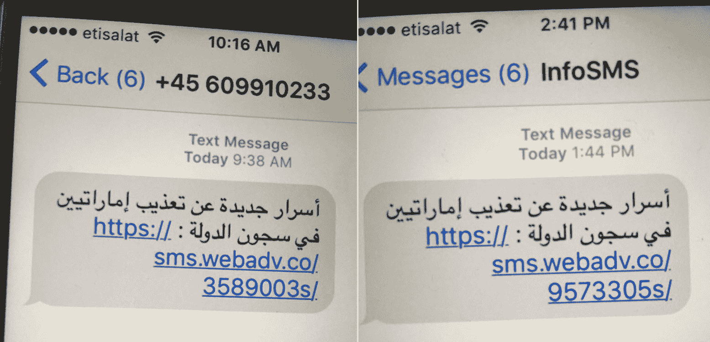
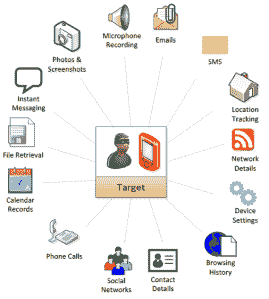

# 苹果今天修补的漏洞暗示了多年来政府的秘密攻击

> 原文：<https://web.archive.org/web/https://techcrunch.com/2016/08/25/exploits-patched-by-apple-today-hint-at-years-of-surreptitious-government-hacks/>

你会想把你的 iOS 设备升级到苹果公司今天发布的 9.3.5 版本——特别是如果你是一名著名的人权活动家。最近挫败的一次针对这样一个人的攻击利用了补丁解决的不是一个而是三个零日漏洞。随后的调查表明，这些都是一家影子网络安全公司的工作，其软件可能已被寻求妥协政治目标的政府使用多年。

总部位于阿联酋的获奖活动家艾哈迈德·曼苏尔(上图)两周前收到了一些可疑的短信，承诺提供被拘留者遭受酷刑的信息——但曼苏尔过去曾多次被高调的“合法拦截”工具锁定，他决定将短信发送给加拿大安全研究组织公民实验室。

发给曼苏尔的短信。

在[瞭望保安](https://web.archive.org/web/20230226172830/https://blog.lookout.com/blog/2016/08/25/lookout-trident-pegasus-enterprise-discovery/)的协助下，公民实验室下到兔子洞[，发现比预期的](https://web.archive.org/web/20230226172830/https://citizenlab.org/2016/08/million-dollar-dissident-iphone-zero-day-nso-group-uae/)要深得多。

短信当然是一个陷阱，但却是前所未有的复杂。这个链接会利用 iOS 中三个独立且非常严重的漏洞——通过 WebKit 执行任意代码，获得对内核的访问权限，然后在内核中执行代码。野外能找到一个零日已经很难得了，更别说一次三个了。

结果将是一步越狱，在引擎盖下注入恶意代码——授予对所有手机数据和通信的完全访问权。这种建立在彼此基础上的三重威胁获得了恰当的绰号“三叉戟”。

从黑客团队泄露的电子邮件中截取，一幅插图显示了飞马座曾经安装的范围。

这些漏洞被立即发送到苹果公司，10 天后——今天——发布了一个补丁来修复它们。除了以下声明，苹果拒绝发表评论:“我们意识到了这个漏洞，并立即用 iOS 9.3.5 修复了它。我们建议我们所有的客户总是下载最新版本的 iOS，以保护自己免受潜在的安全漏洞。”

值得注意的是，代码中提到了最早可追溯到 7 的 iOS 版本——因此，要么漏洞利用已经存在了很长时间，要么它们只是在很大程度上有效。

在与三叉戟入侵后，该恶意软件会在设备上逗留，研究人员立即将其识别为飞马座，这是一款由以色列网络安全公司 NSO 集团销售的商业间谍软件。这是它第一次在野外被捕获。(也许从事这项工作的团队应该叫做 Bellerophon。)

飞马座显然是黑客团队使用的工具之一——后来，当其电子邮件被泄露时，被无意中公开了。回顾过去，当公民实验室的调查发现该公司在阿联酋追踪的另一个名为隐形猎鹰的威胁中的工作痕迹时，NSO 也出现了。最后，NSO 签名也是针对墨西哥记者拉斐尔·卡夫雷拉的恶意软件；他一直在撰写一篇有可能使该国总统名誉扫地的报道。

据报道，NSO 由旧金山股票公司 Francisco Partners 拥有或至少投资于该公司，但该公司没有回应提供更多信息的要求。

因此，飞马座和 NSO 已经潜伏在两翼相当长的时间，虽然证据肯定是间接的，它表明该公司长期以来一直向政府提供高度复杂的入侵软件。可以预见的是，这种软件不仅被用来(或者可能根本就没有)打击恐怖分子和间谍，还被用来打击违背政府利益的公民。

公民实验室在他们的结论中总结得很好:

> 公民实验室(Citizen Lab)和其他机构已多次证明，先进的“合法拦截”间谍软件使一些政府和机构，尤其是那些在没有强有力监督的情况下运作的政府和机构，能够锁定和骚扰记者、活动人士和人权工作者。如果间谍软件公司不愿意认识到他们的产品在破坏人权方面所起的作用，或者不愿意解决这些紧迫的问题，他们将继续支持政府和其他利益攸关方的进一步干预。

小心操作，保持手机更新。全球互联网是一个危险的地方。