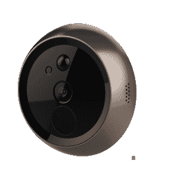
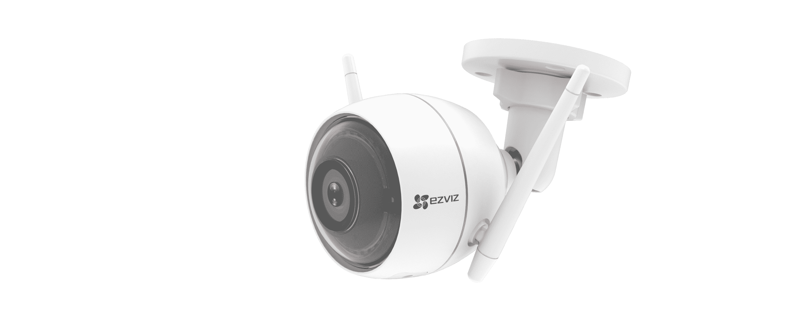

# EZVIZ 的“Lookout Smart Door Viewer”将窥视孔变成了智能视频门铃 

> 原文：<https://web.archive.org/web/https://techcrunch.com/2018/01/09/ezvizs-lookout-smart-door-viewer-turns-a-peephole-into-a-smart-video-doorbell/>

家庭安全摄像头制造商 EZVIZ 今天在 CES 2018 上宣布了其首款智能门禁产品，首次亮相的是 [Lookout 智能门禁查看器](https://web.archive.org/web/20230203081514/https://us.ezvizlife.com/ces2018)。该系统旨在与该公司新的 ezGuard 安全摄像头，以及其他 EZVIZ 产品和亚马逊 Alexa 配合使用。

这些产品构成了一个由两部分组成的智能家居门禁视频解决方案，允许房主远程查看屋外发生的活动，同时还提供了为可信访客远程解锁的能力。

该系统比通常的智能进入解决方案更有趣的是它如何利用面部识别。使用 EZVIZ 应用程序，房主可以选择创建一个信任的人的画廊，他们可以进入房子。它通过利用面部识别技术来自动识别门口的人，允许房主按照他们认为合适的方式进入。

然而，该系统不包括任何智能锁组件，这意味着你仍然需要自己开门。更多的是让你看到谁在门口，然后做出回应。

但 Lookout 智能门浏览器确实提供了一个可调节的麦克风、扬声器和蜂鸣器，使其成为一个智能视频门铃。

门观察器本身被包裹在一个耐用的锌合金外壳中，并且被设计成使用家中现有的窥视孔。它包括一个高清专业级相机镜头，采用红外自适应技术用于夜视，通过一根穿过窥视孔的安全电缆连接。这使你可以在门内安装的触摸屏上或应用程序中看到外面的行动。

与之相关的产品 ezGuard 是一款新的家庭安全摄像机，具有高清专业级摄像机、智能警报器、警告闪光灯和记录功能。警报器可以发出 10 dB 的警报，并打开灯，以阻止潜在的入侵者试图闯入。运动检测器还会向您的手机发送室外活动的实时视频。

这款相机专为户外使用而设计——例如，放在门廊上、车道上或门上。它有双天线，即使离家较远，也能保持与家中 Wi-Fi 的强连接。

 一个防水麦克风和扬声器允许双向通话，允许房主发出指令，如告诉送货司机在门口留下一个包裹，或通过说话阻止小偷。

此外，该相机与亚马逊 Alexa 的智能家居功能配合使用，实现语音控制。

该公司表示，Lookout 智能浏览器(229.99 美元)和 ez guard(109.99 美元)将于 2018 年第一季度通过 EZVIZ 网站亚马逊和北美的其他零售商上市。