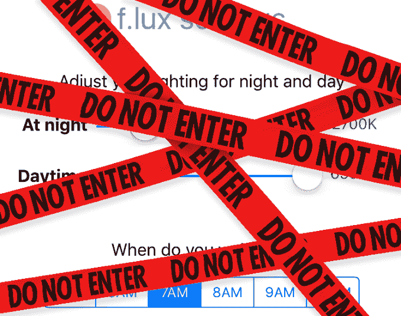

# F.lux 要求苹果将其屏幕颜色调整应用程序放回 App Store 

> 原文：<https://web.archive.org/web/https://techcrunch.com/2016/01/15/f-lux-asks-apple-to-let-its-screen-brightness-app-back-into-app-store/>

正如许多人在本周早些时候苹果发布 iOS 测试版时所注意到的，这个移动操作系统的最新功能之一，减少蓝光发射的夜间阅读模式，看起来非常熟悉。软件制造商 [F.lux](https://web.archive.org/web/20221007032035/https://justgetflux.com/) 多年来一直在开发在 iOS 设备上调节屏幕亮度的功能。它的技术甚至可以在 iOS 上短暂工作而无需越狱，让用户可以调整屏幕的照明以供白天和夜间使用。

现在，一项被苹果称为“夜班”的类似技术成为了 iOS 9.3 的官方功能， [F.lux 呼吁苹果](https://web.archive.org/web/20221007032035/https://justgetflux.com/news/2016/01/14/apple.html)允许其应用程序重新进入 iTunes 应用程序商店。

如果你对这个问题不熟悉:研究表明，蓝光会阻止人们的松果体释放褪黑激素——这通常发生在睡前几个小时。这种激素会降低警觉性，并有助于向身体发出该睡觉了的信号。但如今，当我们睡前抱着智能手机和平板电脑——而不是书籍或杂志——我们无意中让自己更难入睡。

F.lux 还指出，研究指出了夜间暴露在光线下与癌症之间的联系，[引用](https://web.archive.org/web/20221007032035/http://www.eurekalert.org/pub_releases/2014-05/aaos-bsp050214.php) [的报告](https://web.archive.org/web/20221007032035/http://cancerres.aacrjournals.org/content/early/2014/07/18/0008-5472.CAN-13-3156.abstract?sid=abf2ad57-4589-4c99-b300-c22e4293df29)称，夜班工作或睡眠-觉醒周期被扰乱导致我们的昼夜节律被打乱，可能会增加患乳腺癌和其他疾病的风险。

该公司是解决这一问题的软件领域的先驱之一。它的应用程序最初是在 2009 年设计的，现在可以在一系列设备上运行，包括 Mac OS X、Windows、Linux 和 iOS 设备，如果它们被越狱的话(意思是，一种侵入设备运行未经批准的应用程序的方法。)

2015 年 11 月，[该公司发布了其 iOS 应用程序](https://web.archive.org/web/20221007032035/https://beta.techcrunch.com/2015/11/12/you-can-now-install-screen-brightness-app-f-lux-on-your-ios-device-without-jailbreaking-it/)的开源版本，这是一个短暂但受欢迎的喘息机会，让你不必为了利用其软件而破解你的设备。iOS 应用程序提供了调整屏幕色温的设置。不幸的是， [F.lux 不得不迅速撤回其下载链接](https://web.archive.org/web/20221007032035/https://beta.techcrunch.com/2015/11/12/f-uxd-apple-says-screen-brightness-app-violates-developer-agreement/)，因为该应用违反了苹果的开发者协议。

侧装版本的[问题并不在于安装方法——苹果现在允许任何拥有 Apple ID 的人直接从 Xcode 加载应用——而是在于 F.lux 使用私有 API。](https://web.archive.org/web/20221007032035/https://beta.techcrunch.com/2015/11/12/f-uxd-apple-says-screen-brightness-app-violates-developer-agreement/)

然而，随着“夜班”现在作为 iOS 功能得到官方支持，F.lux 认为其应用程序应该被允许重新进入应用程序商店。也就是说，苹果应该开放对那些私有 API 的访问，这样应用就不再违反苹果的条款。

很多 iOS 用户同意这一观点——在禁令发布后，超过 5000 名 F.lux 粉丝签署了一份请愿书,要求苹果重新考虑其立场。

这个要求很合理，现在多亏了“[夜班](https://web.archive.org/web/20221007032035/http://www.apple.com/ios/preview/)”如果苹果正式提供一种功能，可以在特定时间自动将显示屏的颜色转移到光谱的暖色端，那么允许第三方在该功能的基础上为高级用户提供更高级的功能集似乎没有什么坏处。

当然，虽然 F.lux 值得称赞，因为它是我们计算设备蓝光发射问题的早期解决方案提供商，但解决这个问题是设备制造商现在正在自己解决的事情。例如，亚马逊[最近为 Kindle 设备](https://web.archive.org/web/20221007032035/https://beta.techcrunch.com/2015/12/02/amazon-fire-tablets-get-expanded-parental-controls-plus-a-blue-shade-feature-for-better-nighttime-reading/)推出了类似的“蓝色阴影”功能，谷歌[也在上个月在其 Play Books 应用](https://web.archive.org/web/20221007032035/http://www.engadget.com/2015/12/16/google-play-books-new-blue-light-filter-reduces-eye-strain/)中引入了蓝光滤镜。

此外，值得注意的是，今天在 Google Play 商店上有[许多第三方应用](https://web.archive.org/web/20221007032035/http://www.makeuseof.com/tag/get-good-nights-sleep-filtering-phones-blue-light/)提供相同的蓝光减少功能[，这表明第三方软件在这一领域有市场。](https://web.archive.org/web/20221007032035/https://play.google.com/store/search?q=blue%20light&c=apps&hl=en)

然而，苹果从越狱社区借鉴想法并不罕见，在过去几年中，它从许多未经批准的调整[、](https://web.archive.org/web/20221007032035/http://www.businessinsider.com/apple-steal-jailbreak-2011-6?op=1)中获得了“灵感”，来做一些事情，如增强通知，实现 Wi-Fi 同步，添加对小工具和动态壁纸的支持，改善多任务处理和应用程序组织，等等。

*图像功劳，顶:[9to5Mac.com](https://web.archive.org/web/20221007032035/http://9to5mac.com/2015/11/11/you-can-now-install-popular-automatic-screen-brightness-app-flux-on-iphone-and-ipad/)*