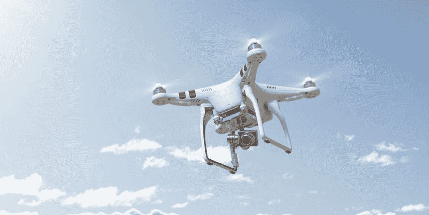

# FAA 允许第一家房地产公司使用无人机进行航拍 

> 原文：<https://web.archive.org/web/https://techcrunch.com/2015/01/06/faa-allows-first-real-estate-company-to-use-drones-for-aerial-photography/>

# FAA 允许第一房地产公司使用无人机进行航拍

亚利桑那州图森市 Tierra Antigua Realty 的 Douglas Trudeau 今天成为第一位可以合法使用无人机进行房地产摄影的房地产经纪人。如果你最近在你当地的[大联盟](https://web.archive.org/web/20221210054607/https://en.wikipedia.org/wiki/Multiple_listing_service)(或 [Zillow](https://web.archive.org/web/20221210054607/http://www.zillow.com/blog/pro/drones-real-estate-photography-113674/) 和 Redfin)上看了列表，你可能已经看到了大量只能来自无人机的图像。然而，根据联邦航空局的严格定义，这些都不是合法的，因为该机构仍然禁止无人机的几乎所有商业用途。

联邦航空局今天宣布，特鲁多被授权“驾驶 Phantom 2 Vision+四轴飞行器，以提高学术界的认识，并增加房地产上市视频。” [Vision+](https://web.archive.org/web/20221210054607/http://www.dji.com/product/phantom-2-vision-plus) 是目前 DJI 消费级无人机系列中的顶级机型(在我看来，3400 美元的 Inspire 1 不符合消费级机型的标准)。

此外，FAA 还批准了华盛顿州斯波坎高级航空解决方案的另一个例外。它将使用来自 [senseFly](https://web.archive.org/web/20221210054607/https://www.sensefly.com/) 的固定翼 [eBee AG 无人机](https://web.archive.org/web/20221210054607/https://www.sensefly.com/drones/ebee-ag.html)来监测农作物。

然而，Tierra Antigua 和 Advanced Aviation Solutions 不能只是让他们的无人机兜兜风。除了飞行员之外，周围还必须有一名观察员。飞行员还需要“联邦航空局私人飞行员证书和有效的医疗证书，UAS 必须一直保持在视线范围内。”显然，如果你不能回答联邦航空局飞行员考试中的[这些问题](https://web.archive.org/web/20221210054607/http://www.faa.gov/training_testing/testing/test_questions/media/pvt.pdf)，你就不能安全地操作 Vision+。

今天的新豁免使美国获准商业运营无人机的公司总数达到 13 家(现在共有 13 家公司的 [14 项例外](https://web.archive.org/web/20221210054607/http://www.faa.gov/uas/legislative_programs/section_333/))。无论怎么想象，这都不算多。今年早些时候，美国联邦航空局给一些电影公司豁免时，实际上遇到了一些阻力。联邦航空局表示，目前已经收到了总共 214 份豁免申请。