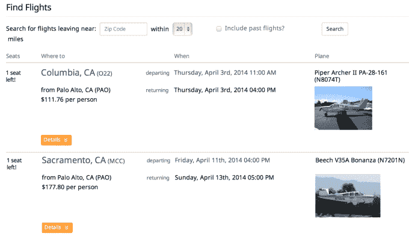

# 美国联邦航空局禁止飞机共享初创公司 

> 原文：<https://web.archive.org/web/https://techcrunch.com/2014/08/15/faa-bans-planesharing-startups/>

根据美国联邦航空局今天发布的一项规定，禁止私人飞行员公开在飞机上提供座位以换取汽油费，包括通过像 T2 空中加油器和 T4 Flytenow 这样的初创公司。这一决定对共享经济是一个打击，也是对 AirPooler 正式要求澄清其经营的灰色地带的回应。禁止这种形式的飞机共享(就像飞机拼车一样)可以防止人们和菜鸟飞行员一起乘坐，从而保证人们的安全。然而，这也将使飞行员的飞行成本更高，因为他们无法分担成本，减少了乘客的旅行选择，并扼杀了整个类别的创业公司。

AirPooler 计划要求澄清这一裁决，因为它是基于 1963 年飞机共享提案的非正式草案，而不是 1964 年的规定，该规定称飞行员可以私下询问乘客是否愿意加入他们并分摊费用。如果飞行员支付了他们的比例份额，我们已经在计划飞行，并满足了一些其他限制。

到目前为止，这种做法通常是通过口头或机场公告板组织的，但现在这将是非法的。联邦航空局的新规定认为，任何形式的成本分摊都是对私人飞行员的补偿，无论他们是使用老式方法还是网站来列出座位。目前，向私人飞行员支付报酬是非法的，除非他们从政府那里获得一份难以获得的航空公司运营证书。许多私人飞行员没有这种执照，所以在像 AirPooler 和 Flytenow 这样的网站上或通过其他低技术含量的方法为他们计划乘坐的航班列出开放座位是不被允许的。

联邦航空局裁决的核心部分指出,“我们的结论是，对于使用 AirPooler 网站的飞行员，共同运输的所有四个要素都存在。通过在空中加油器网站上发布具体的航班，参与空中加油器服务的飞行员将会坚持把人员或财产从一个地方运送到另一个地方，以获得报酬或租金。虽然参与 AirPooler 网站的飞行员选择了目的地，但他们坚持要求公众以减少运营费用的形式运送
乘客，以获得补偿，他们将支付飞行费用。”

AirPooler 首席执行官史蒂夫·刘易斯(Steve Lewis)在给我的回信中写道，“虽然联邦航空局的决定令人困惑，但它也阻碍了私营企业和政府合作促进共享经济创新的机会。这对成千上万的飞行员和日常旅行者来说是一个很大的失望。飞行员一直喜欢拼车，但发现很难安排，他们期待利用现代共享技术提供座位，作为支付成本的一种方式。

尽管空中警察可能会在技术上推翻这一裁决，但现在天空中不会出现拼车。

[scribd id = 236884814 key = key-7g 9 PE 023 x 47 lpki 89 i2k mode = scroll]