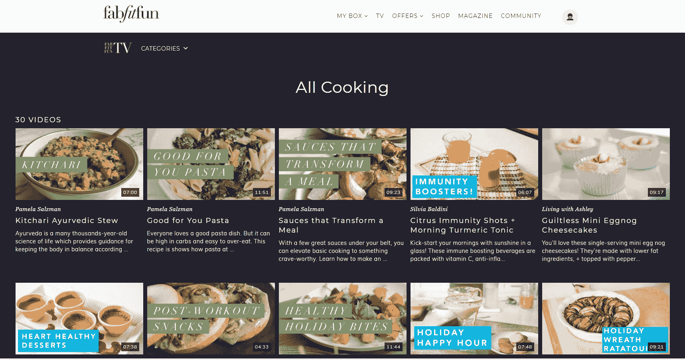

# FabFitFun 通过苹果电视和亚马逊 Fire TechCrunch 的新应用程序扩大其帝国

> 原文：<https://web.archive.org/web/https://techcrunch.com/2017/12/21/fabfitfun-expands-its-empire-with-a-new-app-for-apple-tv-and-amazon-fire/>

[fabbit fun](https://web.archive.org/web/20221207044831/https://fabfitfun.com/),[女性生活方式订阅服务和媒体公司](https://web.archive.org/web/20221207044831/https://beta.techcrunch.com/2015/10/14/nea-and-upfront-ventures-back-subscription-box-company-fabfitfun-in-3-5m-round/)已经成为某一代人中家喻户晓的名字，随着苹果电视和亚马逊 Fire 的新视频应用[的推出，该公司正在扩张其帝国。](https://web.archive.org/web/20221207044831/https://tv.fabfitfun.com/)

丹尼尔和迈克尔·布鲁希姆(Daniel brouk him)创立的洛杉矶公司凭借其在订阅盒业务上的成功以及与 instafamous [的联系，已经成为南加州科技界的宠儿之一(参见该公司最近在《纽约客》的一篇文章中被点名](https://web.archive.org/web/20221207044831/https://www.newyorker.com/humor/daily-shouts/how-to-be-an-amazing-influencer-like-me)；一对情侣在最近的活动[中被抓到亲热，成为第六版](https://web.archive.org/web/20221207044831/https://pagesix.com/2017/12/19/lala-kents-mystery-lover-is-a-married-vanderpump-fan/)的头条；它还为 MTV 的音乐录影带大奖创造了一个定制的盒子。

洛杉矶的初创企业创始人经常(有点羡慕地)说:“布鲁希姆在印钞票。”

虽然 Broukhim 兄弟对他们零售业务的收入保持沉默，但其影响力是不可否认的，据联合创始人兼联合首席执行官 Daniel Broukhim 称，视频是增长的关键组成部分。

这也是该公司在 2010 年作为在线杂志的媒体根基的回归。当公司在 2015 年筹集到第一笔(也是唯一一笔)外部资金时，Daniel [告诉我们:“品牌会把产品发给我们进行编辑审核，并在媒体活动上为我们提供 VIP 礼品袋。”。“没有人复制这种体验——尝试所有这些令人惊叹的产品——供公众消费。我们认为我们可以为观众带来这种体验。”](https://web.archive.org/web/20221207044831/https://beta.techcrunch.com/2015/10/14/nea-and-upfront-ventures-back-subscription-box-company-fabfitfun-in-3-5m-round/)

如今，Broukhims 夫妇(以及联合创始人凯蒂·罗森厨房公司的总编辑)正跟随媒体行业的其他人“转向视频”但与其他房产不同的是，它们得到了订阅零售业务的支持，这一业务产生了可观的收入(我听说远远超过 1 亿美元)，还有一个每月访问量超过 300 万的网站。

“我们能够将内容、商业和社区结合起来，这是(订阅者)在其他地方无法做到的，”Broukhim 告诉我。

FabFitFun 的发展在某些方面反映了内容和在线商务的共生发展。影响者是公司如何营销自己和创造其内容不可或缺的一部分，他们现在也是自己的品牌，就像 FabFitFun 从媒体资产变成零售渠道一样——也是自己的品牌，有自己的化妆品系列(有点像是与乔伊·马洛夫合作的[)和服装及配饰系列(](https://web.archive.org/web/20221207044831/https://www.instagram.com/joeymaalouf/)[夏季&玫瑰](https://web.archive.org/web/20221207044831/https://www.summerandrose.com/))。

电视应用程序是利用公司在多个渠道与有影响力的人合作的另一种方式。这些盒子为视频提供了信息，这些视频自 3 月份以来一直在该公司的网站上直播。它还补充了该公司的 iPhone 应用程序，该应用程序于今年早些时候推出，具有围绕 FabFitFun 的订阅框构建的增强现实体验。

新的应用程序将把该公司的视频放在 Apple TV 和亚马逊 Fire 上，显著扩大其目前 40 万视频观众的覆盖范围。

该应用程序上的大多数内容都是会员专属的，但在 1 月份，一系列烹饪和健身技巧和诀窍将免费提供。

厨师西尔维亚·巴尔迪尼(Silvia Baldini)是 Food Network“Chopped”系列的冠军，帕梅拉·萨尔兹曼(Pamela Salzman)是洛杉矶的烹饪书作者，他们将从厨房提供课程，而新的健身视频将每天在应用程序上发布，并通过脸书直播与受欢迎的影响者一起锻炼。

例如，[雷切尔·布拉森](https://web.archive.org/web/20221207044831/https://www.instagram.com/yoga_girl/)将提供瑜伽课程；oneOeight 健身[盛行拳击](https://web.archive.org/web/20221207044831/https://www.instagram.com/prevailboxing/?hl=en)将开设拳击课；[吐气 Spa](https://web.archive.org/web/20221207044831/https://www.instagram.com/exhalespa/?hl=en) ，是普拉提、芭蕾和瑜伽的融合课程；并且[的 Barre 代码](https://web.archive.org/web/20221207044831/http://thebarrecode.com/)提供…嗯… barre。

该公司还将自己的产品与使用 FabFitFunTV 健身球的 [Burn 60](https://web.archive.org/web/20221207044831/http://www.burn60.com/) 整合到视频内容中(将在该公司的下一个订阅箱中提供)。

为了帮助掌舵这一新的内容之旅，FabFitFun 聘请卡特·鲍德温(Carter Baldwin)担任公司新的内容副总裁。自 8 月份开始工作以来，鲍德温一直是自己音像店的前负责人，该音像店与 JustFab 等品牌合作，之后进入 Ipsy 帮助米歇尔·潘(Michelle Phan)发展她的美容帝国。

在 FabFitFun，鲍德温将帮助管理该公司在其办公室刚刚设立的新视频制作工作室的内容创作。

“内容是 fabbit fun DNA 的一部分，”鲍德温在声明中说。“随着 FabFitFun 工作室在我们新扩建的总部开业，我们很高兴能够在今年早些时候启动 FabFitFunTV 的势头上再接再厉。我们希望这个空间成为与我们的影响者和品牌合作伙伴协作的中心，为我们的社区专门创建原创内容。”

新的工作室空间和一个用于视频分发的应用程序只是为 FabFitFun 繁忙的一年奠定了基础。根据丹尼尔·布鲁希姆的说法，有计划在“未来”推出男性会员箱，该公司将继续推出更多的品牌，其影响力越来越稳定。

“我们认为机会是不断推出像 ISH 这样有影响力的品牌，作为我们平台的一部分，”Broukhim 说。“我们推出 contour kit 的原因是因为 Joey 想要这样做，我们的客户也想要这样做。”