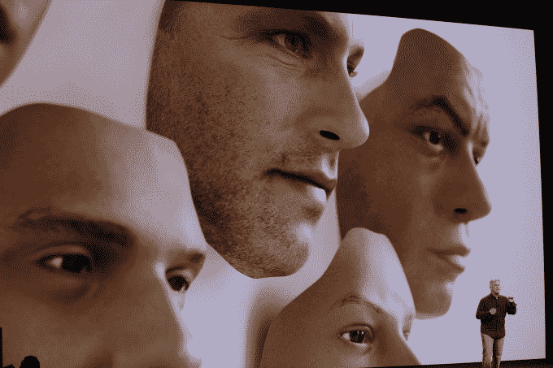

# Face ID 在新的 iPhone X 上取代了触控 ID

> 原文：<https://web.archive.org/web/https://techcrunch.com/2017/09/12/face-id-is-replacing-touch-id-on-the-new-iphone-x/>

# Face ID 在新的 iPhone X 上取代了触控 ID

苹果[刚刚推出新款 iPhone X](https://web.archive.org/web/20230315095319/https://techcrunch.com/2017/09/12/iphone-x/) ，全边到边屏幕意味着不再有 home 键。没有 home 键意味着没有触控 ID，因为那是苹果在旧手机上安装指纹扫描仪的地方。

所以为了保证你手机的安全，苹果推出了 Face ID，让你只需看一眼就能解锁手机。这项新的扫描功能也[取代了 Apple Pay 和其他应用程序的触控 ID，这些应用程序使用触控 ID](https://web.archive.org/web/20230315095319/https://techcrunch.com/2017/09/12/faceid-will-work-with-apple-pay-third-party-apps/) 来验证用户身份，如银行应用程序。

它是这样工作的:新的 iPhone X 在你第一次使用手机时，从各个角度对你的脸进行 3D 扫描。然后，它将你的面部扫描保存在 iPhone X 的 secure enclave 硬件芯片中，并在你想解锁手机时进行比较。

苹果使用了一系列新硬件来捕捉这张 3D 面部地图——包括点投影仪、传统的前置摄像头、泛光照明器和红外摄像头。它本质上是一个小型化的 Xbox Kinect，放在你的手机前面。

苹果公司表示，面部扫描非常精确，现在只有 1/100 万的概率，另一个随机的人的脸可以解锁你的手机。这比触控 ID 1/50，000 的错误率好得多。不，举着某人的照片不能解锁他们的手机——好莱坞级别的面具也不能，这是苹果工程团队用来训练该功能的(如下所示)。