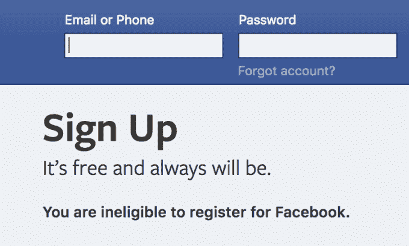

# 脸书和 Instagram 改变以打击未成年儿童 

> 原文：<https://web.archive.org/web/https://techcrunch.com/2018/07/19/facebok-under-13/>

脸书和 Instagram 将更主动地锁定其版主遇到并怀疑年龄低于 13 岁的用户的账户。它以前的政策是，只调查那些被举报可能未成年的账户。但脸书向 TechCrunch 证实，本周对评论者政策的“操作性”改变将使他们锁定他们遇到的任何未成年用户的账户，即使他们因其他事情被举报，如不良内容，或被评论者发现。脸书将要求用户提供超过 13 岁的证明，如政府颁发的带照片的身份证，以重新获得访问权。这个问题源于脸书在注册时不要求任何年龄证明。

Facebook Messenger Kids 专门针对 13 岁以下的用户

更强硬的立场可能会减少脸书和 Instagram 的用户数量和广告收入。这些应用程序以前更不干涉的方法使它们能够吸引年轻用户，所以当他们 13 岁时，他们已经投资建立了一个社交图和内容历史，将他们与脸书公司联系在一起。虽然随着时间的推移，脸书已经失去了与年轻人的联系，随着他们的父母加入，Instagram 仍然非常受他们的欢迎，并可能将许多十几岁甚至更小的孩子作为用户。

这一变化是对英国第四频道(Channel 4)和 Firecrest Films 的一篇秘密纪录片报道的回应，该报道称一名记者通过爱尔兰都柏林一家名为 CPL Resources 的第三方公司成为脸书内容审查员。那里的一位评论者声称他们被指示忽略 13 岁以下的用户，说“我们必须承认这个人是未成年人。如果没有，我们只是喜欢假装我们是盲人，我们不知道未成年是什么样子。”该报告还概述了极右翼政治团体在发布违反脸书政策的仇恨内容时，如何受到与其他页面或账户不同的删除门槛。

作为回应，脸书在 7 月 16 日发表了一篇[博客文章](https://web.archive.org/web/20230219164011/https://newsroom.fb.com/news/2018/07/working-to-keep-facebook-safe/)，声称高调的页面和注册的政治团体可能会受到脸书员工的第二层审查。但在 7 月 17 日的更新中，脸书指出，“自该项目以来，我们一直在努力更新对审查者的指导，以便在他们遇到任何有强烈迹象表明未成年的账户时，暂停他们的账户，即使报告是为了其他事情。”

现在，脸书发言人向 TechCrunch 证实，这是对审查员培训方式的改变，以执行脸书和 Instagram 的年龄政策。这并不意味着脸书将开始大范围搜索未成年用户，但它将不再忽视它遇到的那些人。脸书的发言人强调，已经禁止未成年用户的服务条款保持不变，但给版主的执行政策的操作指南已经改变。

脸书禁止 13 岁以下的用户遵守美国儿童在线隐私保护法案，该法案要求父母同意收集儿童的数据。这一变化可能会导致更多未成年用户的账户被终止。这反过来可能会降低该网站对 13 岁以上或 13 岁以下朋友的效用，使他们更少参与社交网络。

这一消息与脸书有目的地试图通过其 [Messenger 儿童应用](https://web.archive.org/web/20230219164011/https://techcrunch.com/2017/12/04/facebook-messenger-kids/)吸引未成年用户形成鲜明对比，该应用允许 6 至 12 岁的儿童与父母批准的人聊天，今天该应用已从美国扩展到墨西哥、加拿大和秘鲁。一方面，脸书试图让 13 岁以下的用户依赖于这个社交网络……而另一方面，却把他们推开了。

## 随着用户年龄的增长，儿童注册会带来问题

一位早期在脸书工作过的高层人士告诉我，对监管未成年用户采取不干涉的做法的一个后果是，随着一些人变老，脸书会错误地认为他们超过了 18 岁或 21 岁。

这是有问题的，因为它可能会使未成年人不正当地有资格看到酒类、真钱赌博、贷款或订阅服务的广告。他们还可以看到潜在的攻击性内容，如图形暴力，这些内容[只对 18 岁以上](https://web.archive.org/web/20230219164011/https://www.facebook.com/help/814083248683500?helpref=uf_permalink)的用户显示，并隐藏在一个警告间隙后面。脸书可能还会在公共搜索结果中暴露他们的联系信息、学校和生日，但对 18 岁以下的用户是隐藏的。

要求更改出生日期的用户可能会被暂停账号，从而阻止用户坦白自己的真实年龄。脸书发言人证实，在美国、加拿大和欧盟，如果被列为 18 岁以上的用户试图将其年龄改为 18 岁以下，或者相反，他们将被提示提供年龄证明。

对于那些想在不暂停账户的情况下更正年龄的用户，脸书给他们一个特赦期可能是明智的。让朋友确认好友请求和建立个人资料需要时间和社会资本，而以前的未成年用户现在实际上已经超过 13 岁，他们可能不想仅仅为了显示他们的准确出生日期和保护脸书而冒险。如果公司想纠正这个问题，它可能需要为用户提供一个暂时的无后果的方法来纠正他们的年龄。然后，它可以向最年轻的用户或那些算法根据他们的联系认为可能在 13 岁以下的用户推广这一选项。

除了自我证明他们已经成年之外，脸书没有在未成年用户面前设置任何真正的注册障碍，这可能是为了让他们容易加入社交网络并发展业务。可以理解一些 9 岁或 11 岁的孩子会撒谎来获取信息。盲目相信自我认证导致了剑桥分析丑闻，因为数据研究公司向脸书承诺，它已经删除了偷偷收集的用户数据，但脸书未能证实这一点。

还有很多其他应用无视 COPPA 的法律，让未成年儿童很容易注册。假唱应用 Musical.ly 尤其臭名昭著，它让 13 岁以下的女孩在数百万观众面前随着现代流行歌曲挑逗性地跳舞——令人担忧的是，这些观众中也包括成年人。2016 年 TechCrunch Disrupt London 上，当我拿着证据[与该公司首席执行官亚历克斯·朱(Alex Zhu)对质时，他愤怒地否认该公司违反了 COPPA。](https://web.archive.org/web/20230219164011/https://techcrunch.com/2016/12/06/musically-techcrunch-disrupt-london/)

## 脸书的计算

剑桥分析公司(Cambridge Analytica)的失败、俄罗斯对选举的干预、对屏幕时间的沉迷、缺乏对假新闻的保护以及对阴谋论者和危险内容的宽松政策带来的越来越多的审查已经引发了对脸书的清算。

昨天，脸书宣布了一项内容审核政策更新，他告诉 TechCrunch，“某些形式的错误信息导致了身体伤害，我们正在做出政策改变，这将使我们能够删除这种类型的内容。我们将在未来几个月开始实施这项政策。”这是对通过 WhatsApp 传播的虚假谣言的回应，这些谣言导致暴民在印度等国家私刑杀人。这项政策可能会影响阴谋论者和传播脸书虚假新闻的出版物，其中一些声称在实践言论自由。

在安全、隐私和真相方面，脸书将不得不就如何主动监管其社交网络划定界限。它试图平衡其连接世界的使命、因用户数量和参与度最大化而蓬勃发展的业务、作为家庭友好型公用事业的品牌、保护社会和民主免受错误信息影响的责任以及支持言论自由和每个人都有发言权的价值观。有些东西必须放弃。