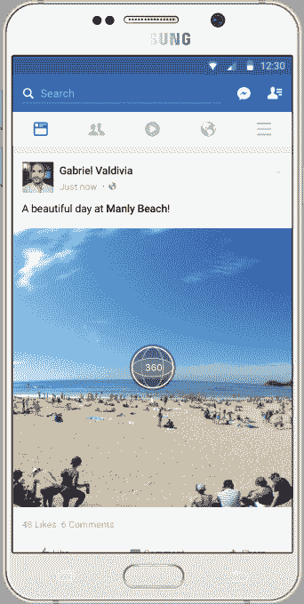
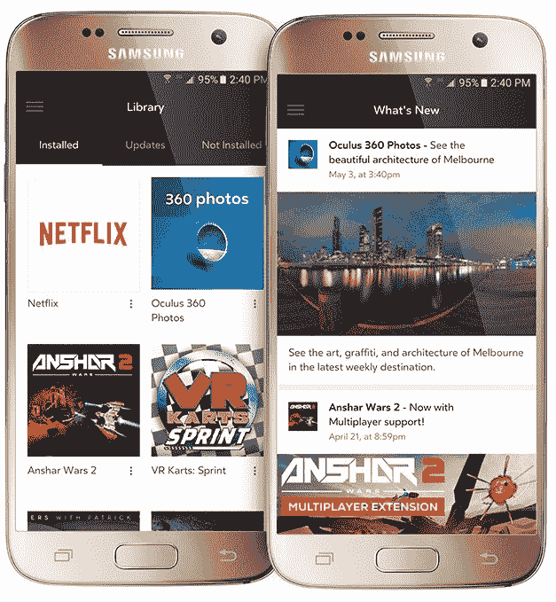
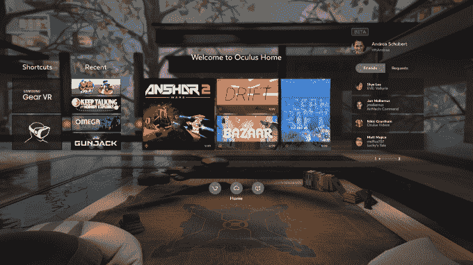

# 脸书将为 feed 和 Gear VR 的 100 万用户将全景照片变成“360 度照片”

> 原文：<https://web.archive.org/web/https://techcrunch.com/2016/05/11/facebook-360-photos/>

那些被困在手机上的全景照片最终将获得更好的观看体验，无论是在 News Feed 上还是在 Oculus 支持的三星 Gear VR 上。脸书还首次发布了 Gear VR 的使用统计数据，称 Gear VR 每月有 100 万用户，用户每天在设备上花费 25 分钟。这可能会鼓励开发者为这个平台开发产品。

脸书即将推出的“360 照片”功能将允许人们上传平面全景照片，就像 iPhones、谷歌照片球或 360 相机拍摄的照片一样。然后，脸书会将它们变成 360 张照片，供新闻订阅使用，用户可以按住并拖动照片，或在 Gear VR 上移动他们的头来环顾四周。

360 全景照片可以让人们在没有特殊设备的情况下制作虚拟现实内容，从而使虚拟现实内容创作民主化。他们只需要一部运行 iOS 6 或更高版本的 iPhone，一部运行 4.2 或更高版本的 Android，或者众多可供下载的 360 照片应用中的一个。事实上，许多人已经创建了这些内容，这在以前很难看到。

作为参考，谷歌将其 Photo Sphere 系统内置到 Android 中，允许用户拍摄完整的 360 全景，然后在类似谷歌 Cardboard 的 VR 耳机上观看。

自 9 月份以来，脸书已经在新闻提要中支持 360°视频，但好的 360°视频很难拍摄，通常需要指定的硬件。现在很大比例的智能手机都可以拍 VR。

## Gear VR 点击 100 万用户

6 个月前，三星 Gear VR 在全球推出了一款 99 美元的移动虚拟现实耳机，采用 Oculus 的技术。用户将一部最新的三星 Galaxy 手机滑入，充当屏幕。现在，Oculus 的所有者脸书提供了一些关于其进展的统计数据。

该公司表示，上个月有超过 100 万人使用了 Gear VR，开发者为其开发了 250 多个应用，包括像《《我的世界》》这样的游戏和各种视频体验。

为了消除 VR 只面向游戏玩家的观念，脸书兜售说，每天有近 80%的 Gear VR 用户观看视频内容，在排名前 10 位的 Gear VR 应用程序中，有 7 个是视频应用程序。

脸书也正在兜售新的视频系列来齿轮 VR，包括费利克斯&保罗工作室的游牧民系列以下的生活游牧民族从蒙古和肯尼亚。与此同时，Discovery 将根据热门电视节目《最致命的猎物》(deally Catch)发布一款新的 VR 体验，内容是在白令海捕捞阿拉斯加蟹。

Oculus 还在 Gear VR 上更新其 Oculus 主页，以使其更易于导航，特别是查找最近下载的内容。与此同时，Oculus Mobile app 将推出“最新动态”版块，重点介绍最近发布的内容，此举应有助于用户在更多 VR 体验发布之前不至于感到厌烦。

全新 Oculus 家居设计

虽然 Oculus Rift 可能会获得更多关注，但 Gear VR 等移动 VR 耳机将把虚拟现实带给主流受众。但要有吸引力，就需要为他们创造大量优秀的内容，比如这些最受关注的 360 个脸书 T2 视频。一些 VR 用户已经告诉我，他们已经烧掉了大部分高质量的视频和游戏，而且在制作新内容之前会减少耳机的使用。

通过亲重点的举措，如开放采购脸书的 360 环绕声 VR 相机，以及新的 360 照片功能，人们从各个领域将能够贡献的经验，我们绑在我们的脸图书馆。

