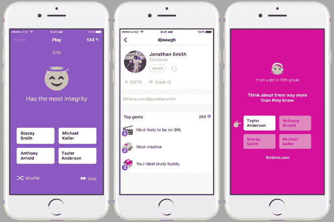
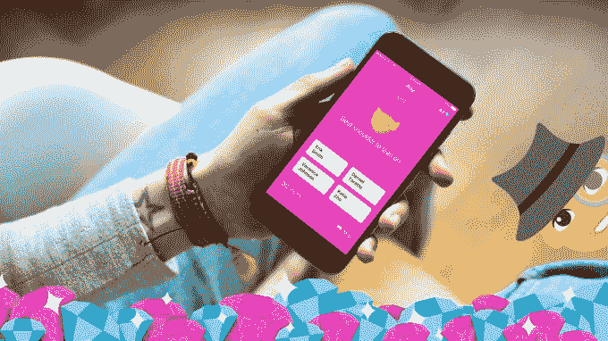
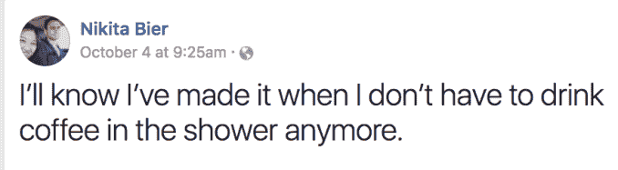
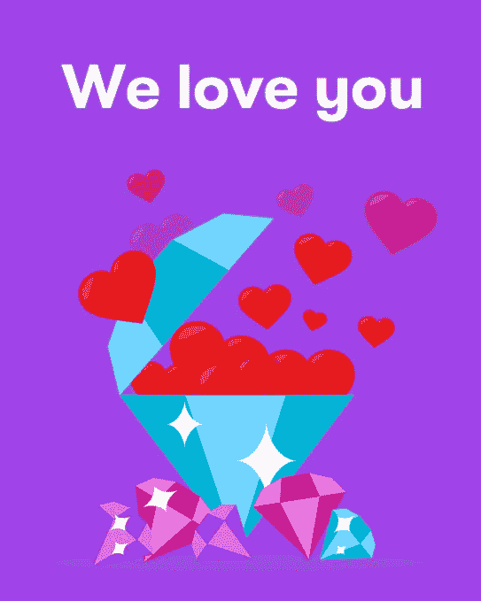

# 脸书收购匿名青少年赞美应用 tbh，将让它运行

> 原文：<https://web.archive.org/web/https://techcrunch.com/2017/10/16/facebook-acquires-anonymous-teen-compliment-app-tbh-will-let-it-run/>

脸书希望 tbh 成为它的下一个 Instagram。今天，脸书[宣布](https://web.archive.org/web/20230404053518/https://tbhtime.com/news/)将收购[一家关注积极性的民调初创公司 tbh](https://web.archive.org/web/20230404053518/https://techcrunch.com/2017/09/22/tbh-app/) ，并允许其以自己的品牌进行一定程度的独立运营。

[tbh](https://web.archive.org/web/20230404053518/https://tbhtime.com/) 在过去九周内已经获得了 500 万次下载和 250 万日活跃用户，其应用程序允许人们匿名回答关于朋友的善意选择题，然后收到投票结果作为称赞。你会看到这样的问题:“参加聚会最好带什么？、”“他们的毅力令人钦佩？”和“能成为一名诗人吗？”将你上传到应用程序上的联系人作为答案选项。

自 8 月份在有限的几个州正式推出以来，tbh 已经获得了超过 10 亿个投票回答，其中大部分来自青少年和高中生，并连续几周高居免费应用排行榜榜首。当我们[上个月在 tbh 公司的第一次大型采访](https://web.archive.org/web/20230404053518/https://techcrunch.com/2017/09/22/tbh-app/)中介绍 tbh 时，联合创始人尼基塔·比尔告诉我们，“如果我们改善了数百万青少年的心理健康，那就是我们的成功。”

交易的财务条款没有披露，但 TechCrunch 听说支付的价格不到 1 亿美元，不需要任何监管批准。作为协议的一部分，tbh 的四位联合创始人——比尔、埃里克·哈扎德、凯尔·萨拉戈萨和尼古拉斯·杜多登——将加入脸书的门洛帕克总部，同时继续利用脸书的现金、工程、反垃圾邮件、适度和本地化资源发展他们的应用。

然而，tbh 的创始人将成为脸书的正式员工，拥有脸书的电子邮件地址，而不是像 Instagram 和 WhatsApp 那样更加独立地运营，它们有自己的大楼和电子邮件。

tbh 团队[在一份公告中写道](https://web.archive.org/web/20230404053518/https://tbhtime.com/news/)“当我们与脸书会面时，我们意识到我们有许多相同的核心价值观，即通过积极的互动来联系人们。最重要的是，我们被他们帮助我们实现我们的愿景并将其带给更多人的方式所驱使。”

在给 TechCrunch 的一份声明中，脸书写道:“tbh 和脸书有着共同的目标——建立社区，让人们以拉近我们距离的方式分享。我们对 tbh 使用投票和信息的方式印象深刻，借助脸书的资源，tbh 可以继续扩大和建立积极的体验。”

有趣的是，脸书选择收购 tbh 而不是克隆它，因为它最近一直在积极复制其他热门的青少年应用程序，如《T4》。虽然脸书的 Snapchat 克隆版 Instagram Stories 获得了巨大的人气，但它的其他仿制品却没有表现得那么好。

凭借 tbh 强大的品牌名称、与众不同的设计和爆炸性的早期牵引力，脸书似乎已经决定合作比对抗更好。

[更正:tbh 拥有 250 万日活跃用户，而不是我们最初公布的 400 万，因为比尔在这篇文章发表后删除的一条推文中暗示了这么多。]

## 从 14 次失败到脸书

比尔最初于 2010 年创办了母公司 Midnight Labs。app studio 尝试了一系列产品，包括个人理财应用、大学聊天应用和性格测试。最终，该公司在 2013 年进行了一轮小规模种子投资，投资者包括 Greylock via 合伙人 Josh Elman、Bee Partners 和 Indicator Ventures。但是没有任何进展，午夜实验室的钱也快用完了。

只剩下 60 天的现金，该公司决定在它认为 Secret 和 Yik Yak 等匿名应用缺乏的积极性和青少年渴望的诚实的交叉点上建立一些东西，正如在 TBH 趋势中看到的那样，社交网络用户要求他们的朋友提供坦率的反馈:tbh 诞生了。“我们把它运到了佐治亚州的一所学校。百分之四十的学校在第一天就下载了它，”比尔说。

最大的问题很快变成了如何让用户参与到应用中来；tbh 已经限制你一次回答几个问题，所以你乞求更多。它的第一个大功能发布是在本周，增加了直接消息。这可以让你给选择你作为答案的人发信息，他们可以选择向你透露他们的身份。

但是，对于这样一个小团队来说，试图同时保持服务器在线、编写新问题和构建下一个粘性功能是一项艰巨的任务。

现在，tbh 将有脸书来帮助它扩大规模，同时保持现有用户的娱乐性。该应用将在 iOS 和 Android 上保持免费下载，品牌保持不变。

有了脸书的支持，比尔和他的团队应该可以松一口气了。与脸书联手有很多好处:

*   **现金**——tbh 不会再筹集新一轮资金来保持势头，而是会有雄厚的资金来实现让青少年更快乐的使命。
*   **工程**——在只有四名联合创作者和一些承包商的情况下，扩展到 250 万每日用户是一项极其艰巨的工作。如果应用程序一直崩溃，用户就会消失。现在，tbh 将拥有脸书庞大的精英工程团队作为后盾。
*   **反垃圾邮件**——随着 tbh 增加其新的直接信息功能，它将让脸书协助其利用十多年来开发的技术清除垃圾邮件。
*   **本地化**–tbh 甚至还没有扩展到美国的每个州。在脸书的帮助下，它可以在船上有更多的位置，而且，随着它走向国际化，它将能够更快地接受新的语言和文化。
*   内容适度——tbh 承诺只允许你选择的朋友对被选中感觉良好的投票问题。随着更多的大脑想出问题，更多的眼睛审查它们的误用，以及多元化的团队为不同的地方编写正确的问题，这将变得更容易。

自从脸书在 2012 年收购 Instagram 以来，这些资源帮助 insta gram 的规模增长了 10 倍以上，用户数量增加到了 8 亿，而自脸书在 2014 年收购 WhatsApp 以来，WhatsApp 的用户数量从 4 . 5 亿增加到了 13 亿。

但是，脸书没有等到 tbh 像 Instagram 一样攀升到近 10 亿美元，或者像 WhatsApp 一样达到 190 亿美元，而是早早地就出手了。它最不需要的就是 tbh 最终被 Snapchat 收购。

“尼基塔和他的团队已经对青少年如何使用产品了如指掌。tbh 投资者乔希·埃尔曼说:“这是为数不多的获得这种认养的公司之一，应该庆祝一下。”“希望这表明仍有空间让很多人接受新的移动体验。”

在 tbh 之前，大多数社交媒体都是关于争夺喜欢或赞美你的线下生活。但是这些小小的多巴胺诱导通知在另一边几乎没有真正的联系，当其他人看起来都很开心的时候，很容易认为你不酷。事实上，tbh 填补了被“喜欢”和真正被欣赏之间的差距。

“我们认为下一个里程碑是从爱和积极的角度考虑社交平台，”比尔告诉我。“我们认为这正是自互联网诞生以来社交产品所缺失的。”

更多关于 tbh 的信息，请阅读我们对其联合创始人关于其创建和使命的采访。