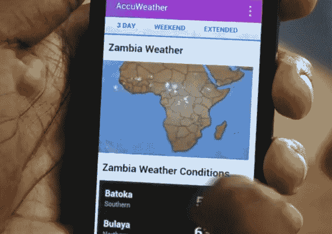
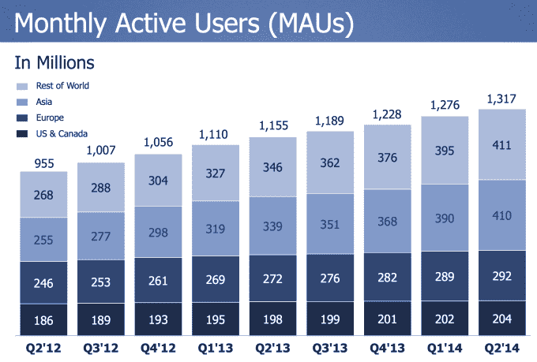
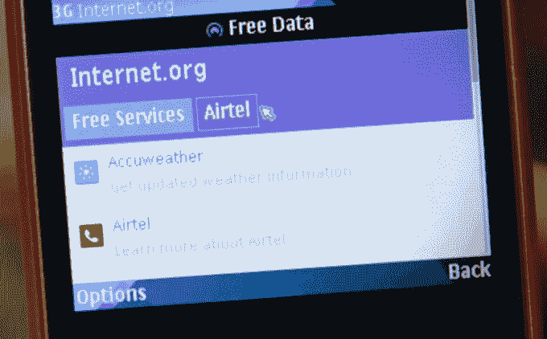

# 脸书在非洲拥有 1 亿用户，占该大陆互联网连接人口的一半

> 原文：<https://web.archive.org/web/https://techcrunch.com/2014/09/08/facebook-africa/>

# 脸书在非洲拥有 1 亿用户，占该大陆互联网接入人口的一半

发展中国家想要脸书，它的无障碍倡议 Internet.org 可以带来巨大的红利。这些是脸书宣布其在非洲拥有 1 亿活跃用户的结果，其中 80%来自手机。这 1 亿人占所有非洲互联网用户的 50%。

这一消息表明，如果无人机、卫星和当地运营商的免费接入协议能够将互联网普及到印度和南美等地的更多人，他们中的很大一部分人将成为脸书的忠实用户。不仅仅是使用智能手机的西方人想要社交网络。即使这意味着通过喜欢来量化一个人的生活，在没有面对面互动的情况下进行社交，以及为了广告定位而放弃数据，世界各地的人们都渴望通过脸书与朋友和家人联系。

脸书宣布的 1 亿用户里程碑为其典型的财报用户增长细分提供了更多细节，这些细分将非洲归入一个大的“世界其他地区”，截至 2014 年 Q2 年底，该地区拥有[4.11 亿活跃用户](https://web.archive.org/web/20230322085346/https://techcrunch.com/2014/07/23/facebook-q2-2014-earnings/)。脸书在非洲联网用户中的渗透率为 50%，脸书在美国和加拿大地区的渗透率为 71%，即 2.837 亿用户中的 2.04 亿用户。

事实上，非洲 80%的脸书用户是通过手机上网的，这表明非洲大陆已经在很大程度上超越了笔记本电脑，并在小屏幕上进行大量的计算。

就在一个月前，脸书电信合作伙伴在非洲 T2 推出了 Internet.org 应用程序，为仍未联网的 50 亿人带来互联网。Android 应用和移动网站提供免费访问一系列“基本”互联网服务，如维基百科、谷歌搜索、脸书、Facebook Messenger，以及关于人权、妇女权利和公民参与的当地资源。非洲电信 Airtel 完全补贴数据费用，希望 Internet.org 的应用程序能够向人们证明互联网的价值，并说服他们购买整个网络的订阅服务。

在非洲大部分地区，互联网使用的障碍不是电话或数据连接，而是数据计划的高昂费用。这就是为什么脸书正致力于这些类型的免费互联网运营商交易，以及通过提高传输效率来降低数据支出的方法。

正如该公司所写的那样，“我们知道，当涉及到构建满足全球多样化本地需求的产品和解决方案时，一刀切的方法是行不通的，这就是为什么我们致力于为高增长市场量身定制解决方案。”这些措施包括[缩减其安卓应用](https://web.archive.org/web/20230322085346/https://techcrunch.com/2014/07/31/internet-org-app/)以降低下载成本，提供“[点击未接来电](https://web.archive.org/web/20230322085346/https://www.facebook.com/business/news/high-growth-markets)，以便用户可以从广告商那里获得更多信息，以及[针对](https://web.archive.org/web/20230322085346/https://www.facebook.com/business/news/high-growth-markets)的带宽，以通过功能手机优化的广告来接触用户。

从非洲 50%的使用率来看，如果脸书能在互联网上覆盖全球，它将有望获得数十亿用户。