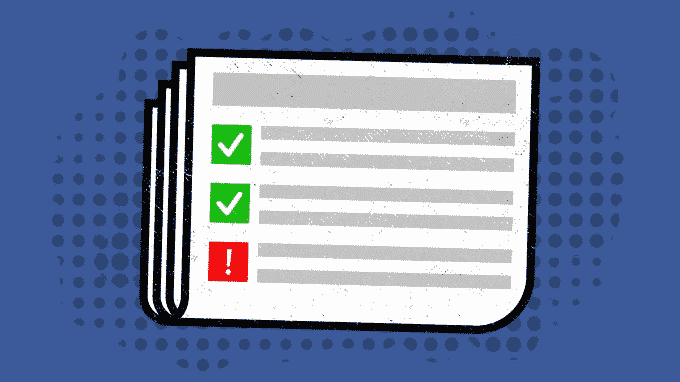

# 桑德伯格说脸书允许虚假新闻广告的麻烦

> 原文：<https://web.archive.org/web/https://techcrunch.com/2017/10/12/facebook-allows-fake-news/>

脸书·首席运营官·雪莉·桑德伯格今天早上说，如果俄罗斯购买的选举干扰广告没有被欺诈账户购买，“它们中的大多数将被允许运行”。“一个开放平台的责任是允许人们表达自己，”她在 Axios [采访脸书高管系列](https://web.archive.org/web/20220810155353/https://newsroom.fb.com/news/2017/10/hard-questions-axios-sheryl-sandberg/)的第一场时说。

桑德伯格说:“关于言论自由，当你允许自由表达时，你就允许自由表达，”她指出，“我们不会检查人们发布的内容”，她认为人们不应该希望脸书这样做。

采访中的关键引用是桑德伯格说的“问题是应该播放分裂性、政治性或议题广告……我们的答案是肯定的，因为当你切断一个人的言论时，你就切断了所有人的言论。”

这一观点保持了脸书在整个政治领域的中立，并免除了它作为真相警察的责任。但这也意味着它有意创造了一个人们可以互相传递错误信息的平台。

这引发了一个问题，即言论自由如何扩展到缺乏传统新闻发布系统的监管和编辑监督的用户生成内容共享网络。桑德伯格回避了 Axios 编辑迈克艾伦(Mike Allen)关于脸书是否是一家媒体公司的问题，也没有被问及它如何像其他媒体公司一样接受广告资金。

[脸书计划雇佣 1000 多名人类主持人](https://web.archive.org/web/20220810155353/https://beta.techcrunch.com/2017/10/02/facebook-will-hire-1000-and-make-ads-visible-to-fight-election-interference/)来保护选举的完整性，让所有广告对所有人透明，而不是只对那些目标可见，并加强对政治广告购买的审查。但是，如果脸书真的打着言论自由的旗号允许假新闻，假新闻问题能得到解决吗？

图片:布莱斯·德宾/

在她的谈话中，桑德伯格还证实，脸书将支持国会调查人员调查选举干预的计划，向公众发布俄罗斯购买的广告。她说，她昨天会见了国会，脸书正在全力配合，并将向国会提供调查人员想要的任何内容。这包括非广告。桑德伯格解释说:“如果他们中的许多人是由合法的人经营的，我们会让他们经营。”

她还表示，广告的目标信息也将向公众公布。桑德伯格说:“我们有责任尽我们所能来防止这种虐待。”。"我们希望在广告透明度方面建立一个新的标准。"尽管与此同时，她公然回避了一个问题，即俄罗斯购买的广告和唐纳德·特朗普的竞选广告是否有匹配的目标。

至于指责脸书通过在我们的社交图谱上分享信息而不是一个更公正的新闻来源来包围我们，从而导致过滤泡沫，桑德伯格说，脸书实际上通过暴露我们薄弱的联系和熟人来拓宽我们的视角。她引用研究表明，通过脸书的镜头，我们看到的新闻比传统来源更广阔。

你可以在下面观看桑德伯格的完整对话:

桑德伯格的评论伴随着新曝光的关于脸书打击假新闻有效性的信息。在 [BuzzFeed](https://web.archive.org/web/20220810155353/https://www.buzzfeed.com/craigsilverman/facebook-just-shared-the-first-data-about-how-effective-its?utm_term=.lmZQVZJ9OY#.co0K3gDq4w) 获得的一封电子邮件中，脸书新闻合作伙伴关系经理杰森·怀特(Jason White)写给该公司的一名第三方事实审查员:

> *“一旦我们从我们的一个事实核查伙伴那里收到一个错误的评级，我们就能够将未来对脸书的印象减少 80%。。。我们正在努力尽快揭露这些骗局。这通常需要 3 天以上的时间，我们知道大多数印象通常发生在最初的那段时间。”*

但是，尽管脸书愿意降低被第三方明确认定为虚假的新闻报道的重要性，但它仍然允许这些内容出现在它的平台上。

## 值得航行的滑坡

这一切都归结于一个事实，即脸书的新闻提要是按参与度排序的。通常情况下，低质量的内容只会收到很少的赞或评论，不会被很多人看到。但是假新闻是如此的诱人，它刺激了我们的偏见和政治倾向，以至于打破了这个系统。人们会点击、喜欢和分享这些内容，因为他们认同这些内容或从中获得乐趣，而不是因为这些内容质量很高。

这反过来又刺激了虚假新闻的发布者。一旦发现恶作剧，脸书会将其降级，并阻止这些出版商的盈利和广告购买。但这些机制也刺激了高度两极分化的观点、夸张和哗众取宠的出版。当广告商付费以扩大假新闻的覆盖范围时，其点击诱饵为这些广告赢得了一定的参与度，从而在脸书的拍卖系统中赢得了较低的价格。

这就是脸书如何从假新闻和两极分化中获利的，尽管它发誓要更加努力地保护我们免受其害。虽然脸书可能希望提供一个开放的平台，让它不是意见警察，甚至不是真相警察，但它同时也在从一些最恶意的言论自由中赚钱。

这是一条不归路。一个人的假新闻破坏是另一个人的审查。但与此同时，脸书在法律上没有义务维护一个言论自由的平台。它为了“安全”而禁止裸体、仇恨言论和图形图像的规定已经表明，它愿意对言论自由何时越界做出判断。但是假新闻也是不安全的。

一些批评者采取了愤世嫉俗的态度，说脸书严厉打击这种东西，因为它吓跑了广告商，而假新闻实际上带来了美元。当然，通过算法搜索乳头、种族歧视和血液，更容易大规模检测出那些被禁止的内容类型。然而，即使脸书不仅能可靠地发现毫不掩饰的虚假新闻，还能发现耸人听闻的内容，但它目前的政策是允许它，只要它不宣扬暴力或纯粹的仇恨。

有些事情必须改变。桑德伯格说，公众应该得到的不仅仅是道歉，而是解决问题的决心。现在是时候看到这种决心付诸行动了。在我看来，要么:

*   脸书必须发展其政策，以更广泛和更有力地定义和删除假新闻，无论这意味着承受内部审查内容和被指控有偏见的政治压力，还是大量资助第三方事实检查员，以便他们能够处理脸书要求的适度量。

或者

*   脸书必须继续在技术上允许假新闻，但增加公开的“假新闻报道”按钮，严格迅速地降级被报道的链接，使它们几乎不可见。这需要防止滥用举报按钮，同样也需要内部监管或资助第三方按照脸书的规模进行事实核查。

或者至少

*   脸书应该对购买新闻文章推广广告的广告商的合法性设置更高的门槛。这可能意味着限制从非原始新闻出版商或未经脸书证实的任何人那里购买广告。或者限制广告购买，推广任何被标记为虚假的内容。

所有这些强制选项都有可能诱捕合法新闻，被网络钓鱼者滥用，或者阻止无辜的广告购买。但是，如果脸书承诺尽量减少这些误报，那么与以言论自由的名义故意允许虚假新闻扩散相比，其结果可能会更好地保护民主和公民社会。