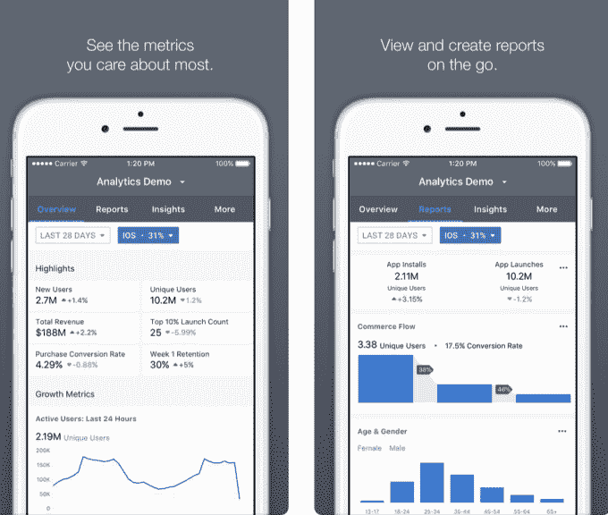
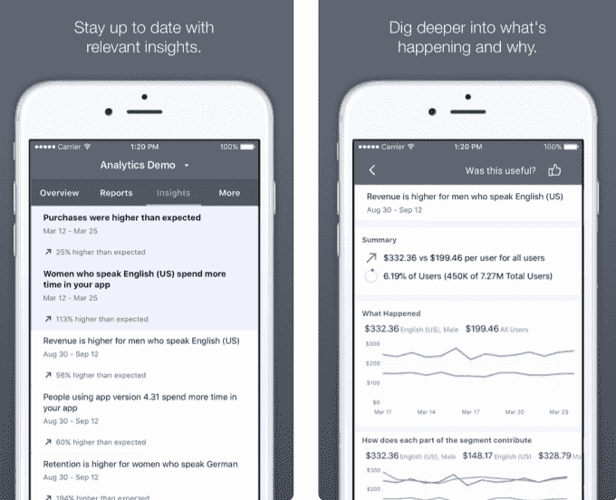

# 脸书推出商务“分析”应用 

> 原文：<https://web.archive.org/web/https://techcrunch.com/2018/05/01/facebook-analytics-app/>

脸书想要证明它可以为企业赚钱，而不仅仅是建立他们的社交媒体受众。今天早上，就在它的[大 F8 会议](https://web.archive.org/web/20230102110920/https://techcrunch.com/tag/f8-2018/)之前，一个适用于 iOS 和安卓的“脸书分析”应用[出现在应用商店里。它鼓吹“在旅途中掌控您的增长、参与和转化努力”的能力。轻松查看关键指标和报告，检查自动化洞察，并在发生变化时接收通知。”](https://web.archive.org/web/20230102110920/https://itunes.apple.com/us/app/facebook-analytics/id1266461465?mt=8)

随着社交营销的成熟，公司不满足于仅仅获得喜欢、追随者和影响力。他们想卖东西。在脸书的店面、Messenger 的营销机器人、Instagram 的专业账户和购物标签以及新的 WhatsApp For Business 应用程序之间，脸书希望提供工具来保持他们的忠诚度。

我们可能会在今天晚些时候的会议上听到更多关于分析应用程序的信息，我们已经寻求更多信息。该应用程序补充了脸书的页面管理器和广告管理器。但不仅仅是这些表面，分析应用程序还可以帮助企业跟踪他们的应用程序、网站、机器人和事件源组。

脸书分析应用允许用户创建他们最重要的指标的定制移动视图，如收入、留存、人口统计和活跃用户。它连接到脸书的网络分析套件，让你查看你在那里创建的漏斗、群组和细分市场。一些企业还会看到自动洞察，比如你经历了一段时间的高销售额，或者某个特定人群在你的应用上花费了更多的时间或金钱。

如果脸书能够增强企业从其社交网络获得投资回报的信心，它可能会说服它们在广告、内容和管理其在那里的存在方面进行更多投资。由于脸书最近的丑闻，客户基本上都选择了它，因为根本没有更精确的方式来接触客户。但随着该应用在某些市场达到饱和，用户增长陷入停滞，脸书必须继续寻找方法从每个市场中榨取更多的钱。

