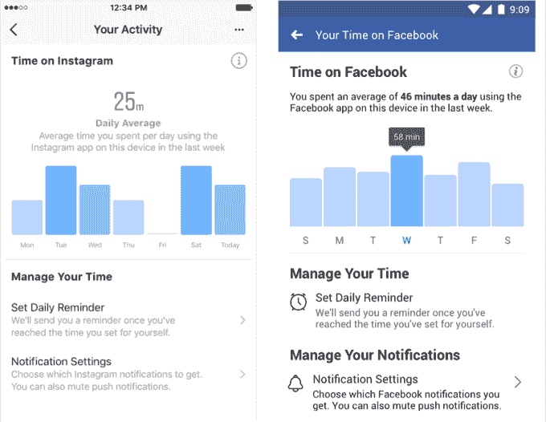
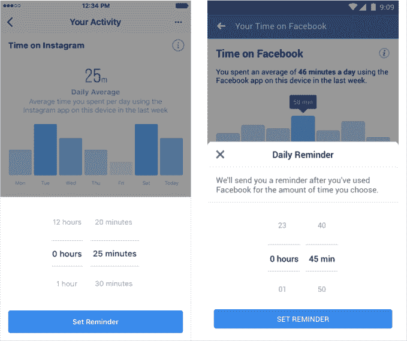

# 脸书和 Instagram 现在显示你使用它们的时间

> 原文：<https://web.archive.org/web/https://techcrunch.com/2018/08/01/facebook-and-instagram-your-activity-time/>

根据脸书在过去七个月中指出的研究，是被动的僵尸食物滚动而不是与朋友的主动交流损害了我们的健康。然而，它对我们所有的社交网络一视同仁，[今天推出了](https://web.archive.org/web/20230320215411/https://newsroom.fb.com/news/2018/08/manage-your-time/)[脸书和美国 Instagram](https://web.archive.org/web/20230320215411/https://instagram-press.com/blog/2018/08/01/new-tools-to-manage-your-time-on-instagram-and-facebook/) 的数字健康屏幕时间管理仪表板，并在未来几周内向所有人推出。

给用户一个上周每天花在应用程序上的分钟数，加上他们一周的平均时间，是让用户更加注意的一个好的开始。但是，由于将它们隐藏在很大程度上看不见的地方，没有真正的方法迫使它们减少使用，并且不区分被动和主动行为，它们似乎注定会被忽视，同时错过了公司本身强调的要点。

在过去的几个月里，TechCrunch [利用](https://web.archive.org/web/20230320215411/https://techcrunch.com/2018/05/15/instagram-usage-insights/)[简·满春·王](https://web.archive.org/web/20230320215411/https://twitter.com/wongmjane)生成的应用程序代码截图，抢先获得了两个独立但相同的 Instagram 和[脸书工具](https://web.archive.org/web/20230320215411/https://techcrunch.com/2018/06/22/your-time-on-facebook/)的设计。今天发布的是我们所看到的，仪表盘位于脸书的“设置”——>“你在脸书的时间”和 Instagram 的“设置”——>“你的活动”

遗憾的是，您只能在该设备的移动应用程序上看到您的使用信息。它不包括你在没有这些功能的桌面上花费的时间，你在平板电脑上做了什么，或者你在脸书系列应用程序上的使用信息。没有基准来衡量你这个年龄或你所在国家的其他人在应用上花了多长时间。所有这些都会对仪表板做出很好的改进。

除了每日和平均分钟数，你还可以设置每日分钟数的“限制”，超过这个限制后，任何一款应用都会向你发送提醒，提醒你已经超过了自己设定的阈值。但它们不会阻止你浏览和喜欢，也不会强迫你挖掘设置菜单来扩展你的限制。你需要意志力来切断自己。这些工具还可以让你静音推送通知(你仍会看到应用内提醒)，但最多只能持续 8 小时。如果你想要更持久的东西，你必须挖掘他们单独的推送通知选项菜单或你的手机设置。

该声明是在 Instagram 首席执行官凯文·斯特罗姆对我们的原始独家新闻发表评论后发布的，他在推特上写道“这是真的。。。我们正在开发工具，帮助 IG 社区更多地了解他们在 Instagram 上花费的时间——任何时间都应该是积极的和有意的。。。理解在线时间如何影响人们是很重要的，所有公司都有责任诚实面对这一点。我们想成为解决方案的一部分。我认真对待这一责任。”

用户第一次尝试 Instagram，试图减少过度使用，它的[“你都赶上了”通知](https://web.archive.org/web/20230320215411/https://techcrunch.com/2018/07/02/instagram-do-not-disturb/)，显示你在过去两天看到的所有帖子。这两款应用现在都将向用户提供关于新的活动监控工具的说明。脸书表示，它没有计划使用你是否打开工具或设定每日限额来定向广告。它将跟踪人们如何使用这些工具来调整设计，但听起来更像是在日常提醒和静音通知选项中显示什么时间增量，而不是大幅增强他们的肌肉。脸书将悄悄地阻止一小部分用户获得这些功能，以衡量发布是否会影响行为。

“对于使用 Instagram 和脸书的人来说，他们与我们共度的时光是值得的，这真的很重要，”Instagram 福祉产品总监阿米特·拉纳迪夫(Ameet Ranadive)在电话会议上告诉记者。“可能会有一些与公司其他指标的权衡，这是我们愿意接受的权衡，因为从长远来看，我们认为这对社区很重要，我们愿意投资。”

## 脸书需要更强大的屏幕时间工具来阻止被动浏览

脸书已经感受到了这种交易的冲击。自从今年 1 月一个大的算法变化[以来，它一直试图通过显示更少的低质量病毒视频和 clickbait 新闻故事，以及更多来自你朋友的信息来改善数字福祉。这导致其在北美的增长停滞，甚至在今年早些时候暂时减少了 70 万用户，而在过去的一个季度中，它在欧洲也失去了 100 万用户。这导致了脸书有史以来最慢的用户增长率，](https://web.archive.org/web/20230320215411/https://techcrunch.com/2018/01/11/facebook-time-well-spent/)[的股价下跌了 20%，市值下降了 1200 亿美元。“1 月份对新闻反馈的改变是其中的一步。。。第二步是让人们意识到自己的时间，这样他们就会更加珍惜时间，”Ranadive 说。](https://web.archive.org/web/20230320215411/https://techcrunch.com/2018/07/25/facebook-q2-2018-earnings/)

脸书愿意为数字福祉投入资金，这是一大进步。这也是一个明智的长期商业决策。如果我们对自己的总体使用情况感到满意，我们就不会完全放弃这些应用，并可能在下一个十年继续看到它们的广告。但很可能是脸书和 Instagram feeds 的变化，这些变化会优先考虑你会发表评论的内容，而不是看一眼，静静地滚动过去，这将比今天没有牙齿的工具更有助于健康的社交网络。

虽然 iOS 12 的屏幕时间和安卓的新数字福利功能都可以计算你在不同应用上的时间，但它们提供了更激烈的方式来实现你的良好意图。iOS 将发布一份每周使用报告，提醒您这些功能已经存在。Android 是同类产品中最好的，因为它使应用程序的图标变灰，并要求你在超过每日限额后打开设置来解锁应用程序。

iOS 屏幕时间(左)和 Android 数字福利(右)

为了履行 Systrom 承诺的责任，脸书和 Instagram 必须采取更多措施，让我们真正意识到我们在他们的应用程序上花费的时间，并帮助我们自助。让我们实际上把自己锁在应用程序之外，把它们变成灰度，淡化它们的应用程序图标，或者当我们超过极限时，在屏幕上持续显示我们的分钟数。任何让他们的应用程序变得健康的东西，你都不能像其他推送通知一样忽视。

或者根据研究，让仪表盘把我们分享、评论和发信息的时间与滚动订阅、浏览故事、观看视频和跟踪照片的时间分开。重点是，社交网络并不全是坏事，但也有伤害他人的行为。我们大多数人都不会放弃脸书和 Instagram。即使只是试图在他们身上花更少的时间也是困难的。但是通过引导我们去做那些让我们相互联系而不是孤立的事情，脸书可以让我们把时间转移到正确的方向上。