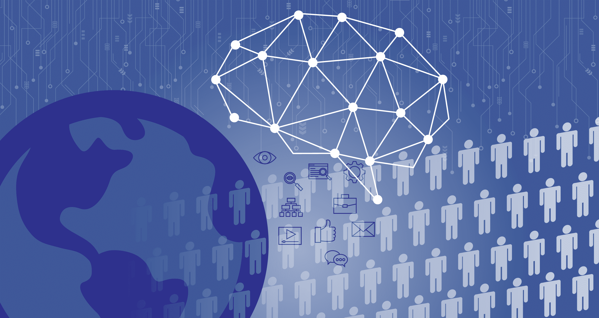
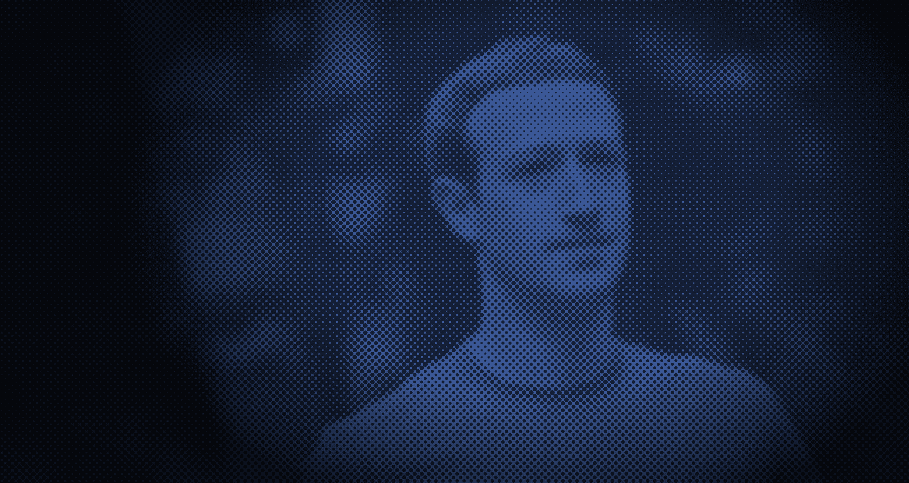

# 脸书和个性化选择架构的风险 

> 原文：<https://web.archive.org/web/https://techcrunch.com/2018/04/24/facebook-and-the-perils-of-a-personalized-choice-architecture/>

亚菲特勒夫-阿雷兹撰稿人

Yafit Lev-Aretz 是纽约大学法学院信息法律研究所的研究员。

More posts by this contributor

[最近的脸书-剑桥分析](https://web.archive.org/web/20221209205215/https://techcrunch.com/story/facebook-responds-to-data-misuse/)混乱点燃了意识之火，将当今数据监控文化的风险推到了主流对话的前沿。

这一事件和它所强调的许多令人不安的前景有力地唤醒了一个沉睡的巨人:人们寻求关于他们的隐私设置和更新他们的应用程序权限的信息，一场“删除脸书”运动已经开始，美国联邦贸易委员会对脸书展开了调查，导致脸书的股票下跌。完美风暴。

 **脸书-剑桥分析公司的崩溃由非常简单的事实组成:用户允许脸书收集个人信息，脸书为第三方获取这些信息提供便利。脸书根据其服务条款被授权这样做，用户正式同意但很少真正理解。《剑桥分析》的访问显然超出了脸书及其大多数用户的授权范围。尽管如此，这个故事已经成为大规模数据收集所产生的危害的一个标志性例证。

 **虽然讨论保护措施以最大限度地减少未授权访问的可能性很重要，但缺乏同意是错误的目标。同意是必不可少的，但它的人为性质早已确立。我们已经知道，除了形式上的目的，我们的同意往往是没有意义的。当我们从来没有注意到客人名单时，人们真的对脸书没有发现不速之客破坏了我们的个人信息盛宴感到愤怒吗？没错，就是烦。是的，这是错误的。但这并不是我们认为这一次事情走得太远的原因。

在他们 2008 年的书《推动》中，卡斯·桑斯坦和理查德·塞勒创造了“选择建筑”这个术语这个想法简单明了:人们做决定的环境设计会影响他们的选择。孩子们在超市里愉快地遇到糖果并不是偶然的:糖果通常放在孩子们看得见、拿得着的地方。

餐馆里给小费的选择通常是三倍，因为个人倾向于选择中间的一个，你必须从礼品店出去，因为你可能会在出去的时候想买些东西。但是你可能已经知道了，因为选择建筑自人类诞生以来就存在了，并且存在于任何人类的互动、设计和结构中。choice architecture 这个词已经有 10 年的历史了，但是 choice architecture 本身更古老。

脸书-剑桥分析公司的混乱，加上之前的许多迹象，预示着一种新型的选择架构:个性化，根据你的个人偏好量身定制，并优化以影响你的决定。

我们不再处于同样适用于所有人的熟悉的选择架构区域。它不再是关于人类认知的普遍弱点。它也不是关于人类推理特有的偏见。这不是什么让人类成为人类。这是关于什么让你成为你自己。

当各种来源的信息融合在一起时，我们个性的不同部分就聚集在一起，呈现出我们是谁的全面图景。然后，个性化选择架构被应用到我们数据化的策划自我中，潜意识地推动我们选择一个行动方案，而不是另一个。

个性化选择架构击中的软肋是我们最亲密的自我。它在合法的劝说和伪装成自愿决定的强制之间不断缩小的界限上活动。这就是脸书-剑桥分析公司的故事吸引我们的地方——意识到做出自主选择的权利，这是任何人的基本特权，可能很快就会消失，而我们甚至不会注意到。

一些人很快注意到，剑桥分析公司在川普竞选中没有使用脸书的数据，还有许多人质疑心理分析策略的有效性。然而，这些都不重要。通过微目标的个性化选择建筑正在兴起，剑桥分析不是第一个也不是最后一个成功利用它的。

例如，谷歌旗下的智库 Jigsaw 正在[使用类似的方法来识别潜在的 ISIS 新兵，并将他们](https://web.archive.org/web/20221209205215/https://redirectmethod.org/)重定向到 YouTube 视频，这些视频呈现了对 ISIS 宣传的反驳。脸书本身被指控根据他们的情绪状态针对澳大利亚的高危青年。脸书-剑桥分析公司的故事可能是第一个在众多新闻周期中幸存下来的高调事件，但肯定会有更多的事件发生。

我们必须开始思考在微目标时代选择建筑的限制。像任何技术一样，个性化选择架构可以用于善与恶:它可以识别处于危险中的个人，并引导他们获得帮助。它可以激励我们多读书，多锻炼，养成健康的习惯。这可能会增加投票率。但是当被误用或滥用时，个性化选择架构会变成一种破坏性的操纵力量。

个性化的选择架构可能会破坏民主选举背后的整个前提——选举我们自己的代表的是我们，人民，而不是选择架构。但即使在民主进程之外，不受约束的个性化选择架构也能让我们的个人自主变成一个神话。

人们离开脸书或无视剑桥分析公司的策略，不会解决诸如个性化选择架构引发的系统性风险。

个性化选择架构要求系统化的解决方案，涉及各种社会、经济、技术、法律和伦理方面的考虑。我们不能让个人选择在微观目标中消亡。个性化选择架构不能变成选择的无效化。****