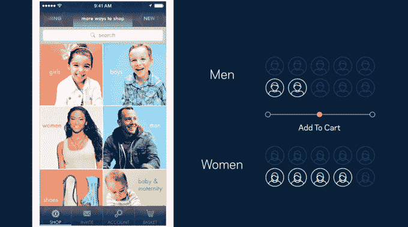

# 脸书宣布应用分析

> 原文：<https://web.archive.org/web/https://techcrunch.com/2015/03/25/facebook-announces-analytics-for-apps/>

# 脸书宣布应用分析

似乎将 Facebook Messenger 转变为一个平台和[为新闻订阅上的虚拟现实视频奠定基础](https://web.archive.org/web/20230404154727/https://techcrunch.com/2015/03/25/facebook-to-support-spherical-video-in-news-feed-and-oculus/#ns6Pf3:QvvF)还不够，脸书刚刚宣布了应用分析，这是一个新工具，面向那些希望根据聚合的社交数据更好地进行营销活动的营销人员。

[今日推出](https://web.archive.org/web/20230404154727/https://developers.facebook.com/products/analytics)，应用分析为您提供了一个网络仪表盘，让您可以跨平台查看您的应用在受众参与度和转化率方面的表现。

在 F8 舞台上的一个例子中，脸书展示了一家公司如何比较不同人群的营销活动表现。在脸书，你可以看到不同的群体在销售过程中走了多远，而不是简单地看谁点击了一个广告，这样你就可以改变策略，推出更多可能吸引落后群体的产品，或者专注于需要最少努力就能实现转化的人群。

此举提升了脸书为营销人员提供的价值，营销人员已经严重依赖该公司的广告让用户进入他们的手机和平板电脑应用程序，并在首次安装后让他们回来。看看这个新的分析平台与 [Mixpanel](https://web.archive.org/web/20230404154727/https://mixpanel.com/) 和[雅虎最近宣布的移动开发套件](https://web.archive.org/web/20230404154727/https://techcrunch.com/2015/02/19/mobile-is-not-yahoos-hobby-anymore/)相比表现如何将会很有趣，Mixpanel 刚刚在 12 月份为[筹集了 6500 万美元。](https://web.archive.org/web/20230404154727/https://techcrunch.com/2014/12/18/mixpanel-raises-65-million/)

