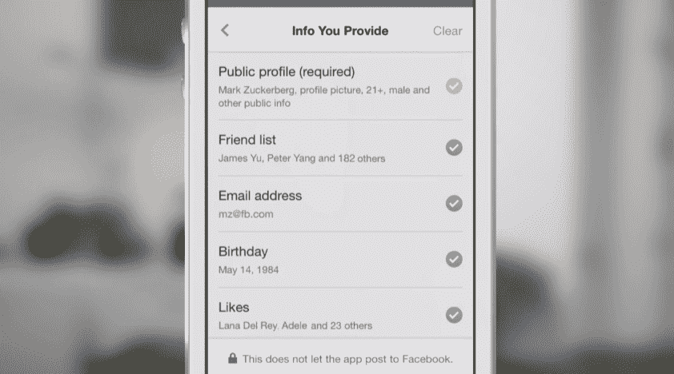
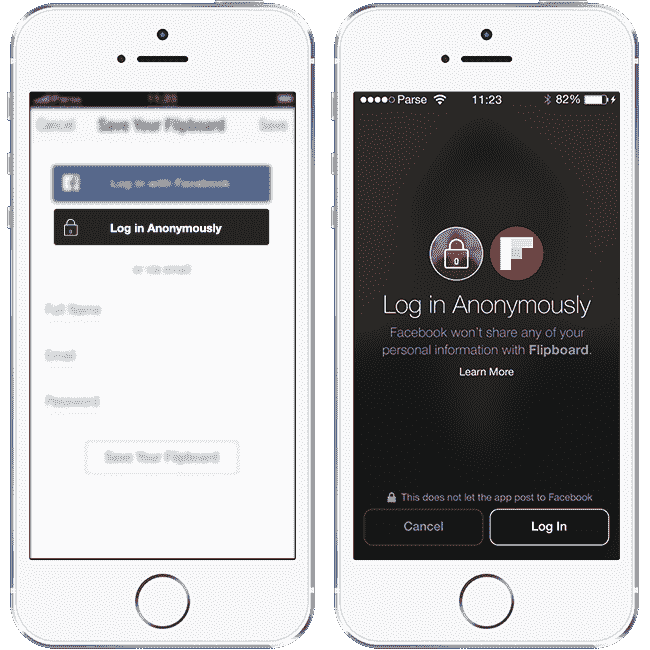

# 脸书推出匿名登录，这样你就可以在不泄露数据的情况下试用应用程序

> 原文：<https://web.archive.org/web/https://techcrunch.com/2014/04/30/facebook-anonymous-login/>

# 脸书推出匿名登录，这样你就可以在不放弃数据的情况下试用应用程序

在今天的 F8 开发者大会上，脸书推出了第三方应用登录系统的新版本，允许人们匿名登录，这样他们就可以在提供个人数据之前演示应用。新的登录还可以让你完全控制应用程序的数据类型。

此外，脸书的移动应用程序登录服务现在为用户提供了更精细的控制，让他们可以与应用程序分享内容。从今天开始，用户不仅可以决定一个应用程序是否可以发布到你的新闻订阅源，以及它可以从哪个日期读取，而且他们可以非常精确地控制共享的内容。

即使使用匿名标识符，你在应用程序之间的体验仍然可以同步，但应用程序不会从你那里获得任何个人信息。这很有效，因为脸书仍然在你每次匿名登录时为你使用一个唯一的标识符。这样，即使应用程序不知道你的名字，它也可以保存你的内容、高分或其他数据，并在不同设备之间进行同步。

如果您不使用匿名登录，新的权限对话框现在允许您逐行检查您的权限。

“我们知道有些人害怕按下这个蓝色按钮。这是我们在平台上得到的一些最常见的反馈，”首席执行官马克·扎克伯格今天说。“如果你不信任这些应用，你可能不想给它所有这些权限。所以去年，我们把阅读和发布权限分开了。它帮助人们信任蓝色按钮并登录应用程序。”

重要的是要明白，当脸书说“匿名”时，它真正的意思是“在使用第三方开发者的应用之前，你不必向他们提供你的名字或数据”。然而，正如《福布斯》的卡什米尔·希尔指出的，脸书仍然会“匿名”收集你正在使用的应用程序的数据，这些数据可以用来个性化你在脸书的其他体验，或者潜在地向你投放广告。

目前，匿名登录将为人们提供一种“购买前试用”的方式，也就是在你提供任何个人数据之前，看看你是否喜欢一个应用程序。最初的合作伙伴可能是那些在你使用真实身份和分享脸书时变得更好、更个性化的应用。但最终，随着脸书开放匿名登录，我预计人们会开发“匿名优先”的应用程序，比如一个秘密克隆，设计用于没有你的脸书数据的情况下。