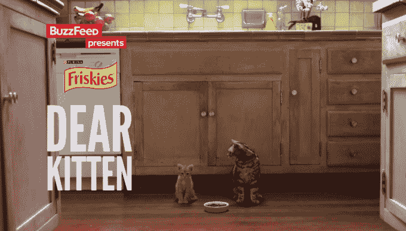

# 脸书获得邪恶，洋葱和更多为广告商制作“选集”病毒视频技术危机

> 原文：<https://web.archive.org/web/https://techcrunch.com/2015/04/23/facebook-anthology/>

# 脸书得到邪恶，洋葱，和更多为广告商制作“选集”病毒视频

脸书的视频广告越好，越少的人会讨厌它们，脸书能展示的就越多。问题在于，大多数广告商不知道如何为社交媒体制作引人注目的短格式视频。你知道是谁吗？《洋葱》、《邪恶》、《搞笑还是死亡》等内容的创作者。

因此，今天脸书宣布了一个新的视频广告计划，称为选集，其既定目标是通过广告商和出版商的合作创造更好的脸书视频广告。

以下是该公司在博客文章中对该项目的描述:

> 选集是艺术和科学的平等部分，将出版商的创造力和脸书的广告见解结合起来，创造符合品牌商业目标的定制活动。该计划汇集了一些领先的出版商，借出品牌的创造力，讲故事的专业知识和视频制作的诀窍。

该帖子称，该计划中的出版商将成为官方的脸书营销合作伙伴。最初的选集合作伙伴包括 Electus Digital、搞笑或死亡、哦，我的迪士尼、洋葱、Tastemade、Vice Media 和 Vox Media。

推特也一直在尝试不同的视频广告程序，尤其是[放大器，它将视频剪辑与非常短的广告](https://web.archive.org/web/20230129065024/https://techcrunch.com/2013/09/23/twitter-amplify-partnership-cbs/)配对。

本质上，当品牌想要为脸书制作顶级视频广告时，社交网络会将它们与合适的视频内容创作者配对。他们将一起制作一个展示品牌的视频，但首先也是最重要的是娱乐性——比这个品牌单独制作的要好得多。品牌大概会付钱给创作者，然后付钱给脸书来播放视频广告。

【YouTube = https://www . YouTube . com/watch？v=G4Sn91t1V4g]

在某种程度上，脸书正在从 BuzzFeed 那里得到启示。千禧内容和新闻网站 BuzzFeed 电影部门制作病毒式视频广告。他们会拿一个像 Friskies 猫粮这样的品牌，然后制作一个像亲爱的小猫这样的搞笑视频，一只老猫告诉一只年轻的猫如何与人类相处。

在这里，脸书正在将所有其他内容创作者转变为自己的 BuzzFeed 电影团队。如果成功的话，脸书可以提高其视频广告的质量，允许它展示更多而不惹人讨厌，赚更多的钱，而实际上不必雇用视频制作人。