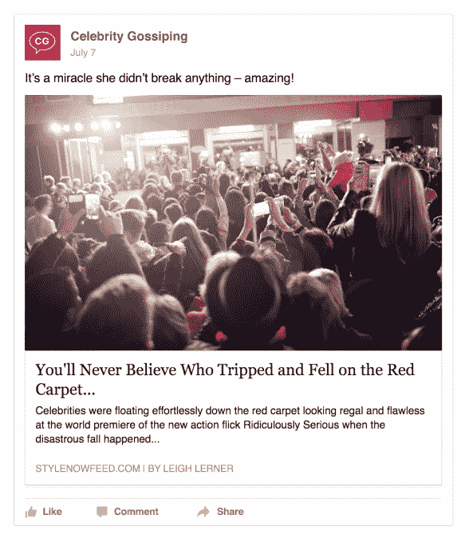

# 脸书 feed change fights clickbait 以 9 种以上语言发布帖子

> 原文：<https://web.archive.org/web/https://techcrunch.com/2017/05/17/facebook-anti-clickbait/>

脸书对新闻出版商的影响力可能令人担忧，但今天它很好地利用了自己的力量。这家社交网络正在国外与 clickbait 展开斗争，更加精确地了解它在新闻提要中降低哪些链接标题的排名，并开始降低个别帖子的排名，而不仅仅是网站域名和脸书页面。

这些更新是今日推出的新闻订阅算法变化 Facebookis [的一部分，该算法建立在 2014 年开始的](https://web.archive.org/web/20230404155745/https://newsroom.fb.com/news/2017/05/news-feed-fyi-new-updates-to-reduce-clickbait-headlines/)[和去年深化的](https://web.archive.org/web/20230404155745/https://techcrunch.com/2014/08/25/facebook-vs-clickbait/)英文标题上，反对隐瞒或夸大信息。

这些变化可能会减少新闻源的覆盖范围和点击诱饵发布者的推荐流量，从“你永远不会相信…”病毒式垃圾博客到有目的的骗子和垃圾邮件发送者。这也可以帮助脸书减少“虚假新闻”的盛行，自川普当选以来，“虚假新闻”已经成为一个主要问题。

关于对出版商的影响，脸书写道:

> “依赖 clickbait 标题的出版商应该预料到它们的发行量会减少。页面应该避免隐瞒理解文章内容所需信息的标题，以及夸大文章以制造误导的标题。如果一个页面停止发布点击诱饵和耸人听闻的标题，他们的帖子将不会受到这一变化的影响。”

现在，脸书可以检测德语、阿拉伯语、西班牙语、法语、葡萄牙语、意大利语、泰语、越南语、中文以及英语的点击诱饵标题，并对其进行排名。脸书新闻订阅产品经理 Greg Marra 告诉我，脸书选择了这些语言，因为它们是“世界上许多人常用的语言，我们希望选择可以帮助许多人的语言，而 clickbait 是一个特殊的问题。”

脸书将开始对其视为点击诱饵的个别帖子征收新闻供稿可见度降低税，而不仅仅是根据脸书页面或某个域的链接的整体覆盖范围来计算违规次数。

脸书将其归类为扣留信息并在新闻提要中降级的点击诱饵示例

最后，脸书将其之前的人工智能 clickbait 分类器分为两部分:一部分寻找夸大文章内容的标题，另一部分保留这些信息。

为了建立这些，脸书首先让一组人分析了 10 种语言的数十万篇帖子，并确定哪些单词和短语在 clickbait 标题中使用得最多。然后，它使用这个数据集来训练两个人工智能分类器，这两个分类器现在可以自动扫描每天分享到脸书的数百万个链接，并对新闻提要中点击量大的链接进行降级。

一个令人担忧的问题是，讽刺和头条新闻可能会被卷入这场拖网中。当被问及这个问题时，马拉说“人们更喜欢以更直截了当的方式写的标题”，这表明让人们点击的笑话可能会被取消。

在过去的几个月里，脸书一直在积极地对新闻提要的算法进行修改，可能是希望摆脱它是虚假新闻推动者的形象。这使得[报告误导或虚假内容](https://web.archive.org/web/20230404155745/https://newsroom.fb.com/news/2016/12/news-feed-fyi-addressing-hoaxes-and-fake-news/) , [降职虚假和耸人听闻的帖子](https://web.archive.org/web/20230404155745/https://techcrunch.com/2017/01/31/facebook-authentic-news/),[减少了垃圾广告网站的推荐流量](https://web.archive.org/web/20230404155745/https://techcrunch.com/2017/05/10/facebook-fights-foot-fungus-ads/)。它还发布了关于国家支持的虚假信息的[报告](https://web.archive.org/web/20230404155745/https://techcrunch.com/2017/04/27/facebook-announces-plan-to-fight-misinformation-campaigns/)以及如何与之斗争，将[虚假新闻发现提示](https://web.archive.org/web/20230404155745/https://techcrunch.com/2017/04/06/facebook-puts-link-to-10-tips-for-spotting-false-news-atop-feed/)放在新闻提要的顶部，将[放在报纸](https://web.archive.org/web/20230404155745/https://techcrunch.com/2017/04/14/facebook-runs-full-page-newspaper-ads-against-fake-news-in-france-ahead-of-the-election/)上，开始与外部[事实审查员合作，为可疑帖子添加警告标签](https://web.archive.org/web/20230404155745/https://techcrunch.com/2016/12/15/facebook-now-flags-and-down-ranks-fake-news-with-help-from-outside-fact-checkers/)，并且[聘请前《纽约时报》产品副总裁 Alex Hardiman](https://web.archive.org/web/20230404155745/https://techcrunch.com/2017/05/01/alex-hardiman-facebook-fake-news/) 管理脸书的新闻产品。

今天的更新很重要，因为当人们被脸书上的 clickbait 标题烧伤时，他们可能会变得不太可能访问新闻提要或点击他们在那里看到的链接。这可能会减少广告点击量和合法的推荐流量，而这些正是脸书的优势所在。

通过这种方式，脸书的无处不在、规模和影响力可能允许它单枪匹马地帮助清除互联网上最普遍的祸害之一。虽然这种中央集权可以让它压制初创公司，颠覆新闻业的商业模式，并以令人不安的方式动摇隐私规范，但至少在这里它可以产生积极的影响。