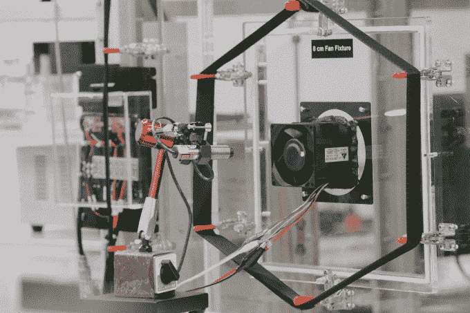

# 走进脸书新的“404 区”硬件实验室 

> 原文：<https://web.archive.org/web/https://techcrunch.com/2016/08/03/facebook-area-404/>

脸书将在这里制作太阳能无人机、互联网激光、虚拟现实耳机和下一代服务器的原型。

比大多数公司走得更快的问题是，每当脸书不得不外包其小工具和小发明的原型制作和测试时，都会受到延迟的困扰。在其 10 年路线图上有如此多的硬件，并且一个季度又一个季度的利润累积，在其门洛帕克总部建立一个专用实验室是有意义的。

***看看我们在旅途中看到的:[“来自脸书‘404 区’疯狂科学实验室的 40 张照片”](https://web.archive.org/web/20230111211751/https://techcrunch.com/gallery/facebook-hardware-lab/)***

脸书的 10 年路线图包括无人机、卫星、激光、电信基础设施、虚拟现实耳机和增强现实硬件，这些都将在 404 区进行原型制作

所以昨天，脸书让一群记者第一次看到了 404 区的内部。

404 区挤满了巨大、昂贵、危险的机器，如电脑控制的 9 轴钻，是脸书为数不多的几个马克·扎克伯格不允许进入的房间之一。尽管脸书为其硬件工程师提供了所有的预防措施、认证和培训，但它还是太不安全了。

幸运的是，脸书严格遵守 5S 安全体系——分类、有序、闪亮、标准化和持续。每一件工具都放在一个贴有标签的正方形胶带里。实验室的 CNC 模型制造商之一斯潘塞·伯恩斯解释说，如果找不到工具，脸书就无法快速前进。

脸书的工程和基础设施主管杰伊·帕里克告诉我，这个 22000 平方英尺的空间以“找不到”的错误代码命名为 404 区。脸书的工程师们一直需要制作新硬件设备的原型，但不幸的是，在脸书“找不到”所需的资源。

在提出了足够多的要求后，脸书在总部 17 号楼挖了一堆办公室，将巨大的支撑柱钻到岩床来支撑重型机器，并将这个空间变成了一个闪闪发光的白色未来主义黑客中心。

[https://web.archive.org/web/20230111211751if_/https://www.youtube.com/embed/sGb2uJQUxYg?feature=oembed](https://web.archive.org/web/20230111211751if_/https://www.youtube.com/embed/sGb2uJQUxYg?feature=oembed)

视频

这是从脸书在物理世界的修补开始的巨大升级。“我们的第一个硬件实验室就像旧收发室里的一张桌子那么大，”Parikh 笑着说。他最喜欢新实验室的哪个部分？放大 10，000 倍的电子显微镜，用于检查硬件中微小的故障。9 个月前，在脸书机械和动力经理米卡勒·格里夫斯的监督下，工程开始动工，现在第一批队伍正在进驻。

杰伊·帕里克解释了为什么脸书需要一个硬件实验室

Parikh 解释说，区域 404 有两个主要目标:

1.  创建一个足够大的协作空间，让全公司的硬件工程师聚在一起解决共同的问题
2.  建立一个最先进的硬件实验室，配备必要的设备对脸书即将推出的产品的早期设计进行原型制作和失败测试

两者都将缩短脸书从设备概念到工作原型然后大规模生产的时间。在弱连接下测试应用程序的 Internet.org 连接团队，Oculus VR squad，脸书神秘的新 Building 8 先锋技术部门，以及建造服务器和数据中心的基础设施团队，现在可以在一个共享的家中相互交流想法。实验室有 50 个工作台来容纳他们。

在实验室里，我们看到了各种东西，从 3D 设计软件建模站到计算机控制的车床和铣床，用于将金属锻造成原型，再到用于检查设备内部错误的 MRI 机器。实验室的一半用于电气工程实验，另一半用于成型、切割和弯曲金属的原型制作车间，以及在必要时处理木材、石头或玻璃。

这里会建什么？数据基础设施，如脸书的开放式机架网络交换机 [Wedge](https://web.archive.org/web/20230111211751/https://code.facebook.com/posts/681382905244727/introducing-wedge-and-fboss-the-next-steps-toward-a-disaggregated-network/) ，其 [Open Vault](https://web.archive.org/web/20230111211751/http://www.opencompute.org/projects/open-vault-storage/) 存储解决方案，以及其电信基础设施项目 [OpenCellular 平台](https://web.archive.org/web/20230111211751/https://code.facebook.com/posts/1754757044806180/introducing-opencellular-an-open-source-wireless-access-platform/)的传感器。连通性实验室发明，如 [Terragraph wifi 节点](https://web.archive.org/web/20230111211751/https://techcrunch.com/2016/04/13/terragraph/)和[项目白羊座天线](https://web.archive.org/web/20230111211751/https://code.facebook.com/posts/1072680049445290/introducing-facebook-s-new-terrestrial-connectivity-systems-terragraph-and-project-aries/)，以及刚刚首次成功试飞的 [Aquila 太阳能无人机](https://web.archive.org/web/20230111211751/https://techcrunch.com/2016/07/21/faceplane/)的部件。此外，Oculus 将开发未来版本的 [Rift 耳机](https://web.archive.org/web/20230111211751/https://techcrunch.com/2016/03/28/review-the-oculus-rift/)和[Surround 360°相机](https://web.archive.org/web/20230111211751/https://techcrunch.com/2016/07/26/if-you-source-it-they-will-build/)。

404 区不是万能的。这里没有焊接工具，也不会自己加工电路板。当设备准备好进行大规模生产时，在 404 区建造的原型将被送到别处进行复制。在这一点上，不应该有任何额外的来回迭代的必要。所有的问题都会在总部解决。

[gallery ids="1363233，1363255，1363253，1363251，1363249，1363246，1363243，1363242，1363238，1363237，1363235，1363234，1363229，1363252"]

硬件对脸书来说并不是新的尝试。它在西雅图有一个 Oculus 中心，在英国有一个飞机库，供其 Aquila 无人机使用。但是有了 Area 404，它可以将它在物理世界中的创造提升到与推动脸书在软件世界中成功的创造和迭代相同的速度。

**通过查看我们的图片，您可以亲自游览 404 区:[“脸书疯狂科学实验室的 40 张照片”](https://web.archive.org/web/20230111211751/https://techcrunch.com/gallery/facebook-hardware-lab/)**