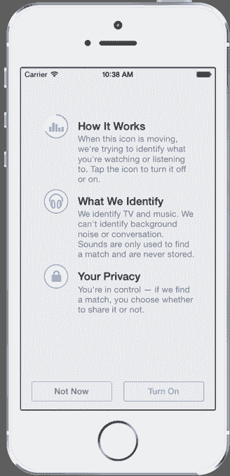

# 脸书增加了 Shazam 风格的音频识别功能，帮助您自动为帖子添加电视节目和歌曲标签

> 原文：<https://web.archive.org/web/https://techcrunch.com/2014/05/21/facebook-audio-id/>

在与 Twitter 的战斗中，脸书有了一个新的武器来主持关于媒体的有利可图的对话。iOS 和 Android status composer 的一个 [Shazam 风格的选择加入功能](https://web.archive.org/web/20230305215514/http://newsroom.fb.com/news/2014/05/a-new-optional-way-to-share-and-discover-music-tv-and-movies/)可以激活您手机的麦克风，识别您正在观看的电视节目或正在收听的歌曲，并将其标记在您的新闻订阅帖子中。然后，朋友们可以试听 30 秒钟的歌曲，或者看到电视节目页面的链接。

脸书在去年从零开始建立了音频识别功能，并将在未来几周内推广到美国的 iOS 和 Android 用户。这是去年推出的[情感和活动分享选项](https://web.archive.org/web/20230305215514/https://techcrunch.com/2013/01/30/facebook-visual-sharing/)的扩展，位于状态编辑器的小表情图标中。脸书表示，有 50 亿个帖子使用了这个选项来分享你的感受(兴奋、疲惫)、所做的事情(喝咖啡、打篮球)或你喜欢的媒体。很快，由于音频 ID，最后一种活动类型将更容易分享，因为你不必知道歌曲或节目的名称，也不必输入它。

如果用户不打开它，他们的脸书体验不会有任何改变。但如果他们这样做了，当他们打开 status composer 时，他们会看到一个小小的音量指示器，它可以识别 160 个频道(仅限美国)上百万首歌曲或电视节目中的任何一个。歌曲或表演将会出现在你可以选择的活动列表中，只需点击一下就可以添加到帖子中。

得益于 Spotify、Rdio 和 Deezer 的 API，用户将能够在脸书新闻订阅中听到朋友在线分享的歌曲的 30 秒音频预览。许可问题限制了播放视频预览的能力，所以脸书只显示了季节和剧集编号、缩略图以及该剧脸书页面的链接。

我试用了这个功能，它能够快速识别流行歌曲、电视节目，如《权力的游戏》，甚至是直播电视，如美国消费者新闻与商业频道的《闭幕钟声》——有时只有六秒钟。脸书还表示，它可以识别直播体育——这是社交媒体订阅中的一个热门话题，现在可能会更加流行。一个缺点是脸书的歌曲数据库仍然有限，无法识别更多模糊的曲目。它也无法检测你通过手机耳机播放的内容，只能检测你听到的内容，除非你使用的是默认的 iPhone 或 Android 音频播放器。所以，不要给你在公交车上默默听的 Spotify 歌曲贴标签。

这一推出可能会给音频 ID 重量级人物 SoundHound 和行业领导者 Shazam 带来麻烦，Shazam 现在拥有 9000 万用户，刚刚筹集了 300 万美元，使其总资金达到 9500 万美元。当人们发现“收音机里这首很棒的歌曲叫什么名字”后，这些应用程序的一个常见用例是分享到社交网络。在这里，脸书省去了中间人，把功能放在世界上最普遍的应用之一。然而，Shazam 拥有超过 2500 万首歌曲的索引，这意味着它更有可能找到异国情调的歌曲。

下面你可以看到一个来自脸书的视频演示，演示其音频 ID 功能是如何工作的:

```
如果用户打开并使用这一功能，audio ID 可以鼓励更多人在脸书而不是其他地方讨论音乐和电视。Twitter 长期以来一直是关于电视和其他时事的谈话之王，但脸书一直在寻求窃取这一桂冠。去年，脸书推出了[标签](https://web.archive.org/web/20230305215514/https://techcrunch.com/2013/06/12/facebook-hashtag/)、[验证简介](https://web.archive.org/web/20230305215514/https://techcrunch.com/2013/05/29/facebook-unveils-verified-pages-and-profiles-takes-a-page-from-twitters-playbook/)和[可嵌入帖子](https://web.archive.org/web/20230305215514/https://techcrunch.com/2013/08/21/embed-facebook-posts/)，此外，它还收购了公共体育数据过滤器[sports stream](https://web.archive.org/web/20230305215514/https://techcrunch.com/2013/12/17/facebook-acquires-sportstream/)，并为电视新闻和其他媒体渠道开放了[新的数据可视化 API](https://web.archive.org/web/20230305215514/https://techcrunch.com/2014/04/30/facebook-visualization/)。
这场斗争在一定程度上是为了帮助用户围绕媒体建立联系，这可以激发热情的辩论和参与。但是做数码饮水机也能赚很多钱。脸书和 Twitter 都想主持这场对话，因为它为他们提供了媒体人消费的货币化数据。然后，它可以使用这些目标数据来哄骗大型电视工作室、电影制片人和唱片公司购买广告活动。
当收到该功能的产品经理 Aryeh Selekman 的演示时，我一直在想“哇，我打赌 Twitter 希望它能想到这一点。”当我脱口而出时，塞勒曼和随行的公关代表忍不住发出一轮胜利的笑声，但拒绝发表评论。
如果 Twitter 真的想拥有媒体的公共讨论，添加某种形式的音频 ID 将是明智的，无论是通过购买、建设还是合作。或许 Twitter 应该直接收购 Shazam。不过，这可能会很贵，这就是我说 Twitter 不应该收购 SoundCloud 的原因(显然也是它拒绝这笔交易的原因)。在脸书，一个共同敌人的崛起可能至少会促成 Twitter 和 Shazam 之间的合作。

“在广告方面，今天没有人能够直接瞄准这些帖子”，Selekman 说。然而，他承认“这肯定是我们已经考虑过的事情，并且将来可能会做。”例如，如果你发布你正在听碧昂斯的新专辑，有一天你可能会成为这位歌手新巡回演唱会的广告目标。
不过现在，脸书将把一首歌或一场演出被标记的次数记录传递给各自的艺术家或工作室。这包括用户拒绝分享的比赛。这些数据可以帮助乐队挑选他们的下一首单曲或者在电视广告中推荐什么歌曲。
音频 ID 是脸书在一个月内选择加入的第二个新功能，显示了对隐私的更强承诺。脸书能打开你手机的麦克风，这肯定会加剧人们对该公司正在窃听每个人的担忧。然而，脸书表示，它将只听歌曲和电视，而不是声音或其他背景噪音，并且不会存储任何录音。


自该功能于 2013 年 1 月推出以来，这些情感和活动帖子已经在脸书上被分享了 50 亿次

好的一面是音频 ID 可以解锁的新行为。塞勒曼告诉我，他很快就要结婚了，他正拼命说服他未来的妻子把迈克尔·杰克逊的《与你共舞》作为他们的第一支舞。他希望当客人不可避免地要去拍摄这一特殊时刻的照片或视频时，他们会使用脸书音频 ID 来标记他们的帖子，并附上这首歌的一小段，这样人们在阅读提要时会感觉更像他们在那里。

```