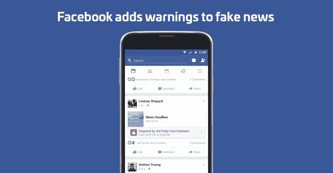

# 脸书用作者信息对抗假新闻，推出出版商上下文

> 原文：<https://web.archive.org/web/http://techcrunch.com/2018/04/03/facebook-author-info/>

# 脸书用作者信息打击假新闻，推出出版商上下文

红旗和“有争议的”标签只是巩固了人们对可疑新闻文章的看法，所以脸书希望给读者提供广泛的信息，让他们可以自己决定哪些是错误信息。脸书[将尝试显示链接](https://web.archive.org/web/20230404105858/https://newsroom.fb.com/news/2018/04/news-feed-fyi-more-context/)到一个记者的维基百科条目、其他文章和一个关注按钮，以帮助用户决定他们是否是一个合法的新闻来源。如果作者的出版商实施了脸书的作者标签，当用户在即时文章中点击作者的名字时，测试将显示给美国的一部分用户。

与此同时，脸书正在向美国的每个人推出其从 10 月开始的测试，即[通过显示他们的维基百科页面的链接、关于同一主题的相关文章、文章被分享的次数和地点，以及一个在“关于这篇文章”按钮中关注出版商的按钮，为读者提供更多关于出版物](https://web.archive.org/web/20230404105858/https://techcrunch.com/2017/10/05/facebook-article-information-button/)的背景信息。脸书也将开始显示朋友是否分享了这篇文章，以及出版商最近其他文章的快照。

由于这种环境的大部分可以通过算法生成，而不是依赖于人的事实检查，该系统可以更快地扩展到世界各地的不同语言和位置。

这些举措旨在让人感觉政治中立，以防止脸书被指责有偏见。在前承包商报告他们在 2016 年压制了脸书的保守趋势话题后，脸书因所谓的自由主义偏见而受到了很大的批评。这导致它在 2016 年总统大选前打击假新闻时犹豫不决……然后在接下来的两年里应对允许错误信息泛滥的反弹。

脸书与外部事实审查员的合作，看到红色争议旗帜被添加到被揭穿的文章中，实际上适得其反。那些同情虚假叙述的人将红旗视为荣誉的徽章，点击和分享任何方式，而不是让别人告诉他们他们错了。

这就是为什么今天的推出和新的测试从来没有直接面对用户关于一篇文章、出版商或作者是否在传播假新闻。相反，脸书希望建立一堵证据墙来证明消息来源是否可靠。

如果其他出版物有类似的帖子，出版商或作者有很好的维基百科文章来支持他们的诚信，如果出版商的其他文章看起来合法，用户可以得出自己的结论，他们值得相信。但是，如果没有维基百科的链接，其他出版物反驳它们，没有朋友分享它，出版商或作者的其他文章看起来也有问题，脸书可能会接受读者应该持怀疑态度的想法。