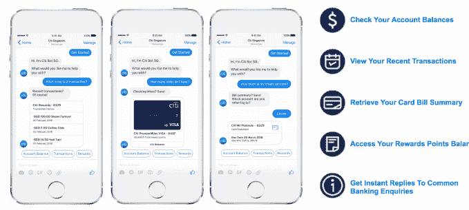
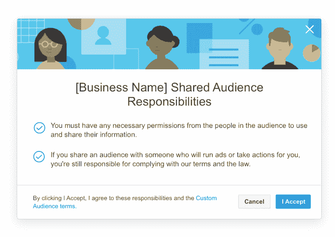

# 脸书监听银行，但聊天机器人不会像 Google TechCrunch 那样购买数据

> 原文：<https://web.archive.org/web/https://techcrunch.com/2018/08/06/facebook-banking/>

今天早上，脸书对金融服务的渴望被《华尔街日报》的一篇报道夸大了，这篇报道忽略了社交网络已经与银行合作的方式。脸书发言人 Elisabeth Diana 告诉 TechCrunch，它没有要求银行提供信用卡交易数据，也没有兴趣建立一个专门的银行功能，让你可以与你的账户互动。该公司还表示，其与银行的合作不是为了收集数据以增强广告针对性，甚至也不是为了个性化内容，比如你根据在别处购买的东西看到了哪些市场产品。

取而代之的是，脸书已经允许新加坡花旗银行的客户连接他们的账户，这样他们就可以 [ping 他们银行的聊天机器人](https://web.archive.org/web/20230101074259/https://www.citibank.com.sg/gcb/otherservices/citibot.htm)来查看他们的余额，报告欺诈行为，或者在他们的账户被锁定的情况下获得客户服务的帮助，而不必在电话上等待。聊天机器人的集成，没有人在另一端限制隐私风险，于去年宣布，[于今年 3 月推出。脸书与 PayPal 在 40 多个国家合作，让用户通过 Messenger 获得购物收据。](https://web.archive.org/web/20230101074259/https://sbr.com.sg/information-technology/more-news/citi-singapore-launches-facebook-messenger-chatbot)

将这些合作关系扩展到更多的金融服务提供商，可以通过增加 Messenger 的便利性来促进其使用，并使其更像一个类似于中国微信的集中化工具。但脸书目前与银行的关系不太可能在广告定位能力方面产生巨大变化，从而大幅提高其盈利预期。今天的新闻与华尔街日报的报道引发的 3.5%的股价上涨不一致。

“《华尔街日报》最近的一篇报道错误地暗示我们正在主动向金融服务公司索要金融交易数据，这是不真实的。像许多有商业业务的在线公司一样，我们与银行和信用卡公司合作，提供客户聊天或账户管理等服务。戴安娜告诉 TechCrunch:“账户链接使人们能够在 Facebook Messenger 中接收实时更新，人们可以跟踪他们的交易数据，如账户余额、收据和运输更新。”“我们的想法是，与银行沟通比在电话中等待更好，而且这是完全自愿的。除了实现这些类型的体验之外，我们不会将这些信息用于广告或任何其他用途。这些合作关系的一个关键部分是保护人们的信息安全。”

戴安娜说，银行和信用卡公司也就潜在的合作关系与它进行了接触，而不仅仅是华尔街日报报道的反过来。她说，来自这些会谈的任何功能都是自愿加入的，而不是在用户背后发生的。这位发言人强调，只有在隐私安全的情况下，这些整合才会被建立。例如，注册使用花旗银行 Messenger 聊天机器人需要通过手机进行双重认证。

但在剑桥分析公司(Cambridge Analytica)丑闻发生后，许多人指出脸书在隐私方面的不良记录，人们被骗自愿提供他们和他们朋友的个人信息，这引发了人们对该国与银行打交道的兴趣。脸书还没有像 LinkedIn、易贝、雅虎(TechCrunch 母公司的一部分)和其他公司那样遭遇数据被彻底窃取的重大传统数据泄露事件。但是用户有理由不愿意看到脸书接收更多的敏感数据，因为他们担心这些数据可能会泄露或被滥用。

脸书最近[打击了](https://web.archive.org/web/20230101074259/https://techcrunch.com/2018/03/28/facebook-will-cut-off-access-to-third-party-data-for-ad-targeting/)利用数据经纪人吸引公众并购买数据集用于广告定位的行为。它不再允许数据经纪人上传用户联系信息或超级合作伙伴类别的托管定制受众列表，以便根据兴趣定向广告。它还更坚决地要求广告商必须得到用户的同意，这些用户的电子邮件地址或电话号码是 T4 上传的，用于定制受众定位，尽管脸书很少核实这种同意，广告商仍然可以从经纪人那里购买数据集并自己上传

脸书今天的声明显示出比谷歌更多的顾忌，谷歌去年与数据经纪人达成了广告测量数据交易，这些数据经纪人拥有美国 70%的信用卡和借记卡交易的[。这](https://web.archive.org/web/20230101074259/https://www.washingtonpost.com/news/the-switch/wp/2017/05/23/google-now-knows-when-you-are-at-a-cash-register-and-how-much-you-are-spending/?utm_term=.1bba16e3872e)[导致电子隐私信息中心向联邦贸易委员会提出正式投诉](https://web.archive.org/web/20230101074259/https://arstechnica.com/tech-policy/2017/07/group-wants-ftc-to-curtail-googles-linking-online-searches-to-in-store-shopping/)。[更正:谷歌告诉我们，这些交易是针对广告测量数据，而不是我们最初发布的广告定位。它只学习匿名的总购买价值，而不是购买的物品，并且数据是加密的。]

《剑桥分析》开启了一个迟到的时代，对隐私和互联网巨头如何使用我们的数据进行审查。被忽视的、被接受为行业标准的或者仅仅被视为做生意的方式的实践正受到抨击。互联网用户不太可能逃避广告，由于深度定位数据，一些人更愿意看到那些他们认为相关的广告。但是，我们的线下购买行为和线上身份的结合似乎引发了使用 cookies 来跟踪我们的网络浏览和购买的网站所没有的骚动。

脸书可能最好远离任何涉及敏感数据的事情，如检查账户余额，直到剑桥分析公司(Cambridge Analytica)平息下来，并证明其新的责任感转化为更安全的社交网络。但至少目前，它没有大量吸收我们的银行数据。