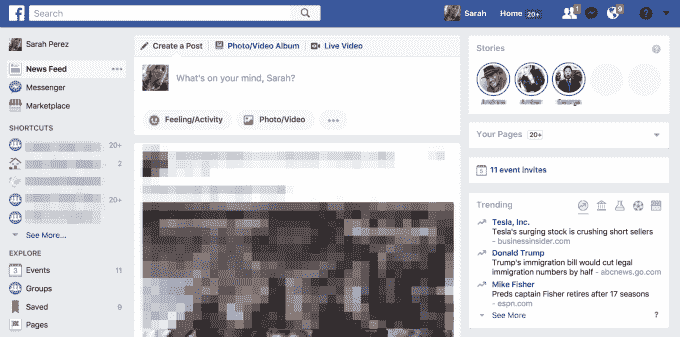

# 脸书开始在桌面上测试故事 

> 原文：<https://web.archive.org/web/https://techcrunch.com/2017/08/03/facebook-begins-testing-stories-on-the-desktop/>

好消息，伙计们。脸书故事，不要脸的 Snapchat 克隆版本，位于脸书手机应用程序的新闻订阅上方，现在正推出到脸书的桌面网站。在这里，故事功能不再位于页面顶部，而是位于右侧，这样至少不会太碍眼。当光标悬停在 Stories 模块上时，会出现一个小问号图标，它将解释该功能的用途。

解释简单地说，故事由照片和视频组成，在消失前 24 小时可见。

脸书向 TechCrunch 证实，在桌面上推出 Stories 仍被视为一项测试，但指出预计很快会有更大范围的推出。

在 Instagram 上看到它的成功后，该公司选择将故事带到脸书，故事于 2016 年夏天在 insta gram 上首次亮相[。](https://web.archive.org/web/20221221100625/https://techcrunch.com/2016/08/02/instagram-stories/)

在最初的五个月里，Instagram Stories [飙升至 1.5 亿日活用户](https://web.archive.org/web/20221221100625/https://techcrunch.com/2017/01/25/facebook-stories/)。相比 Snapchat 的 1.66 亿用户，它现在拥有 2.5 亿每日用户。在过去的一个月里，Instagram 上有一半的企业创造了一个故事，[脸书也在本周宣布，](https://web.archive.org/web/20221221100625/https://techcrunch.com/2017/08/02/instagram-stories-anniversary/)insta gram 的平均使用时间已经攀升至 25 岁以下的人每天 32 分钟，25 岁及以上的人每天 24 分钟。

《T4》于 2017 年初登陆脸书,首先在爱尔兰，然后扩展到包括美国在内的其他国家

该公司称赞 Snapchat 开创了视觉交流形式，但认为转向故事不仅仅是简单地复制竞争对手的流行应用。就像脸书的新闻订阅一样——一种后来成为社交应用标准的格式——故事是一种新的分享方式。这导致这种格式在整个行业被广泛采用。

脸书自己也在 Instagram、Messenger 及其旗舰应用程序中添加了故事。它甚至在 WhatsApp 中尝试了类似故事的功能。在其他地方，Stories 正在启发其他顶级应用的重新设计，[包括最近的 Tinder](https://web.archive.org/web/20221221100625/https://techcrunch.com/2017/07/18/with-new-tappable-gestures-tinders-photos-become-more-like-stories/) 、 [Match](https://web.archive.org/web/20221221100625/https://techcrunch.com/2017/06/27/dating-apps-are-embracing-video/) 和 [Skype](https://web.archive.org/web/20221221100625/https://techcrunch.com/2017/06/01/skypes-snapchat-inspired-makeover-puts-the-camera-a-swipe-away-adds-stories/) 。

然而，在脸书，这一功能并没有受到太多关注。

事实上，在脸书的移动应用程序上使用故事的人非常少，以至于该公司在 4 月份开始显示你最常联系的朋友的灰色图标，而不是没有人使用的故事功能的空白处。

目前还不清楚将脸书的故事带到桌面网站是否会对其使用产生重大影响。也许，毕竟，用户想要发布这种短暂内容的地方就这么多，目前，人们选择了 Instagram。人们不禁会想，脸书会在什么时候承认这一点，转而选择将 Instagram 上的故事切换或同步到脸书的故事功能上。

脸书还没有确认有多少比例的用户在桌面上看新闻，但这并不普遍。但是，我们知道美国以外的用户会看到该模块