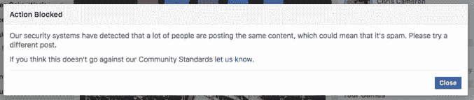
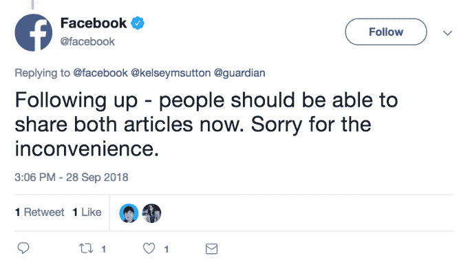

# 脸书阻止用户发布一些关于其安全漏洞的故事

> 原文：<https://web.archive.org/web/https://techcrunch.com/2018/09/28/facebook-blocks-guardian-story/>

# 脸书阻止用户发布一些关于其安全漏洞的故事

一些用户报告说，他们无法发布今天关于影响 5000 万脸书用户的安全漏洞的大新闻。这个问题似乎只影响到来自某些媒体的特定报道，目前一篇来自[《卫报》](https://web.archive.org/web/20230307140201/https://www.theguardian.com/technology/2018/sep/28/facebook-50-million-user-accounts-security-berach)和一篇来自[美联社](https://web.archive.org/web/20230307140201/https://apnews.com/65986276c04449ffb3e795ce0eef29d4)，这两家媒体都享有盛誉。

当将这个故事分享到他们的新闻订阅源时，一些用户，包括 TechCrunch 的工作人员，他们能够复制这个错误，却遇到了以下错误信息，这使得他们无法分享这个故事。

根据这条消息，脸书将这些故事标记为垃圾邮件，因为它们被广泛分享，或者如消息所述，系统观察到“许多人都在发布相同的内容”

***更新:**根据[脸书的推特账户](https://web.archive.org/web/20230307140201/https://twitter.com/facebook/status/1045796897506516992)的更新，在引起关注后，这个漏洞似乎被解决了。我们仍然没有更多关于这种行为如何或为什么发生的官方信息。*

需要澄清的是，这不是一个脸书的内容版主坐在屏幕后面拒绝某个地方的链接，也不是该公司密谋反对用户传播致命的消息。这种情况是脸书的自动内容标记工具将合法内容标记为非法内容的又一个例子，在这种情况下称之为垃圾邮件。尽管如此，令人奇怪和难以理解的是，为什么这样的错误不会影响到社交平台上经常传播的许多其他故事。

这对于脸书来说绝不是第一次。众所周知，该平台的自动化工具——在社交网络中以前所未有的规模运行——有时会审查合法帖子，并标记良性内容,而无法检测骚扰和仇恨言论。我们已经联系了脸书，了解这种事情是如何发生的细节，但该公司似乎忙于当天的重大新闻。

虽然这不是什么特别新鲜的事情，但这是一个奇怪的怪癖——在这种情况下，考虑到坏消息影响到脸书本身，这看起来相当糟糕。