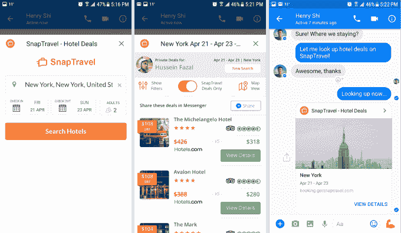
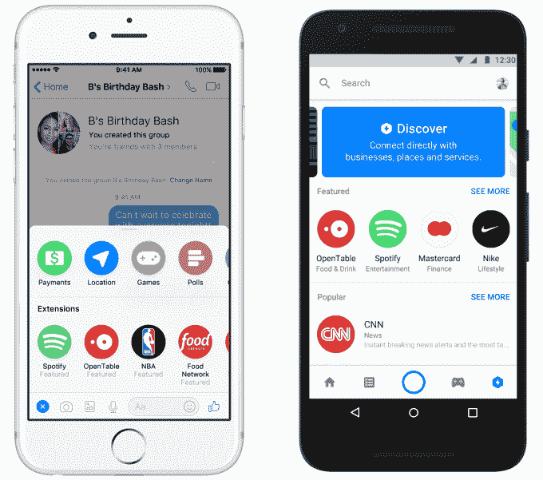
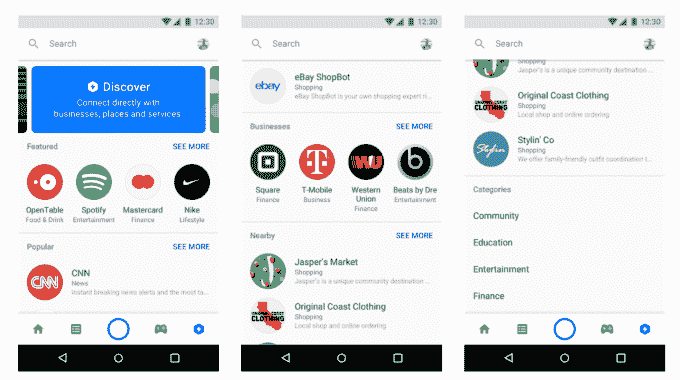

# Facebook Messenger 推出群组机器人和机器人发现标签

> 原文：<https://web.archive.org/web/https://techcrunch.com/2017/04/18/facebook-bot-discovery/>

脸书今天推出了两种强大的方式让人们找到信使机器人使用，解决了困扰该平台 10 万开发者的发现问题。

脸书新的[聊天扩展](https://web.archive.org/web/20230404155803/https://developers.facebook.com/docs/messenger-platform/guides/chat-extensions)可以让你在群聊中使用信使机器人，这样你就可以通过 theScore 的新闻自动收报机一起观看一场体育比赛的详细报道，合作建立一个 [Spotify 播放列表](https://web.archive.org/web/20230404155803/https://techcrunch.com/2017/04/18/spotify-is-launching-a-messenger-bot-for-sharing-song-clips-with-friends/)，确定你想和朋友住在哪个酒店，并通过 [SnapTravel](https://web.archive.org/web/20230404155803/https://www.getsnaptravel.com/) 预订，或者通过 Kayak 就预订航班达成共识。OpenTable、NBA、Food Network、WSJ 和其他开发者今天也在推出群组机器人。Apple Music 即将推出。

TechCrunch 上个月报道称，脸书将于今天在 F8 发布这些群体机器人。直到现在，机器人体验只是你和机器人。但是这给机器人看起来像人类带来了巨大的压力。聊天扩展让他们更像助手或收报机，而不是对话伙伴，更好地匹配了当今技术的可行性。

机器人发现新闻的第二大新闻是在 Messenger 上推出了一个[发现标签](https://web.archive.org/web/20230404155803/https://developers.facebook.com/docs/messenger-platform/discover)，人们可以在这里看到他们最近使用的机器人，浏览机器人类别，查看趋势体验或搜索特定的机器人。用户将能够在开始与机器人对话之前查看一个关于机器人做什么的预览屏幕。开发人员需要提交一个包含预览信息的表单，以包含在策划选项卡中。

最后，脸书正在扩展其 M Suggestions 功能，该功能使用人工智能来扫描您的对话，并推荐 Messenger 功能供您使用。m 现在将开始推荐来自外部开发者的机器人，这些机器人可以满足用户正在谈论的需求。例如，如果有人说“我们应该订购食物”，M 可以推荐 delivery.com 的机器人进行订购。

总之，这些可以通过群体病毒式传播给 Messenger 上的机器人更大的吸引力，并通过脸书的最佳选择给予其价值。这可能会吸引更多有声望的开发者加入这个平台。脸书去年推出了信使机器人，但用户很难找到好的；许多机器人让人们失望，因为它们依赖于不充分的人工智能，或者它们使用起来令人困惑。今天在脸书 F8 会议的舞台上，Messenger 负责人 David Marcus 说“我很高兴我们称它为测试版。”

脸书一直在试图改进机器人，让它们可以通过菜单导航，而不是文本命令。在 F8，Messenger 还推出了实体世界的二维码，可以在机器人内部打开特定的体验，以及更多帮助企业的功能。与此同时，像 SnapTravel 这样的机器人已经在 Messenger 中完成了价值 100 万美元的酒店预订，证明了聊天式商务正在开始发挥作用。

随着今天的更新，机器人开发者将有很好的理由通过流失率和缺乏用户理解来战斗。Messenger 上有 12 亿用户，有很多人可以尝试他们的机器人。