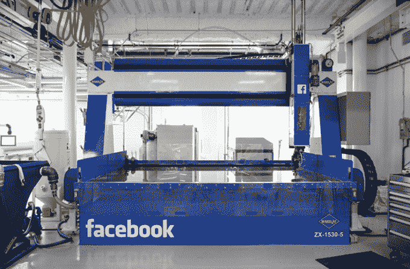

# 脸书正在为打字和皮肤听觉构建脑机接口

> 原文：<https://web.archive.org/web/https://techcrunch.com/2017/04/19/facebook-brain-interface/>

今天在 F8，脸书透露，它有一个由 60 名工程师组成的团队，致力于建立一个脑机接口，让你不用侵入性的植入物，只用你的思维打字。该团队计划使用光学成像每秒钟扫描你的大脑一百次，以检测你在脑海中无声的说话，并将其翻译成文本。

脸书 R&D 分部 8 号楼的负责人 Regina Dugan 向与会者解释说，他们的目标是最终让人们可以用意念以每分钟 100 个单词的速度打字，比打电话还快。

最终，脑机接口可以让人们用意念控制增强现实和虚拟现实体验，而不是屏幕或控制器。过去两天，脸书的首席执行官和首席技术官在 F8 探讨了这项“直接大脑接口”技术的细节。

## 大脑分型

"如果你能直接用大脑打字会怎么样？"[杜根问](https://web.archive.org/web/20230330034732/https://www.facebook.com/photo.php?fbid=343078196094625&set=a.122932358109211.1073741828.100011773423902&type=3&theater)。她展示了一个斯坦福大学瘫痪病人的视频，多亏了一个植入的传感器，他可以用思维打字。她继续解释脸书是如何在没有外科植入物的情况下做到这一点的。

Building 8 六个月前才开始研究大脑打字项目，但它现在正与加州大学旧金山分校、加州大学柏克莱分校、约翰霍普金斯医学院、约翰霍普金斯大学应用物理实验室和圣路易斯华盛顿大学医学院合作。研究人员专门从事解码语音和语言的机器学习，建立具有高级空间分辨率的光学神经成像系统和下一代神经修复术。

斯坦福大学的病人可以通过外科植入物用意念打字。脸书想要建造一个更快的非侵入性版本

计划是最终制造出可以大规模运输的非植入设备。为了压制这项研究将激发的不可避免的恐惧，脸书告诉我"这不是关于解码随机的想法。这是关于解码你已经决定分享的话语，把它们发送到你大脑的语言中心。”脸书把这比作你拍了很多照片，但只分享了其中的一部分。脸书说，即使有了这个设备，你也可以自由思考，但只能将一些想法转化为文本。

## 皮肤听觉

与此同时，8 号楼正在研究一种让人类通过皮肤听到声音的方法。它一直在构建硬件和软件的原型，让你的皮肤模仿你耳朵中的耳蜗，将声音转化为大脑的特定频率。这项技术可以让聋人通过绕过他们的耳朵来“听”。

脸书大学的一个工程师团队展示了使用一个调谐到 16 个频带的致动器系统通过皮肤进行听觉实验。一名受试者能够开发出一个九个单词的词汇，他们可以通过皮肤听到这些单词。

为了强调 Building 8s 读心术技术的重要性，杜根在演讲开始时说，她从未见过像智能手机这样强大的东西，“没有意想不到的后果。”她提到，如果我们不时地从手机上抬起头来，我们都会过得更好。但与此同时，她认为技术可以培养同理心、教育和全球社区。

## 8 号楼的大揭秘

脸书去年聘请杜根领导其秘密的新 8 号楼研究实验室。她之前曾负责谷歌的先进技术和产品部门，也曾是 DARPA 的负责人。

脸书用成吨的机械工程设备在其门洛帕克总部建造了一个特殊区域 404 翼，以帮助杜根的团队快速制作新硬件的原型。去年 12 月，它与斯坦福大学、哈佛大学、麻省理工学院等签署了快速合作协议，以获得学术界的援助。

然而直到现在，没有人真正知道 8 号楼是什么……大楼。[商业内幕](https://web.archive.org/web/20230330034732/http://www.businessinsider.com/facebooks-building-8-working-on-camera-augmented-reality-mind-reading-projects-2017-3?op=1)报道了 8 号楼[的工作列表](https://web.archive.org/web/20230330034732/http://www.businessinsider.com/facebooks-building-8-working-on-brain-computer-communication-platform-2017-1)并且它可能在 F8 炫耀新闻。

根据这些工作清单，脸书正在寻找一名脑机接口工程师“他将负责一个为期两年的 B8 项目，专注于开发先进的 BCI 技术。”职责包括“将机器学习方法(包括编码和解码模型)应用于神经成像和电生理数据。”它还在寻找一名[神经成像工程师](https://web.archive.org/web/20230330034732/https://www.facebook.com/careers/jobs/a0I1200000JXr3eEAD/)，该工程师将“专注于开发新型非侵入性神经成像技术”，将“设计和评估基于光学、射频、超声波或其他完全非侵入性方法的新型神经成像方法。”

埃隆·马斯克一直在开发自己的初创公司，名为 [Neuralink，用于创建大脑接口](https://web.archive.org/web/20230330034732/https://techcrunch.com/2017/03/27/elon-musks-neuralink-wants-to-boost-the-brain-to-keep-up-with-ai/)。

脸书 8 号楼 R&D 分部负责人雷吉娜·杜根

脸书以前也制造过硬件，并取得过成功。它制造了一款搭载 HTC 的 Android 手机，被称为第一款搭载 Facebook Home 操作系统的手机。失败了。自那以后，脸书已经将注意力从消费电子产品转移到了网络连接上。它已经建造了 [Terragraph Wi-Fi 节点](https://web.archive.org/web/20230330034732/https://techcrunch.com/2016/04/13/terragraph/)、[项目白羊座天线](https://web.archive.org/web/20230330034732/https://code.facebook.com/posts/1072680049445290/introducing-facebook-s-new-terrestrial-connectivity-systems-terragraph-and-project-aries/)、 [Aquila 太阳能无人机](https://web.archive.org/web/20230330034732/https://techcrunch.com/2016/07/21/faceplane/)和它自己的互联网接入倡议连接卫星——尽管当 SpaceX 运载它的车辆爆炸时，它在发射台上爆炸了。

脸书已经建造并开源了它的[环绕 360 摄像机](https://web.archive.org/web/20230330034732/https://techcrunch.com/2016/07/26/if-you-source-it-they-will-build/)。至于后端基础设施，它开发了一个名为 [Wedge](https://web.archive.org/web/20230330034732/https://code.facebook.com/posts/681382905244727/introducing-wedge-and-fboss-the-next-steps-toward-a-disaggregated-network/) 的开放式网络交换机，用于存储的[开放式保险库](https://web.archive.org/web/20230330034732/http://www.opencompute.org/projects/open-vault-storage/)，以及用于电信基础设施项目 [OpenCellular 平台](https://web.archive.org/web/20230330034732/https://code.facebook.com/posts/1754757044806180/introducing-opencellular-an-open-source-wireless-access-platform/)的传感器。最后，通过收购 Oculus，脸书已经建立了有线和移动虚拟现实耳机。

脸书的 404 区硬件实验室包含大量的机械工程和原型设备

但随着脸书的发展，它有资源和人才在硬件方面尝试新的方法。超过 18 亿用户连接到其主要的脸书应用程序，该公司有一个巨大的潜在实验对象漏斗。

今天的公告自然令人不安。听到一家小型创业公司开发这些先进技术，可能会联想到政府或企业集团有一天会读取我们的思想，以检测思想犯罪，就像 1984 年的*。无论扎克伯格和杜根如何试图将公司定位为仁慈和富有同情心的，脸书的规模都让未来看起来更有可能。脸书在建立安全卫士、独立监控和大脑接口技术如何建立和测试的透明度方面做得越多，公众就越容易接受。*

 *

一周前，脸书被批评为停止创新的 Snapchat 抄袭者。今天的演示似乎旨在消除这种争论，并让顶尖的工程人才来敲门。

“你想为开创给青少年戴上增强现实狗耳朵的公司工作，还是为开创用心灵感应打字的公司工作？”你什么都不用说。对脸书来说，思考可能就足够了。*