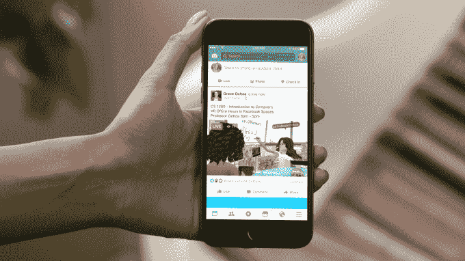

# 脸书将直播引入其 Spaces 虚拟现实应用 

> 原文：<https://web.archive.org/web/https://techcrunch.com/2017/07/12/facebook-brings-live-to-its-spaces-vr-app/>

# 脸书为其 Spaces 虚拟现实应用带来了直播

为了似乎结合今年的几个顶级技术趋势，脸书很快将允许其 Oculus Rift 虚拟现实系统的用户在虚拟现实中以虚拟形象的形式向他们的脸书朋友和粉丝直播自己。

脸书 Live 功能将在 Spaces 应用程序中实现，该应用程序仍处于测试阶段。用户将能够向他们所有的朋友直播，并可以放置一个虚拟摄像头来捕捉他们的体验。对于 streamer 来说，许多事情在传统的直播中看起来很熟悉，但像身体伸出来抓住评论以向观众展示这样的事情只有在 VR 中才有可能。

脸书空间可能只是首席执行官马克·扎克伯格对该公司虚拟现实 10 年愿景的预览，但随着 Messenger 视频通话和脸书直播已经进入该应用程序，很明显该公司不会回避在其更高的 VR 赌注和其中央 2D 服务之间建立一座桥梁，该服务目前拥有 20 亿用户。

不过，在每一个功能都出现在虚拟现实中之前，可能还需要一段时间。

“有些事情不会一一对应，但我认为在很多方面脸书有点像 2D·元宇宙，”脸书虚拟现实大师迈克·布斯告诉 TechCrunch。“这是一个由人、地点和事物组成的巨大网络，所以这是一个我们如何在虚拟现实中呈现这些事物以及我们如何让人们访问它们并与之互动的问题，但这也是一个巨大的网络，所以有很多事情需要解决和探索。”

对布斯来说，将脸书 Live 带到 Spaces 就像其他任何事情一样，是关于“福音传道”，让更多的朋友接触到应用程序和虚拟现实。

用户是否看到了像这样返回到一个特性的需要才是真正的问题；虚拟现实系统有一些非常显眼的设置，不像移动设备那样易于使用。看头像是有趣、古怪还是仅仅是噱头，这似乎是在几分钟的直播后可能会引起争论的事情，但对脸书来说，他们的虚拟现实战略涉及大量的试验和大量的潜在错误。