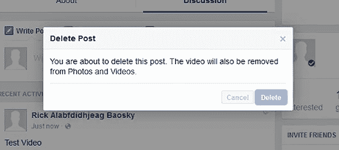

# 脸书 bug 会让任何人删除任何视频

> 原文：<https://web.archive.org/web/https://techcrunch.com/2017/01/23/facebook-bug-wouldve-let-anyone-delete-any-video/>

# 脸书臭虫会让任何人删除任何视频

欢迎收看另一集“昆虫赏金很有用！”。

还记得不久前的那个 bug[会让任何人删除你在脸书的照片](https://web.archive.org/web/20221005195511/https://beta.techcrunch.com/2015/02/12/this-bug-wouldve-let-anyone-delete-your-photos-from-facebook/)？事实证明，视频中也潜伏着类似的漏洞。

安全研究员[丹·梅拉梅德](https://web.archive.org/web/20221005195511/http://danmelamed.blogspot.ca/2017/01/facebook-vulnerability-delete-any-video.html)发现了现已修复的潜伏在脸书处理活动视频方式中的漏洞，并为他的发现赢得了一万美元。

**事情将如何发展的简短版本:**

1.  想要删除的人创建了一个脸书事件
2.  然后，他们会进入活动页面，开始上传视频
3.  当视频上传完成时，他们会使用 Fiddler 等浏览器工具来修改请求，具体来说，他们会将刚刚上传的视频的视频 ID 与他们想要劫持和删除的视频 ID 进行交换，然后发送请求。
4.  一旦修改后的请求通过，他们只需点击产生的事件帖子上的“删除帖子”按钮——然后 tada！他们的事件帖子*和*的原始视频都将被删除。

这是一个相对简单的错误——但是，对于像脸书这样庞大而复杂的代码库来说，这正是那种可能会被忽视很久的错误，也是那种在造成太大损害之前，赏金程序可以帮助发现的错误。挖这种东西？看看凯特·康格的[对国防部](https://web.archive.org/web/20221005195511/https://beta.techcrunch.com/2017/01/19/hacking-the-army/)如何拥抱昆虫奖励计划的探究。

同样的错误会让那些不务正业的人悄悄关掉视频评论，让上传者疑惑为什么这些该死的东西突然变得沉默了。

在你惊慌失措并开始无休止地刷新你的视频以确保它们都还在之前:这个错误已经被修复。梅拉梅德说，他在 2016 年 6 月 29 日报告了这个漏洞，几周后脸书就付给他 1 万美元的赏金。脸书向我证实，这个 bug 已经在 7 月份修复了。

[通过 [Gizmodo](https://web.archive.org/web/20221005195511/http://gizmodo.com/some-guy-figured-out-how-to-delete-any-video-on-faceboo-1791526536)

[https://web.archive.org/web/20221005195511if_/https://www.youtube.com/embed/GlY_I2ZnNt8?feature=oembed](https://web.archive.org/web/20221005195511if_/https://www.youtube.com/embed/GlY_I2ZnNt8?feature=oembed)

视频