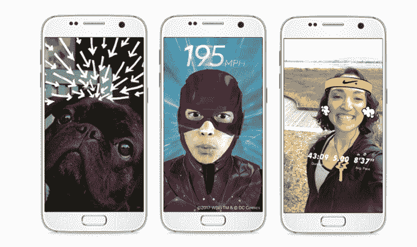
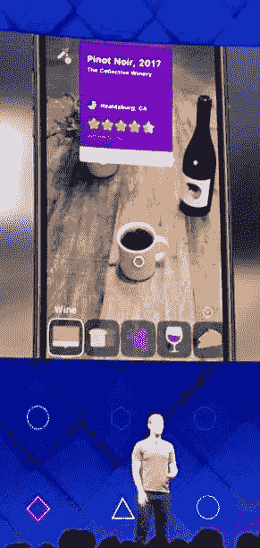
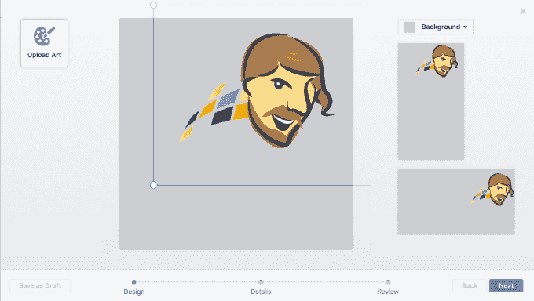
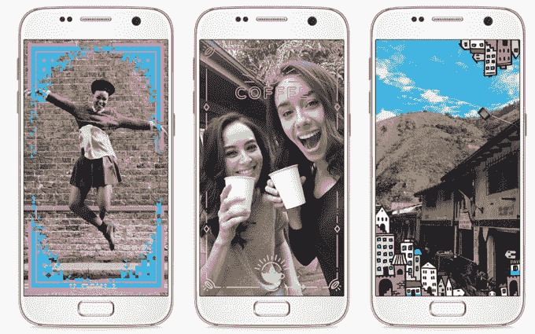
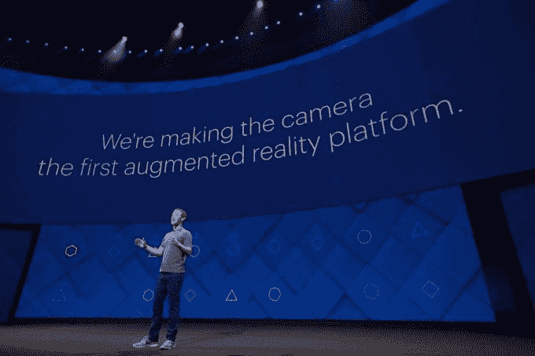

# 脸书推出增强现实相机特效开发平台 

> 原文：<https://web.archive.org/web/https://techcrunch.com/2017/04/18/facebook-camera-effects-platform/>

脸书将依靠一大批外部开发者为其新的相机特效平台贡献增强现实图像过滤器和互动体验。在今天的脸书 F8 会议之后，首批效果将在脸书的智能手机相机功能中提供，但相机效果平台的设计最终将与未来的增强现实硬件兼容，如眼镜。

虽然批评者认为脸书只是盲目地复制 Snapchat 在脸书、Messenger、Instagram 和 WhatsApp 上的最新故事和相机功能，[马克·扎克伯格告诉 TechCrunch](https://web.archive.org/web/20230202204449/https://techcrunch.com/2017/04/18/will-snap-copy-the-fb-platform/) 他的公司只是为今天的相机特效平台发布奠定基础。

脸书的相机效果平台提供物体识别

因为时尚、实惠的 AR 眼镜可能还需要几年时间，但每个人都已经有了拍照手机，扎克伯格告诉我"第一个成为主流的增强现实平台不会是眼镜，而是相机。"他表示，其他应用程序(如 Snapchat)一直在保留他们的增强现实体验创建工具，但“建立一个开放平台，我认为将是推动这一发展的重大进步之一。。。所有开发者都可以在[开放平台]上工作，这样你就不只是有 10 个或 20 个效果，而是有成千上万个。”

这也是我 8 月份关于为什么相机应该成为脸书下一个平台的想法背后的逻辑。开发者让脸书提供了更加多样化的体验。

[脸书现在允许开发者申请进入该平台的 AR 工作室工具](https://web.archive.org/web/20230202204449/http://go.facebookdevelopers.com/camera-effects-platform-signup.html)的封闭测试版。它将允许开发人员使用精确的位置、对象识别和深度检测来创建他们的效果。脸书的相机将能够识别特定的物体，如咖啡杯，并向用户显示相关的效果，如杯子冒出的蒸汽或咖啡中游动的鲨鱼。

与此同时，[任何人现在都可以使用 Frame Studio](https://web.archive.org/web/20230202204449/https://www.facebook.com/fbcameraeffects/home/#frameStudio) 上传简单的静态叠加图像滤镜，这些滤镜将出现在脸书相机中，展示给他们的朋友或粉丝。使用 Frame Studio 不需要编码知识，你只需上传一张图片，你的名字就会出现在 Frame 的预览和新闻订阅帖子上，给你加分。

脸书的画框工作室允许任何人创建一个图像过滤器

目前，脸书不允许任何品牌或广告，除非事先获得批准，尽管它最终会将该平台货币化，一位发言人表示，“在引入企业参与的付费方式之前，我们专注于让这款产品对人们来说很棒。”

## 增强现实内容的三个类别

扎克伯格设想 AR 体验分为三大类:用额外的信息增加现实世界中的物体，如在街道上放置方向或在他们的店面上放置餐馆的评论，将新的虚拟物体层叠到现实中，如棋盘或工作的电视，并用额外的效果增强已经存在的物体，如给你一个闪亮的胡子或给你的公寓楼添加一个城堡塔楼。

扎克伯格认为增强现实体验有三个方面(左起):叠加信息、添加虚拟物体和增强真实物体

扎克伯格告诉我，人们低估了 AR，“哦，很多人都在使用这些原始的工具，因为，我不知道，就像现在孩子们做的一样。”但他认为，随着必要的技术最终到来，开发者变得更有创造力，我们将做的不仅仅是在脸上添加假胡子。

开发者可以制作信息工具，如商业专家的叠加建议、互动游戏和令人费解的艺术，扎克伯格表示这些在现实世界中是不可能实现的。与此同时，用户将能够在不同的特定位置添加增强现实笔记，这样他们就可以告诉朋友他们在餐馆最喜欢的菜。

任何人都可以使用 simple Frame Studio 上传静态相机效果

开发人员可以使用三种输入来触发他们的增强现实效果:面部追踪器(但不是身份或面部识别)，传感器数据，如陀螺仪和位置，以及从其他应用程序中提取数据并实时响应用户输入的脚本 API。推出合作伙伴和经验包括曼联拉在足球比赛数据和“GOOAALL！”图像覆盖了人群噪音，而游戏开发商 EA 已经建立了一个以质量效果为主题的头盔面具，可以从你在游戏中的进度中获取数据。Nike 会在你的头上覆盖一个吸汗带，并把你最近的跑步路线作为一个覆盖地图拉进来。

AR 工作室开发者也可以为脸书直播制作效果，今天推出的效果包括一个覆盖的观众投票这个或那个功能和评论标签，这些标签展示了 Giphy 直播的动画 GIF，广播公司可以在屏幕上显示。

脸书 Live 的新增强现实效果可以通过相机效果平台的 AR 工作室工具来构建

## 扎克伯格对 AR 世界的愿景

目前，扎克伯格说，在脸书，“我们肯定认为自己更多的是在软件和服务方面。”幸运的是，照相手机上 AR 的下一阶段将不需要特殊的硬件。“我们不需要制造手机，因为手机已经在那里了。”然而他承认，“在任何平台的开始，硬件和软件都是不可分的，”所以当 AR 眼镜技术成熟时，脸书最终可能会自己制造。

在这一点上，扎克伯格的宏伟愿景将增强现实视为经济均衡器。“这种能力只需要眼镜或隐形眼镜，你就可以覆盖任何你想要的信息。。。我们可以把一台电视挂在墙上，让它成为一个 1 美元的应用程序，而不是一个很多人都买不起的 500 美元的硬件。 所以，如果这款眼镜的价格是 500 美元左右，那么与你必须购买的所有其他硬件相比，你可以省下一大笔钱。”

这就是增强现实与扎克伯格关于社区未来的 6000 字宣言融合的地方。他信中的一个方面讨论了自动化如何迫使一些人离开传统工作，进入更直接服务于社区和创作艺术的角色。AR 可以使后者更容易和更负担得起。

“我认为会有更多的人去工作，花更多的时间。。。扎克伯格告诉我:“与人交流，表达自己，做艺术。“我认为这与现实世界非常吻合，在现实世界中，我们将能够做的很多事情只是创造想法、制作想法并分享它们。在 AR 中，绘画是免费的。”

以前的计算平台是完全数字化的，任何连接到互联网的人都可以访问。但是现实世界是巨大的——甚至比脸书可以用增强现实体验填满的还要大。通过开放这个开发者平台，脸书不需要自己开发所有东西。虽然 Snapchat 可能已经在将 AR 带给消费者方面领先了一步，但脸书刚刚规划出它将如何进一步推进增强现实。