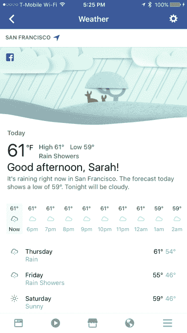

# 脸书现在可以取代你的天气应用了

> 原文：<https://web.archive.org/web/https://techcrunch.com/2017/02/08/facebook-can-now-replace-your-weather-app/>

脸书正在推出一个有用的新功能，将完整的天气预报放入其移动应用和桌面网站。该功能可从新闻源或移动应用程序的“更多”菜单访问，该菜单可将您链接到朋友、活动、群组、页面和其他关键的脸书功能，如“今天”或“已保存的项目”。在天气部分，你可以查看由 Weather.com 数据驱动的未来一周的完整天气预报。

脸书证实，这一新功能是其早期“天气问候”的更新版本，截至本周，已向全球约 95%的人口推出。

这不是脸书第一次在服务中引入天气信息。该公司几年前[增加了对事件和公共场所的预测](https://web.archive.org/web/20230227231829/https://techcrunch.com/2013/03/21/facebook-adds-weather-forecasts-to-events-and-public-places-in-quest-to-show-useful-info-where-people-need-it/)，最近[被发现在英国的新闻中测试天气更新](https://web.archive.org/web/20230227231829/https://thenextweb.com/facebook/2016/04/08/facebook-testing-weather-alerts-mobile-apps/)

一年前，脸书还在 News Feed 中推出了“天气问候”，这是一种简短的信息性天气更新，早上出现在你的 Feed 顶部。新功能是对那个功能的扩展。现在，您将在新闻提要的顶部看到类似的消息，并带有完整的五天天气预报链接。脸书告诉我们，这些新闻源“问候”将同时出现在桌面和手机上。

即使你错过了问候，你也可以访问应用程序中的天气部分，它作为一个新的菜单项存在。

此外，脸书现在将提供一个选项来设置接收天气报告的通知。该公司表示，通知和更详细的问候现在正在推出测试，所有这些更新将在本月底广泛提供。

天气部分将默认为您的当前位置，但您可以单击右上角的设置轮来添加您想要跟踪的其他位置，就像任何其他天气应用程序一样。您也可以选择以华氏或摄氏显示温度。

然而，一旦设置好，你就不能像在雅虎天气或苹果天气应用等典型应用中那样在多个位置之间滑动——相反，如果你想换到不同的位置，你必须返回到设置，然后点击你想查看的位置。

提供的天气信息相当基本——只有最高气温和最低气温，以及一般预报，如晴天、局部多云等。在天气页面的顶部，你还可以看到每小时的天气预报，这在今天的大多数天气应用程序中很常见。

天气预报的信息来自 Weather.com 的 API。该网站还链接在屏幕底部，上面写着“查看更多天气信息”，后面是一个图标，表明点击后会打开一个新窗口。

页面顶部可爱的卡通风格标题也会根据预测进行更新。例如，现在旧金山的一个雨天显示了一张躲在树下的鹿的照片。与此同时，纽约目前部分多云的天气显示绿色草地上有蓬松的云，一只鸟藏在灌木丛中。(见上图)。

这使得该功能感觉更个性化，更像脸书，因为该公司在新闻订阅信息中使用类似的图片已经有一段时间了。

这是脸书最近几天在其移动应用程序中推出的几个新书签之一，继有用的实用程序之后，如[其“Wi-Fi finder”，](https://web.archive.org/web/20230227231829/https://www.engadget.com/2016/11/22/facebook-testing-public-wifi/)，一个名为[“发现人”](https://web.archive.org/web/20230227231829/https://techcrunch.com/2017/02/01/facebooks-new-discover-people-section-wants-to-help-you-make-friends/)和现在的天气的新网络(甚至约会)部分。

表面上看，新功能的目标是通过向脸书用户提供他们原本需要在其他地方寻找的信息来留住他们，同时提供与当今其他第三方移动应用程序类似的体验。

然而，脸书说，这更多的是为了取悦用户。

“我们这样做是因为我们的目标是开发产品，将人们与他们最关心的事情联系起来，并在人们的一天中创造欢乐的时刻，就像简单地告诉你待会儿要下雨一样，”一位发言人说。

*感谢 TechCrunch 读者[何塞古铁雷斯](https://web.archive.org/web/20230227231829/https://twitter.com/nastybadhombre)的提示！*