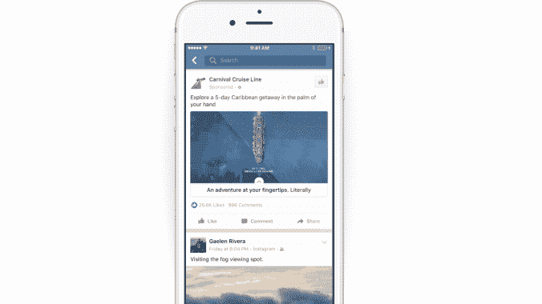
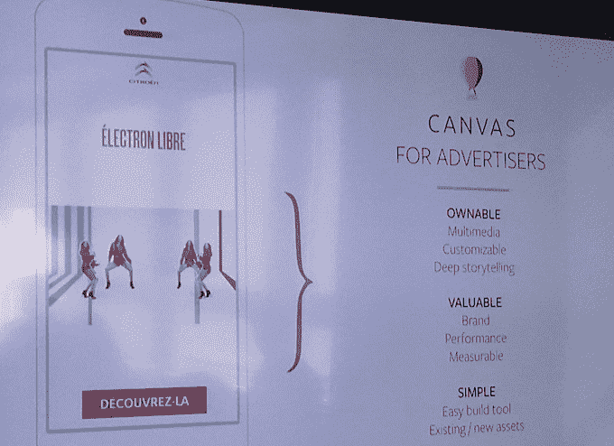
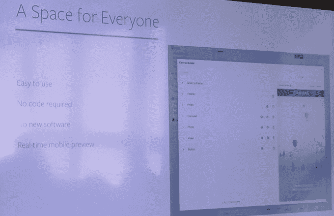
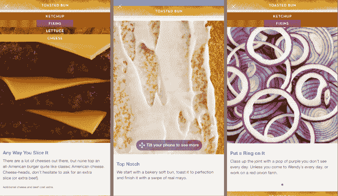
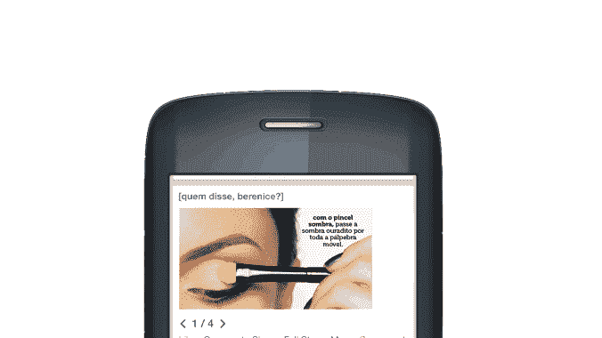

# 脸书正式推出画布广告，在应用程序 中加载全屏富媒体页面

> 原文：<https://web.archive.org/web/https://techcrunch.com/2016/02/25/facebook-canvas-ads/>

即时文章，遇见即时广告。脸书希望为广告商提供一种身临其境的方式来接触人们，而不会让他们离开社交网络。所以今天它正式为所有广告商推出了它的广告画布。当用户点击连接到 Canvas 的脸书新闻 Feed 广告时，它会在脸书打开一个全屏的富媒体页面，而不是强迫用户等待移动网站加载。

去年，脸书开始测试 [Canvas，我称之为](https://web.archive.org/web/20230406162037/https://techcrunch.com/2015/10/20/instant-ads/)广告即时文章。推动因素是移动网站的规模自 2011 年以来已经增长了两倍，导致 5 到 10 秒的加载时间，用户不想坐着看广告。人们真正记得的富媒体营销体验在手机上加载太慢了。因此，脸书将广告端点内置到自己的应用程序中，这样它就可以在大约一秒钟内预加载并显示广告。

Canvas 消除了低功耗移动网站对内容的限制。[脸书画布允许互动元素](https://web.archive.org/web/20230406162037/https://www.facebook.com/business/news/introducing-canvas)如动画、旋转木马、产品目录、倾斜观看图像和视频。在 iOS 和 Android 上，画布似乎链接到了来自新闻源的广告，脸书正在评估如何将这一功能扩展到 Instagram 等其他版本和应用程序。

品牌可以用自助工具制作画布广告。不需要任何代码。脸书的设计工具让他们只需拖动图像、gif、视频等，然后设置属性并开始显示他们的广告。脸书广告公司的高管马克·达西开玩笑说:“他们唯一不会做的事，真的，就是找借口。”

[广告主可以在这里注册使用 Canvas。](https://web.archive.org/web/20230406162037/https://www.facebook.com/help/contact/162497704112958)制作一个画布广告不需要额外的成本。企业只需一如既往地为相同的新闻源广告付费，但可以在他们领先的地方建立更好的目的地。就像普通的脸书广告一样，不同版本的画布可以针对不同的人群。

脸书说画布不会导致更多的脸书广告。用户可以通过一个向上的小箭头来识别画布广告，这表示全屏体验将会展开。

脸书说，对 Canvas 的早期测试表明，用户确实想留下来体验广告。53%打开画布的用户至少浏览了一半，平均浏览时间是惊人的 31 秒。顶部的画布广告可以看到每个用户超过 70 秒的观看时间。

在这个画布广告活动中，温迪解构了一个芝士汉堡，让人们滚动、滑动并查看不同配料的 gif，平均观看时间为 65 秒。2.9%的观众甚至一路看到底，使用了温蒂餐厅定位器。

通过广告讲故事一直是脸书最近的一大推动力，因为它试图从每个用户身上榨取更多收入，特别是发展中国家市场。去年，它推出了创意加速器，教品牌如何为慢速移动网络和功能手机制作广告，并推出了一种特殊的幻灯片广告格式，模仿视频，但加载速度很快。但是画布是光谱的另一端——第一世界的高带宽广告。

通过给广告客户更丰富的营销形式，它可以确保观众记住他们。虽然许多平台都在争夺广告收入，但没有一个平台在这些广告的目标上有所创新。由于 Canvas 不会让用户因为长时间的加载而感到沮丧，也不会诱使他们通过浏览器离开脸书，这个社交网络可以让他们在与朋友联系的同时四处走动，看到更多的新闻订阅广告。

安东尼·哈补充报道