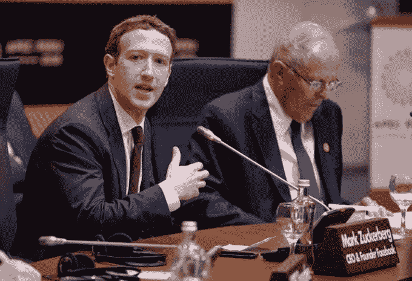
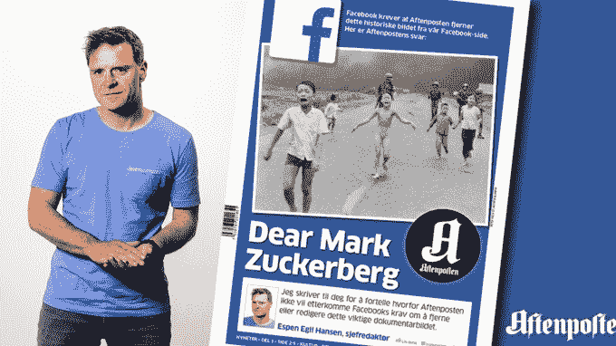

# 脸书请求就审查和恐怖主义等棘手问题发表意见

> 原文：<https://web.archive.org/web/https://techcrunch.com/2017/06/15/facebook-censorship-terrorism/>

脸书应该如何决定其社交网络上允许什么，以及如何在安全和真实与多样化的观点和文化规范之间取得平衡？对于它正在努力解决的最棘手的问题，脸书希望得到你的反馈，所以今天它[发布了](https://web.archive.org/web/20221230060124/https://newsroom.fb.com/news/2017/06/hard-questions/)一份七个“难题”的清单和一个电子邮件地址——[hardquestions@fb.com](https://web.archive.org/web/20221230060124/mailto:hardquestions@fb.com)——你可以在那里发送反馈和建议，以解决更多它应该解决的问题。

脸书的计划是发布博客文章，检查其围绕这些问题的逻辑，今天晚些时候从一篇关于应对网上恐怖主义蔓延以及脸书如何应对这一问题的博客文章开始。

[更新:这是脸书“难题”系列的第一篇文章，看看 T4 是如何打击恐怖主义的。下面我们有更多的分析]

“即使你对我们的选择持怀疑态度，我们也希望这些帖子能让你更好地了解我们是如何对待这些选择的，以及我们对此有多认真，”脸书公共政策副总裁埃利奥特·施拉格写道。“我们相信，通过变得更加开放和负责，我们应该能够犯更少的错误，更快地纠正错误。”

以下是一些来自 TechCrunch 的难题列表，每个问题都有一些背景信息:

*   **平台应该如何阻止恐怖分子在网上传播宣传？**

脸书过去曾努力关闭公然传播恐怖主义言论的网页和账户。但是更艰难的决定来自于灰色地带边缘，以及如何在直言不讳的话语和宣传之间划清界限

*   **一个人死后，他的网络身份应该怎么处理？**

脸书目前将人们的账户制作成纪念页面，可以由他们去世前指定为其[【遗产联系人】](https://web.archive.org/web/20221230060124/https://techcrunch.com/2015/02/12/a-facebook-death/)的亲人管理，但如果死者没有做出选择，将控制权交给某人，甚至是家人，会很麻烦。

*   社交媒体公司应该在多大程度上监控和删除其平台上有争议的帖子和图片？谁来决定什么是有争议的，尤其是在一个有着多种文化规范的全球社区中？

脸书必须在让其应用程序对广大年龄层和广告客户安全，以及避免对热门话题进行审查之间保持平衡。脸书最近陷入了麻烦，因为它临时删除了警察暴力事件后的视频，以及一张具有新闻价值的历史照片中的儿童裸体，这张照片指出了战争的恐怖。马克·扎克伯格说，他希望脸书允许人们能够设置过滤器的严格程度，并使用他们社区的平均区域设置作为默认设置，但这仍然涉及到当本地规范与全球规范冲突时做出许多艰难的决定。

*   谁来定义什么是虚假新闻，什么只是有争议的政治言论？

自 2016 年美国总统大选以来，脸书一直受到批评的折磨，有人声称，它没有采取足够的措施来防止假新闻的传播，包括右翼阴谋论和夸大其词，这些可能给了唐纳德·特朗普优势。如果脸书[成为真相警察](https://web.archive.org/web/20221230060124/https://techcrunch.com/2016/12/15/facebook-now-flags-and-down-ranks-fake-news-with-help-from-outside-fact-checkers/)并做出两极分化的决定，它可能会疏远其用户群中的保守派，并进一步分裂在线社区，但如果它袖手旁观，它可能会严重干扰知情选民的需求。

*   社交媒体有益于民主吗？

在类似的方面，脸书正在处理“新闻”的点对点传播如何忽略了专业编辑，这些编辑通常保护读者免受不准确和错误信息的影响。当耸人听闻或欺骗性的内容往往是最吸引人的时候，这个问题就变得更加严重了，而这正是新闻提要所强调的。脸书已经[改变了它的算法来降低假新闻](https://web.archive.org/web/20221230060124/https://techcrunch.com/2017/01/31/facebook-authentic-news/)的等级，并与[外部事实检查员](https://web.archive.org/web/20221230060124/https://techcrunch.com/2016/12/15/facebook-now-flags-and-down-ranks-fake-news-with-help-from-outside-fact-checkers/)合作，但是更多的[微妙的过滤气泡](https://web.archive.org/web/20221230060124/https://techcrunch.com/2017/05/24/facebook-shrinks-filter-bubbles-with-alternate-news-sources-in-trending/)威胁着将我们从对立的角度隔离开来。

*   我们如何在不损害人们信任的情况下，利用数据造福于所有人？

无论好坏，脸书都是一台数据挖掘机器。这些数据有助于内容的个性化，还能实现高度有针对性的广告，并使脸书在广泛的行业以及我们的隐私方面产生巨大影响。

*   **应该如何向年轻的互联网用户介绍在安全的环境中表达自己的新方式？**

对成年人来说重要的新闻或轻松的娱乐对孩子来说可能是令人震惊或不安的。与此同时，脸书必须在给予年轻用户相互联系和形成支持网络的能力与保护他们免受掠夺者侵害之间取得平衡。脸书限制了成年人寻找孩子的能力，并为父母提供了许多资源，但是是否允许未成年人公开发帖，这可能会让他们与陌生人接触。

## 打击恐怖主义

脸书关于如何应对恐怖主义的帖子不太像是一个话题的引子，而是主要列出了它用人工智能，人类员工和合作伙伴来对抗他们宣传的方式。

脸书在社交网络上打击恐怖主义的方法包括:

*   防止重复上传被禁恐怖内容的图像匹配
*   通过算法进行语言理解，让脸书识别支持恐怖主义的文本，并追捕相似的文本。
*   通过寻找与因恐怖主义而被删除的账户有关联或相似的账户来删除恐怖分子集群
*   通过识别表明某人在被除名后重新注册的模式来检测和阻止恐怖分子惯犯
*   跨平台合作让脸书也可以在 Instagram 和 WhatsApp 上对恐怖分子采取行动
*   脸书雇佣了数千名主持人来审查标记的内容，包括处理执法请求的应急专家，还雇佣了 3000 多名主持人，并配备了 150 多名专门负责反恐的专家
*   脸书与 Twitter 和 YouTube 等其他科技公司合作，共享恐怖分子内容的指纹，接收世界各地政府机构的简报，并支持反间谍和反极端主义的项目

不幸的是，帖子甚至没有包括反馈的电子邮件地址，也没有提出任何哲学问题，即在审查宣传时，界限在哪里。

[更新:在我指出 hardquestions@fb.com 从反恐帖子中消失后，脸书添加了它，[告诉我它将被包含在](https://web.archive.org/web/20221230060124/https://www.facebook.com/elliot/posts/10154499470442536?comment_id=10154499518587536&reply_comment_id=10154500284022536&comment_tracking=%7B%22tn%22%3A%22R%22%7D)所有未来的难题帖子中。这是一个好迹象，表明它已经愿意听取反馈并采取行动。]

## 透明度并不能缓解紧迫性

这些难题背后的潜台词是，脸书必须弄清楚如何以扎克伯格所说的“非传统媒体公司”的身份存在。社交网络同时是一个开放的技术平台，只是用户自愿充实的骨架，但也是一个编辑化的出版商，对什么是有益或有趣的，什么是误导或分散注意力的做出价值判断。

脸书公开提出这些问题，而不是让它们在暗中恶化，这是明智的。或许透明度会让人们安心，因为脸书至少在认真思考这些问题。问题是，这种透明度是否给了脸书在问题紧迫时谨慎行事的余地，尽管它每个季度都在赚取数十亿美元的利润。仅仅众包反馈和解决方案是不够的。脸书必须颁布这些法律，即使它们会妨碍其业务。