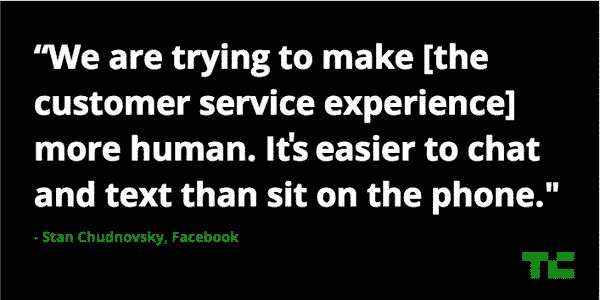

# 脸书表示，10K+开发者正在开发聊天机器人，分析即将到来 

> 原文：<https://web.archive.org/web/https://techcrunch.com/2016/05/10/facebook-chatbot-analytics/>

尽管有人抱怨脸书聊天机器人的用处，但“成千上万”的开发者正在开发它们， [Messenger 的](https://web.archive.org/web/20230217043340/https://www.crunchbase.com/product/facebook-messenger-11)产品负责人 [Stan Chudnovsky](https://web.archive.org/web/20230217043340/https://www.crunchbase.com/person/stan-chudnovsky) 在 TechCrunch Disrupt NY 的舞台上透露。此外，5000 家 [Shopify](https://web.archive.org/web/20230217043340/https://www.crunchbase.com/organization/shopify) 商家正在通过 Messenger 分发订单确认和发货通知，这表明电子商务公司渴望接触到该应用的近 10 亿用户。

你可以通过 TechCrunch 的脸书记者 Josh Constine 观看 Chudnovsky 的完整讨论:

这些机器人变得很健谈。Activision 的使命召唤(Call of Duty bot)是最近在 Messenger 平台上推出的一款备受瞩目的聊天机器人，在问世的第一周，用户之间的互动量飙升至近 600 万条消息。

问题是，如果机器人收到垃圾邮件，它们可能会淹没人们在 Messenger 中的朋友。这可能会让他们不太可能在每次 Messenger 响起时查看手机。幸运的是，Chudnovsky 说 Messenger 正在考虑不同的方法来保护用户免受 bot 垃圾邮件的影响，包括延迟或批量发送，不同的声音或振动模式或根本不发送通知。

理想情况下，开发人员将能够自我监管他们的垃圾邮件，而不是脸书介入。现在，他们对他们的机器人的表现知之甚少。但 Chudnovsky 证实，脸书正在努力建立一个成熟的 Messenger 聊天机器人分析系统。这可以向他们显示哪些信息是令人讨厌的用户，导致他们阻止或放弃一个机器人，以及哪些行动呼吁或信息日程最有吸引力。

由于 Messenger 已经开放了平台，以更好地促进用户对企业的交流，Constine 询问聊天机器人是否会使 Messenger 失去人性。

Chudnovsky 讨论了，事实上，当前企业和客户之间的通信网络是如何过度机器人化的，具有按键式电话树和等待时间。他说，Messenger 聊天机器人平台绝对有潜力改善这些联系。

“如果我们能让人们更容易与企业沟通，这似乎是一个巨大的机会，”丘德诺夫斯基回应道。

从这次谈话中可以清楚地看出，Messenger 上很少有小规模发布这样的事情。Chudnovsky 告诉 Constine，该平台的群组呼叫功能在最初的 24 小时内已经获得了近 1100 万分钟的群组 VoIP 音频呼叫，没有太多的推广。

尽管吹捧群组功能的成功，但当被问及群组视频通话是否会成为下一个目标时，他给出了一个简洁的“无可奉告”，但随后又表示，“我们同意这将是一个很好的体验。”

[gallery ids="1320026，1320020，1320021，1320025，1320024，1320023，1320022，1320018，1320012，1320014，1320017"]