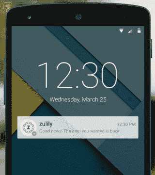
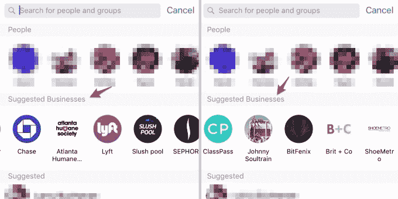

# 脸书将在 F8  发布聊天机器人和实时聊天 API

> 原文：<https://web.archive.org/web/https://techcrunch.com/2016/04/07/facebook-chatbots/>

聊天机器人可以取代 1-800 号码，脸书希望它们能出现在 Messenger 上。但大多数企业没有资源或技术技能来自己构建聊天机器人。这就是为什么脸书目前向开发者提供 API 工具，为商业客户构建聊天机器人和实时聊天网络插件，根据多个来源和脸书与 devs 分享的泄露甲板。这些工具将在下周脸书的 F8 会议上公布。[ [点击这里观看 F8 直播](https://web.archive.org/web/20230313035250/https://techcrunch.com/2016/04/12/f8-stream/)

脸书已经有了一个被认可的市场合作伙伴的目录。它让企业找到可以在广告、内容、测量和社区管理方面帮助企业的技术和服务提供商。但是脸书还没有为合作伙伴提供一个特别的身份、徽章或单独的目录来帮助他们传递信息。

我们采访过的开发者表示，脸书还没有正式确定或命名一个特定的 Messenger 平台合作伙伴计划。不过，预计它会将企业介绍给 Messenger 开发者，一个更官方的合作伙伴计划可能会在稍后推出。

我们所知道的是，脸书一直在与两种类型的 B2B 开发商合作，有些重叠。这是 Messenger 通过聊天将潜在客户与企业联系起来的大扩张的一部分，它去年在 F8 戏弄了这一点。

聊天机器人提供商将帮助企业建立自动响应系统，以接收潜在客户的信息。他们不必自己开发复杂的技术，或者在互联网上摸索着寻找能提供帮助的人，他们可以很容易地找到脸书竖起大拇指的技术。

TechCrunch 审查了脸书发给一些 Messenger 聊天机器人开发者的演示文稿。它详细描述了聊天机器人将如何超越文本，用它所谓的“结构化信息”来回应。这些包括标题、图像、描述、URL 和行动要求，例如访问网站、查看电子商务订单或预订餐厅。

这种结构化信息功能本质上让开发者可以构建类似于优步和荷航与 Messenger 集成的系统。在这里你会看到我们基于脸书与聊天机器人开发者分享的演示文稿制作的一个模型。这是基于我们在一月份报道的关于脸书测试一个秘密聊天 SDK 的独家新闻，该 SDK 允许开发者开发机器人。

脸书还在与实时聊天开发商合作，他们可以为网站开发“给我们发消息”式的联系按钮插件。这样，他们可以通过 Messenger 聊天与人工支持代理进行交互，而不是强迫客户给他们发电子邮件或打电话。

轻触实时聊天按钮，用户就会跳转到手机上的 Messenger 应用程序或网络上的 Messenger.com。用户应该能够看到阅读回执和“打字…”指示器，这取决于如何与脸书的聊天 SDK 和各种 API 集成。

脸书拒绝置评。先前报道称，脸书将允许新闻出版商通过 Messenger 发布内容。

企业通过 Messenger 向用户发送的消息

目前，脸书没有向在该平台上运行的开发者收取任何形式的订阅费或每条消息的费用。然而，脸书仍然可以从聊天机器人和实时聊天客户支持中赚钱。

对脸书来说，一个选择是推动运行聊天机器人的企业购买引发对话的新闻源广告。我们请[脸书的广告沙皇 Andrew“Boz”Bosworth](https://web.archive.org/web/20230313035250/https://techcrunch.com/2015/09/22/facebooks-ad-chief-boz-announces-click-to-message-a-business-ads/)提供了去年 TechCrunch Disrupt 上“点击发送信息”广告的早期细节。但那是在聊天机器人和聊天客户支持成为一件大事之前。

很快你就可以想象商家购买广告，点击这些广告，就可以和试图向你推销商品的聊天机器人进行聊天。让人类回答这些 pings 对企业来说可能成本太高，但聊天机器人可以有效地扩展，使点击信息广告值得购买。

脸书的另一个选择是[允许在 Messenger 本身里面做广告](https://web.archive.org/web/20230313035250/https://techcrunch.com/2016/02/18/facebook-messenger-ads/)。根据 TechCrunch 在 2 月份获得的一份泄露的演示文稿，这就是计划，该演示文稿由一名脸书团队成员发送给其平台上最大的品牌之一。该演示称，广告客户将能够付费向已经发送过该业务信息的人发送营销信息。

脸书建议商家用 Messenger 聊天，这可能成为一个广告机会。图片来自商业内幕

为了开始这些对话，演示解释说，脸书已经悄悄地推出了信使快捷链接，可以立即打开相应业务的信使线程。[这些“信使链接”今天上午正式上线](https://web.archive.org/web/20230313035250/https://techcrunch.com/2016/04/07/facebook-pushes-businesses-to-messenger-with-new-tools-for-pages-including-snapchat-like-scannable-codes/)。另一种可能性是，脸书可以让企业为其建议企业名单中的优先位置付费，商业内幕[昨天发现了这一点。](https://web.archive.org/web/20230313035250/http://www.businessinsider.com/facebook-is-starting-to-suggest-businesses-you-should-chat-with-on-messenger-2016-4?op=1)

脸书无法独自开启聊天机器人和聊天客户服务革命。通过培养一个开发者生态系统来帮助企业，就像它帮助广告和页面发布一样，它可以确保每个利基都被覆盖。我们通过 Messenger 传递的信息越多，我们与脸书应用家族的关系就越密切。