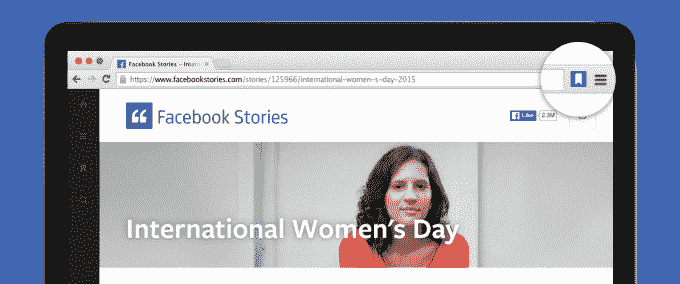
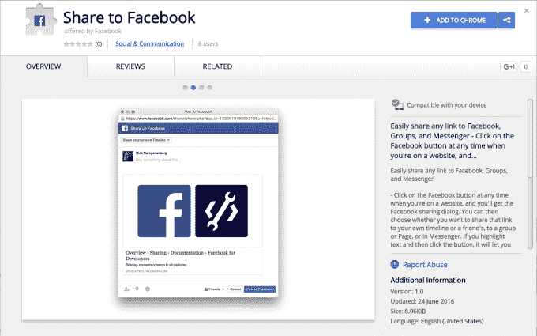

# 脸书从其他网站与新的保存和共享 Chrome 扩展 

> 原文：<https://web.archive.org/web/https://techcrunch.com/2016/06/28/facebook-chrome-extensions/>

脸书通过其 Like 按钮开拓了互联网，该按钮每天在网络上有 100 亿次浏览。现在，随着两个新的保存和共享 Chrome 扩展的发布，它正在为移动设备进行改造，这两个扩展可以让你从任何网站获取内容。

总之，这些更新应该有助于用来自网络的新闻故事填充新闻 Feed，并将脸书变成一个更成熟的稍后阅读服务，与 Pocket 竞争。通过深入挖掘人们的浏览习惯，脸书可以确保其价值增长，即使你身在别处。新的按钮应该会增加广告定位，同时为脸书带来更多内容，在提要中显示广告。

## 在手机上变得更可爱

到目前为止，脸书喜欢按钮实际上缺乏在其网站和应用程序上看到的标志性的竖起大拇指。通过现代化的设计，从脸书“f”切换到拇指，脸书打赌人们会更好地识别按钮。事实上，30%的类似按钮印象来自移动设备，在那里它被渲染得很小，可能更难识别。测试显示，重新设计提高了 6%的喜欢度，所以脸书正在向每个人推广。

脸书也在更新其分享、发送、关注、推荐和保存按钮的设计。它们将改善颜色一致性，使用更适合现代移动操作系统风格的精致扁平按钮设计，并在按钮内显示喜欢和共享计数。

即时文章现在可以在帖子底部展示新的赞、评论和分享按钮，点击量可以正确地计入赞和分享总数。如果网站使用脸书评论插件，他们将在即时文章和传统网页版本之间镜像评论，这样对话就可以跨格式流动。

[开发者可以访问脸书的按钮配置器](https://web.archive.org/web/20221207234321/https://developers.facebook.com/docs/plugins?__mref=message_bubble#like-share-send)，为他们选择合适的尺寸和实现方式。不过，他们不需要做任何事情，因为按钮的设计会自动更新并向后兼容。

## 镀铬

Pocket 广受欢迎的稍后阅读服务最重要的部分之一是它的 Chrome 扩展。通过给你一个按钮，你可以随时点击立即保存一篇文章，它让你浏览互联网，而不用担心如果你没有时间消费你发现的东西。

新的脸书[保存 Chrome 扩展](https://web.archive.org/web/20221207234321/https://chrome.google.com/webstore/detail/save-to-facebook/jmfikkaogpplgnfjmbjdpalkhclendgd)将为脸书在 2014 年推出的[保存功能带来同样的功能，该功能已悄然增长至每月 3 亿用户。通过这种方式，您可以访问脸书来查找您已存储的文章列表，并轻松地返回到它们。它本质上是一个跨设备的书签和提醒系统。](https://web.archive.org/web/20221207234321/https://beta.techcrunch.com/2014/07/21/facebook-save-feature/)

早在四月份的 F8 大会上，脸书就试图让网站自己集成一个[保存插件](https://web.archive.org/web/20221207234321/https://beta.techcrunch.com/gallery/everything-announced-at-facebooks-f8-conference-today/)，但它似乎认为让用户安装 Chrome 扩展更有意义。

添加后，只需点击浏览器右上角的保存图标，然后[从脸书主页或更多标签书签](https://web.archive.org/web/20221207234321/https://www.facebook.com/saved)访问您保存的内容。您还会在确认您保存了新内容的下拉列表中看到最近保存内容的提醒列表，以便您可以立即访问这些网站。

脸书还让分享任何网站到新闻源变得更加容易，即使它没有内置的分享按钮。新的[共享 Chrome 扩展](https://web.archive.org/web/20221207234321/https://chrome.google.com/webstore/detail/share-to-facebook/kbgplcfihfeioiaddclapccnefggiddn?hl=en-GB)可以从你的 Chrome 浏览器栏点击打开一个新闻提要故事编辑器。

通过改善其在网络上的殖民地，脸书将能够证明它可以为出版商带来更多的推荐流量。这使得他们更有可能通过脸书页面和即时文章来投入精力，整合其社交插件并购买脸书的广告。无论脸书按钮是在你访问的网站上，还是在你访问它们的浏览器上，它们都会不断提醒你回去看看朋友们在这个不可避免的社交网络上做了什么。