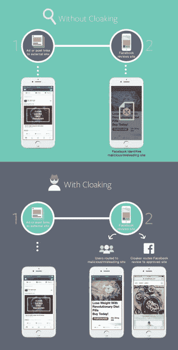

# 脸书禁止欺骗过滤器的垃圾网站的“伪装”

> 原文：<https://web.archive.org/web/https://techcrunch.com/2017/08/09/facebook-cloaking/>

# 脸书禁止“伪装”欺骗过滤器的垃圾网站

“伪装”听起来很科幻，但它实际上是垃圾邮件发送者今天使用的一种技巧，用来向内容版主或搜索引擎蜘蛛显示他们网站看起来无辜的版本，而真正的访问者只会看到广告和骗局。例如，一些垃圾邮件发送者试图通过向任何员工的 IP 地址显示链接或广告的良性登录页面来欺骗脸书的审查团队和技术，而其他人则看到违反脸书社区标准和广告政策的减肥药骗局或色情内容。

所以今天，脸书正在[打击](https://web.archive.org/web/20230404164740/https://newsroom.fb.com/news/2017/08/news-feed-fyi-addressing-cloaking-so-people-see-more-authentic-posts/)的隐形技术。脸书广告产品总监 Rob Leathern 现在告诉我，当它发现一个网站使用伪装时，“我们会停用他们的广告计数，我们会把他们踢出去，我们会清除他们的页面。”脸书将使用人类和扩展的人工智能系统来根除隐形人。然而，它没有公开披露用来识别伪装的信号，因此不会向垃圾邮件发送者通风报信。

无辜的企业应该不会受到影响。“隐形没有合法的用途，”莱瑟恩说。“如果我们找到了，那个演员是谁并不重要。根据定义，他们通常是坏演员和垃圾邮件发送者。因此，如果任何人以任何方式、形状或形式这样做，我们希望他们离开平台。”在这里，脸书仅仅是寻求隐藏，而不是通过网站内容的判断。

这一变化是 T2 对恶作剧、点击诱饵、垃圾邮件和低质量网站进行多管齐下攻击的一部分，此前有人批评脸书没有阻止假新闻影响 2016 年总统选举。通过切断垃圾邮件网站的流量，脸书可以掐断坏人为了利润或政治动机传播错误信息的经济命脉。

根据最近对脸书 450 多个传播超级政治新闻的页面的 400 万个帖子的研究， [BuzzFeed](https://web.archive.org/web/20230404164740/https://www.buzzfeed.com/craigsilverman/inside-the-partisan-fight-for-your-news-feed?utm_term=.mbgaonjAw7#.cmKPQK269w) 得出结论，“出版商痴迷于脸书的算法变化，并避免陷入社交网络的不断升级的倡议，以减少新闻提要中的点击诱饵和错误信息。”

然而隐形不仅仅是脸书的问题。这就是为什么它计划与其他科技公司合作，分享击败隐形人的策略。脸书告诉我，关于如何更好地集体解决这个问题，与行业的对话还处于初期阶段。但是，如果它像阻止恐怖内容或儿童色情的上传一样分享隐形人的指纹，脸书可以利用其大规模的经验来给互联网的其他固定装置接种疫苗。