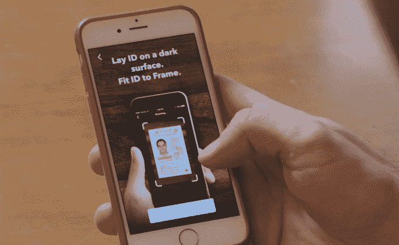

# 脸书收购生物识别身份验证初创公司 Confirm.io 

> 原文：<https://web.archive.org/web/https://techcrunch.com/2018/01/23/facebook-confirm-io/>

# 脸书收购生物识别身份验证初创公司 Confirm.io

脸书已经向 TechCrunch 证实，它已经收购了… [Confirm.io](https://web.archive.org/web/20230404154626/https://www.confirm.io/) 。这家初创公司提供了一个 API，让其他公司可以快速验证某人的政府颁发的身份证(如驾照)是真实的。这家总部位于波士顿的初创公司将关闭，因为它的团队和技术都将进入脸书，在那里它可以帮助那些被锁定账户的用户。

[Confirm.io](https://web.archive.org/web/20230404154626/https://www.crunchbase.com/organization/confirm) 自三年前推出以来，已经从包括 Cava Capital 在内的投资者那里筹集了至少 400 万美元。2015 年的种子轮资助了高级取证，用于从身份证中提取信息，以及移动生物识别和面部识别，以在创业公司删除个人数据之前确认个人身份。

客户可以快速整合技术，这加快了按需启动的员工入职。食品配送服务 Doordash 使用 Confirm.io 来验证其司机，而 Notarize 则使用它来验证希望提交文件的客户的身份。

这家初创公司写道:“当我们推出 Confirm 时，我们的使命是成为市场上值得信赖的身份认证平台，其他多因素验证服务可以在此基础上构建。现在，我们已经准备好和脸书一起踏上旅程的下一步。但是，与此同时，这意味着我们当前所有的数字身份认证软件产品都将逐渐减少。”

Confirm.io 的 ID 认证功能

脸书告诉 TechCrunch，“我们很高兴欢迎确认团队来到脸书。他们的技术和专业知识将支持我们不断努力保持我们社区的安全。”

脸书测试自拍解锁功能

脸书可能会使用这项技术，让人们在被黑客攻击或丢失密码后被锁定账户时确认自己的身份。早在 9 月份，我们就发现脸书正在测试一项功能，可以让你用自拍解锁账户。至少从 2013 年开始，脸书就允许人们邮寄一份带照片的身份证或其他身份验证材料，以重新获得他们的账户。

因为这是一次全面收购，而不仅仅是收购，Confirm.io 的团队和技术可以帮助脸书加强和简化这些选择。也许有一天，脸书在某些情况下甚至可以作为你的身份证。iPhone X 上的 Face ID 最终可能会向第三方开放，以增强应用程序之间的生物识别安全性。随着我们的钥匙和支付卡变得数字化，并成为我们手机的一部分，身份证真的是你必须携带老式钱包的最后一个理由。