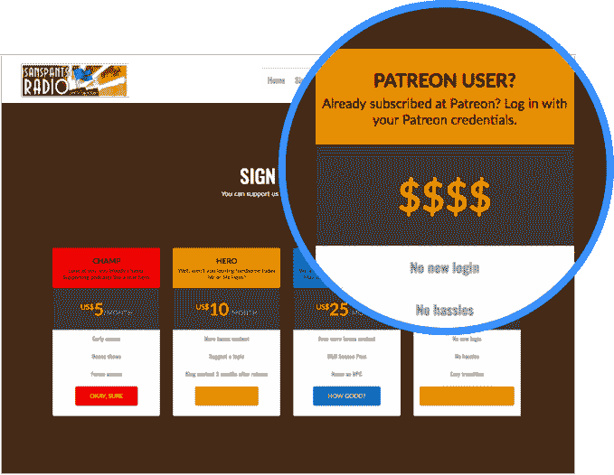
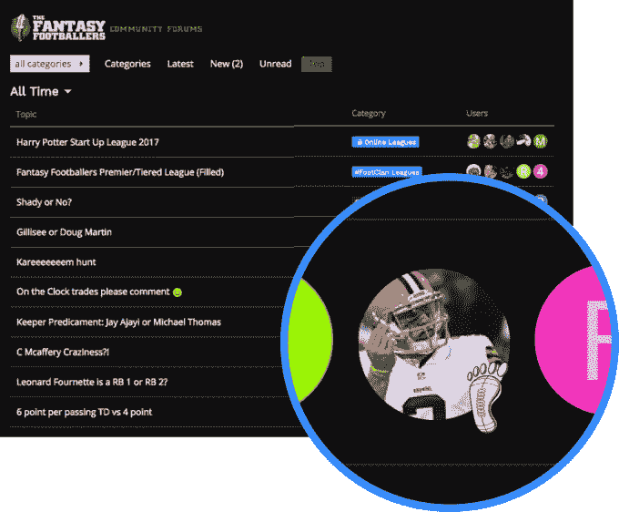
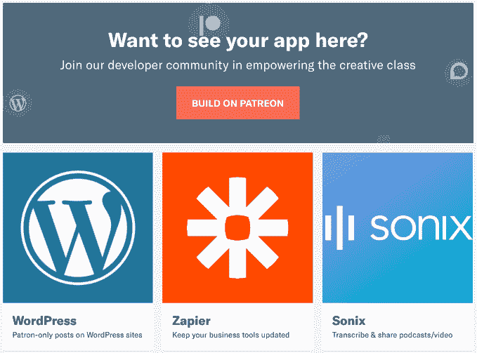

# Patreon 的 API 在网上为艺术投资者解锁奖励 

> 原文：<https://web.archive.org/web/https://techcrunch.com/2017/10/25/facebook-connect-for-art-patronage/>

Patreon 希望通过为艺术家众筹用户提供额外津贴来开拓互联网，就像脸书登录将你的社交图和个人资料带到其他网站一样。

向 Patreon 上的内容创建者支付月费，现在你就可以独家访问他们的顾客专用 WordPress 博客、话语论坛、Discord 聊天室，很快还会有 Slack 等其他应用。本质上，Patreon 正在成为你整个网络的内容会员卡，而不仅仅是它的网站。随着[这个平台](https://web.archive.org/web/20220930221150/https://blog.patreon.com/patreon-powers-membership-across-the-web/)推出新的奖励，订阅变得更有价值，更多的人将开始直接资助他们喜爱的艺术家。

已经有超过 100 万的用户每月平均支付 12 美元给 [Patreon](https://web.archive.org/web/20220930221150/https://www.patreon.com/) 上的 5 万多名创作者，从插画师到政治评论员、摄像师到喜剧演员。它有望每年将其会员市场翻一番。有了 1.07 亿美元的资金，包括上个月由 Thrive 牵头的[6000 万美元的 C 轮](https://web.archive.org/web/20220930221150/https://beta.techcrunch.com/2017/09/19/patreon-60-million/)，它有了建立这个新平台的动力，该公司预计在一年内支持 100 多个集成，包括 Slack。

当您使用 Patreon 订阅登录时，可以访问 WordPress 上的独家或无广告内容

这一切都归功于 Patreon 的新 API，任何人都可以通过 pat reon[开发者门户](https://web.archive.org/web/20220930221150/https://www.patreon.com/portal)将其构建到他们的产品中，成为顾客可以带来他们的会员的地方。然后，这些第三方产品将出现在新的[应用目录](https://web.archive.org/web/20220930221150/https://www.patreon.com/apps/featured)中，创作者可以从中选择，以扩大支持它们的好处，而不仅仅是 Patreon。

这个应用程序目录现在包括 Zapier，它允许创建者集成其他商业应用程序来帮助管理他们的顾客，如 MailChimp 电子邮件营销、Google Sheets、Twitter、Crowdcast live video 和 750 多个应用程序。

Patreon 的业务开发和伙伴关系副总裁 Brent Horowitz 认为这是“围绕这个名为会员的中心组织的数百个辐条，不受制于或局限于任何一个单一的平台。”这意味着 Patreon 原生工具的缺陷，如其基本的博客界面，不会限制那些利用它赚钱的人的创造性表达，因为他们可以使用 WordPress 代替。

当您登录 Patreon 时，获得特殊徽章，使您在 Discourse 的论坛中脱颖而出

合作网站和应用程序也将从中受益。与 Patreon 平台的合作可以为商业工具和内容中心带来新的客户和创作者。像 WordPress 或 Discourse 这样的网站可以依托 Patreon，而不必从零开始建立会员专属层。

随着 Patreon 在网络上的传播，它也希望变得不那么尖锐。它故意接受一些不安全的工作内容，包括裸体、成人小说和色情插图。但是现在[取缔了](https://web.archive.org/web/20220930221150/https://patreonhq.com/checking-in-on-our-commitments-to-creators-about-trust-and-safety-8793a53c3cae)描述虚构的“乱伦、未成年人性描写和暗示性暴力”的不安全内容

我听说，其中一些不容易在其他地方货币化的内容正在成为 Patreon 收入中不可忽视的一部分，它需要在被视为与令人不安的内容串通之前将其砍掉。与此同时，Patreon 重申支持 LGBTQ 社区的其他利基和人权内容。

YouTube 和 Twitch，这两个在 Patreon 创作者中最受欢迎的艺术家与粉丝之间的交流工具，仍然没有出现在这个平台上。他们都为向创作者承诺资金的粉丝提供了适度的现场津贴。

但是 Horowitz 说他们只支持二进制的“是订户”或“非订户”系统，额外津贴不会传播到其他地方。Patreon 的平台允许艺术家为不同的支付等级设置不同的访问级别。这样一来，创作者可以让每月 1 美元及以上的订阅者免费使用 WordPress，以 5 美元及以上的价格提前获取新内容，以 10 美元及以上的价格获取只供顾客使用的内容。

合作伙伴不会从 Patreon 收取的 5%的订阅费中获得任何利润，但他们可以接触到网络上最受欢迎的制造商以及跟随他们到任何地方的粉丝群。