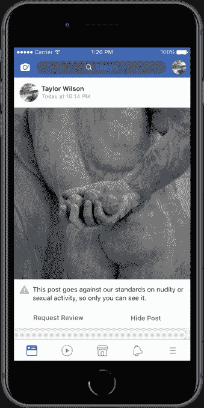
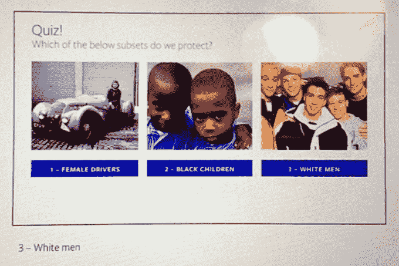
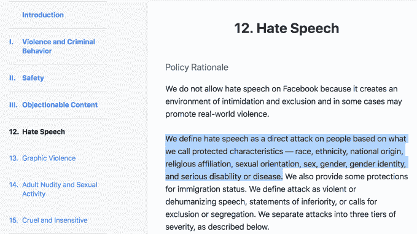

# 脸书公布了 25 页消除仇恨言论的规则

> 原文：<https://web.archive.org/web/https://techcrunch.com/2018/04/24/facebook-content-rules/>

脸书以前从未公开过其版主用来决定是否删除社交网络中的暴力、垃圾邮件、 、骚扰、自残、恐怖主义、知识产权盗窃和仇恨言论的指导方针[直到现在](https://web.archive.org/web/20221025223020/https://newsroom.fb.com/news/2018/04/comprehensive-community-standards/)。该公司希望避免让这些规则变得容易，但公众不断要求澄清并抗议其决定，这种担忧被压倒了。今天，脸书发布了 25 页的详细标准和例子，说明什么是允许的，什么是不允许的。

脸书正在有效地将它将被批评的地方转移到根本的政策，而不是个别的执行错误事件，例如当它[删除有新闻价值的“凝固汽油弹女孩”历史照片的帖子](https://web.archive.org/web/20221025223020/https://techcrunch.com/2016/09/09/facensorbook/)，因为它包含儿童裸体，然后最终恢复它们。一些团体肯定会发现一些问题，但脸书已经做出了一些重大改进。最值得注意的是，它不再因为像“儿童”这样不受保护的特征被附加到像“黑人”这样受保护的特征上而剥夺少数群体屏蔽仇恨言论的资格。

从技术上讲，脸书的政策没有任何变化。但是在此之前，只有像《卫报》获得的一份内部规则手册的副本这样的泄露才让外界看到了脸书实际执行这些政策的时间。这些规则将被翻译成 40 多种语言向公众公布。脸书目前有 7500 名内容审查员，比一年前增加了 40%。

脸书还计划扩大其内容删除上诉程序，它已经允许用户请求审查删除他们的个人资料、页面或群组的决定。现在，当用户的 裸体、性活动、仇恨言论或图形暴力内容被删除时，脸书会通知用户，并让他们点击一个按钮“请求审查”，这通常会在 24 小时内发生。最后，脸书将在德国、法国、英国、印度、新加坡和美国举办脸书论坛:社区标准活动，让其最大的社区近距离了解社交网络的政策是如何运作的。

## 修正“白人受保护，黑人儿童不受保护”的政策

脸书全球产品管理副总裁莫妮卡·比克特(Monika Bickert)自 9 月以来一直在协调指导方针的发布，她上周在脸书门洛帕克总部告诉记者，“有很多研究表明，当机构公布政策时，人们会改变他们的行为，这是一件好事。”她承认，仍然有人担心恐怖分子或仇恨组织会更善于开发“变通方法”来逃避脸书的主持人，“但对幕后发生的事情更加开放的好处超过了这一点。”

包括脸书在内的各种社交媒体公司的内容主持人工作在许多曝光中被描述为地狱般的工作，涉及每天数小时打击儿童色情，斩首视频和种族主义的传播。Bickert 说，脸书的版主接受过处理这一问题的培训，可以获得咨询和 24/7 资源，包括一些现场资源。他们可以要求不看某些他们敏感的内容。但是 Bickert 没有说脸书像 YouTube 最近实施的四小时限制一样，对版主每天看到多少冒犯性内容进行了每小时的限制。

一张有争议的幻灯片描述了脸书现已废除的政策，该政策取消了受保护群体的子集屏蔽仇恨言论的资格。图片来自 [ProPublica](https://web.archive.org/web/20221025223020/https://www.propublica.org/article/facebook-hate-speech-censorship-internal-documents-algorithms)

最新披露的指导方针中最有用的澄清解释了脸书如何放弃其不受欢迎的政策，该政策认为“白人”不受仇恨言论的影响，但“黑人儿童”不受影响。2017 年 6 月, [ProPublica](https://web.archive.org/web/20221025223020/https://www.propublica.org/article/facebook-hate-speech-censorship-internal-documents-algorithms) 的一篇文章抨击了让受保护群体的子集暴露于仇恨言论的规则，尽管脸书表示不再适用该政策。

现在，Bickert 说“黑人儿童——将会受到保护。白人——也将受到保护。如果是针对一个人，我们认为这是攻击，但你可以批评一个组织，一个宗教。。。如果有人说‘这个国家是邪恶的’，那是我们允许的。说‘这个宗教的成员是邪恶的’不是。”她解释说，脸书越来越意识到谁是受害者的背景。然而，Bickert 指出，如果有人说“如果你不来参加我的派对，我会杀了你”，如果这不是一个可信的威胁，我们不想删除它。****

## 社区标准=编辑的声音吗？

当脸书因未能防止其平台上的滥用而受到批评时，对其政策的坦率可能会让它有更多的可指之处。活动组织称，脸书允许假新闻和仇恨言论泛滥，导致许多发展中国家发生暴力事件，而脸书在这些国家没有足够的母语主持人。斯里兰卡政府[暂时封锁了](https://web.archive.org/web/20221025223020/https://www.nytimes.com/2018/03/08/technology/sri-lanka-facebook-shutdown.html)脸书，希望停止暴力呼吁，当地的人说扎克伯格夸大了脸书对缅甸问题的改善，导致了针对罗辛亚人的仇恨犯罪。

披露指导方针至少可以减少脸书是否允许仇恨内容的困惑。它不是。不过，该准则也提出了一个问题，即它所编纂的脸书价值体系是否意味着这家社交网络拥有一种编辑声音，可以将其定义为一家媒体公司。这可能意味着用户发布的内容将失去法律豁免权。Bickert 坚持一条排练过的路线，即“我们不创造内容，也不管理内容”。尽管如此，一些人肯定会说，脸书的所有内容过滤器相当于一个监管层。

但无论脸书是一家媒体公司还是一家科技公司，它都是一家高利润的公司。它需要从每个季度赚取的数十亿美元中拿出更多的钱，在全球范围内均衡而有力地实施这些政策。