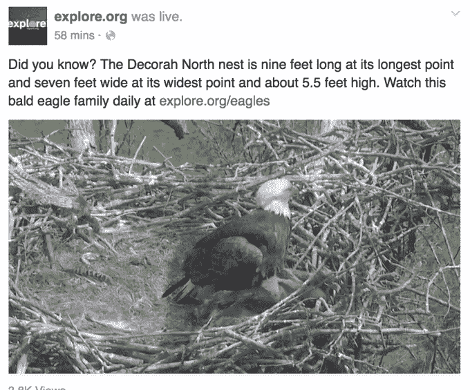

# 脸书支持连续实时视频，为 puppycams 等提供动力

> 原文：<https://web.archive.org/web/http://techcrunch.com/2016/05/23/facebook-continuous-live/>

移动视频直播正在超越自拍视频和公民新闻。脸书现在将允许不间断的长时间播放，只要创作者不介意他们不能永久保存和分享视频。脸书向我透露，新的连续直播视频 API 可以实现持续的视频流，如自然反馈、进入主要地标的 24 小时窗口或在满是小狗的坑上训练的摄像机。

这只是脸书吸引广播公司关注其直播广告的一种方式。今年 4 月，该公司在 F8 成立时有 12 个合作伙伴，但如今已增至 100 多个。API 让更多的专业广播公司使用他们自己的高级摄像机、混合板和效果套件，并控制谁可以看到他们的直播视频，而不仅仅是从他们的手机上播放。

连续的视频直播对脸书的工程团队来说是一个突破。以前，直播最多只能持续 90 分钟。这意味着你无法直播整个会议、体育赛事或聚会，更不用说让摄像机日夜不停地拍摄了。但是现在脸书已经明白了。

唯一的权衡是，不像普通的脸书直播，没有选项让人们稍后重播或倒回更早。这让脸书免除了不得不托管超长视频的服务器成本。

脸书的视频主管 Fidji Simo 告诉我，“我们已经看到了一些有趣的用例——例如，[explore.org](https://web.archive.org/web/20230314041302/http://explore.org/)用它来驱动自然摄像机——我们期待着看到 Live API 开发者在未来会提出什么。我们希望开发人员和发行商能够利用这一新功能发挥创造力。”

Simo 告诉我，另一个吸引广播公司使用 Live API 平台的新功能是 geogating，它让创作者“获得与我们为常规视频提供的相同的控制和定制选项”。

Geogating 允许发布者只让特定位置的人看到视频，如果这是最相关的地方，或者他们只有有限的播放权。如果他们想增加紧急程度，或者只有在事件发生后不久才有意义，他们也可以将视频设置为在特定时间后过期。还有年龄限制，因此只有超过一定年龄的用户才能看到视频，这对于像酒类这样的受限行业的品牌来说可能很重要，因为他们可能希望使用直播进行营销。

Live API 现在支持的其他选项，如屏幕图形和多摄像头广播，为脸书的平台吸引了更多的合作伙伴。[看台报道](https://web.archive.org/web/20230314041302/https://www.facebook.com/bleacherreport/videos/10153984329846006/)正在回答有关 NFL 选秀的问题，[迪士尼](https://web.archive.org/web/20230314041302/https://www.facebook.com/WaltDisneyStudiosUK/videos/388046911366063/?hc_location=ufi)让观众现场观看《爱丽丝镜中奇遇记》电影首映式红地毯上的名人， [CSPAN](https://web.archive.org/web/20230314041302/https://www.facebook.com/CSPAN/videos/10154378052465579/) 将观众带入白宫记者晚宴。  

脸书正在努力使 Live 成为最强大的实时视频平台。今天，我们写了脸书如何开始在现场视频回放中显示参与度图，这样你就可以看到最激动人心的时刻，并跳过那里。

脸书预见直播将成为视频未来的重要组成部分，但在 Twitter 的 Periscope 推出几个月后，它仍在试图确立自己在该领域的领导者地位。在首席执行官马克·扎克伯格的明确命令和巨大资源的支持下，脸书正在快速推进这个新兴媒体。