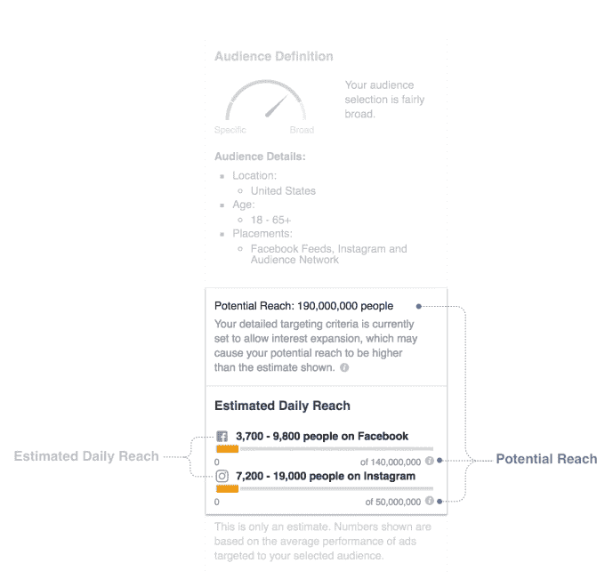
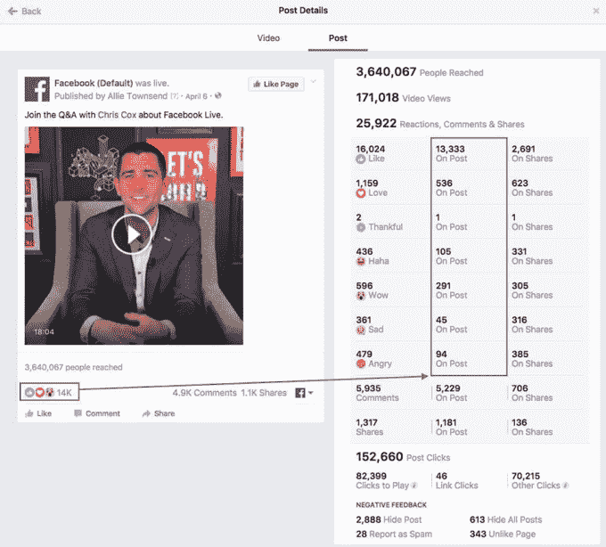
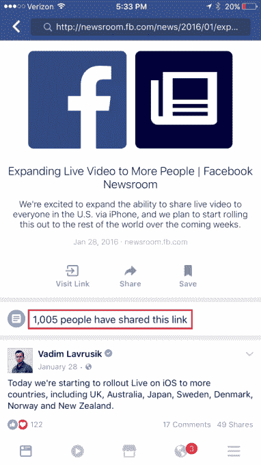

# 脸书修正了更多影响广告触达、流媒体反应以及赞数和分享数的指标 

> 原文：<https://web.archive.org/web/https://techcrunch.com/2016/12/09/facebook-corrects-more-metrics-affecting-ad-reach-streaming-reactions-plus-like-share-counts/>

脸书今天[宣布](https://web.archive.org/web/20221128012514/http://newsroom.fb.com/news/2016/12/metrics-fyi-estimated-reach-streaming-reactions-and-graph-api/)它正在修正其在广告受众估计、直播视频反应计数及其喜欢和分享按钮等领域的一些问题。虽然修复涉及脸书的几个更受关注的产品，但解决的问题不如脸书在 2016 年早些时候发现的问题重要，当时它发现[平均视频观看时间的数据多年来一直被夸大](https://web.archive.org/web/20221128012514/https://beta.techcrunch.com/2016/09/22/facebook-miscalculation-significantly-inflated-average-video-view-times-for-years/)。

在那次披露之后，脸书已经表明要更加透明地披露它在整个系统中发现的误算。例如，上个月，它宣布发现了更多导致[即时文章、视频和页面洞察等产品误报的漏洞和错误。](https://web.archive.org/web/20221128012514/https://beta.techcrunch.com/2016/11/16/facebook-overhauls-ad-metrics-admits-4-bugs-and-errors-led-to-misreported-numbers/)

这一次，只有两处对误报指标的更正，一处更像是改进。

后一项是对脸书广告制作工具的更新。

当广告商开始建立他们的广告时，该工具给他们一个潜在的整体影响的估计和该活动的估计每日影响。脸书表示，它已经改进了这一估计的方法——特别是对潜在观众规模的抽样和推断——因此更加准确。

这有助于更好地估计脸书和跨平台(即脸书、Instagram 和观众网络)的目标观众。

虽然这一变化是为了使数字更加准确，但直播视频指标的变化实际上是一种修正。

在 Page Insights 中，脸书错误地分配了每个用户的额外反应(赞、心等)。)到“帖子分享者的反应”部分，而不是“帖子的反应”部分(这些反应是“额外的”,因为“帖子上的反应”一栏只计算每个唯一用户的一个反应。)

这个问题意味着，即使总计数最终被纠正，它也可能给人一种印象，即直播视频在分享时的参与度高于实际参与度。

脸书表示，这一修复将于 12 月中旬推出，并将平均增加“对帖子的反应”500%，同时平均减少“对帖子份额的反应”25%。

最后一个问题是，通过脸书的 Graph API 获得的“喜欢”和“分享”按钮的数量，与你在脸书手机应用的搜索栏中输入网址的数量之间存在差异。

在这种情况下，仍然不清楚为什么有时移动搜索查询比 Graph API 报告的要高或低。该公司表示，仍在努力解决这个问题。

这一次听起来比现场视频反应更令人不安，但脸书没有说明数字之间的差异，也没有说明问题发生的频率，因为它仍在努力了解为什么会发生这种情况。

虽然这些问题都不是关键问题，但它们进一步表明，脸书在向使用网络做出商业决策的人提供透明度方面存在问题——无论是在哪里以及如何花费广告预算，还是如何通过使用脸书的产品最好地增加社交媒体受众。

这也是脸书系统变得多么复杂的一个例子。这家社交网络继续快速发布新产品，但它的报告系统似乎没有跟上。