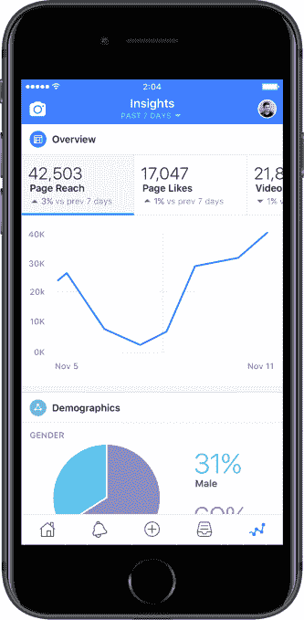

# 脸书为有影响力的人推出 Creator 应用程序，以建立视频社区

> 原文：<https://web.archive.org/web/https://techcrunch.com/2017/11/16/facebook-creator-app/>

脸书希望将无意识、被动的视频消费转变为“值得花的时间”，现在它给了社交媒体明星一个强大的工具来围绕他们的内容培养社区。今天[脸书发布了](https://web.archive.org/web/20230404084944/https://newsroom.fb.com/news/2017/11/announcing-new-tools-for-the-creator-community/)脸书创造者，为有影响力的人提供现场创意套件，用于在广播中添加介绍和结尾，脸书和 Instagram 评论加上 Messenger 聊天的统一收件箱，交叉发布到 Twitter 和扩展分析。

脸书[在六月份的 VidCon 上承诺](https://web.archive.org/web/20230404084944/http://variety.com/2017/digital/news/facebook-to-launch-app-for-influencers-to-manage-content-1202477104/)推出[创造者](https://web.archive.org/web/20230404084944/https://itunes.apple.com/app/id894913642)应用，今天[在](https://web.archive.org/web/20230404084944/https://www.facebook.com/creators/discover/facebook-for-creators-is-here) [iOS](https://web.archive.org/web/20230404084944/https://itunes.apple.com/app/id894913642) 上全球发布，并计划在未来几个月内推出安卓系统。这实际上是对 2014 年脸书提名应用程序的更名和更新，该应用程序只对经过验证的公众人物和页面开放，但现在对所有人开放。奇怪的是，目前它仍然以“提及”的形式出现在 App Store 中。

任何个人资料或页面都可以[下载 Creator](https://web.archive.org/web/20230404084944/https://itunes.apple.com/app/id894913642) 以访问增强的粉丝参与工具。脸书还为创作者推出了一个[脸书](https://web.archive.org/web/20230404084944/https://www.facebook.com/creators)网站，提供扩大粉丝群的最佳实践，其他明星正在做的事情的例子，以及常见问题的答案。

“让人们围绕有意义的内容和对他们有意义的人更紧密地联系在一起，是我们的一大要务，”脸书视频产品副总裁 Fidji Simo 告诉我。“创作者正处在我们认为脸书非常独特的一切事物的交汇点上。”

在首席执行官马克·扎克伯格在本月的收益电话会议上宣布通过视频“花好时间”是脸书的新目标后，Creator 应用程序可以帮助它使脸书视频比看电视少得多。

## 脸书的创造者应用程序内部

“我们的想法是为他们提供一站式服务，让他们能够随时随地管理自己的状态，”Simo 解释了 Creator 应用程序，该应用程序分为四个部分。

**现场创意套件**

这套工具允许用户在他们的直播中添加介绍、结尾和自定义表情反应。创作者登录脸书的网站，上传主题曲或欢迎词等介绍，以及通过社交媒体关注他们的号召等结束语。然后可以在 Creator 应用程序中启用它们，这样它们就可以在广播开始和结束时播放。Simo 指出，“(创作者)说现场直播很酷，因为它原始而真实，但他们希望每次都能介绍他们的节目是关于什么或主题是关于什么的。”

图形框架让制作者为他们的视频添加漂亮的边框，以获得更身临其境的感觉。自定义反应让创作者用自己选择的图形替换标准“喜欢”的六个默认“哈哈”、“生气”或“哇”选项中的一个。这可以配合他们的广播主题或个性。例如，Simo 说，感觉良好的视频明星 Markian 可以添加一个特别露齿的微笑反应，以娱乐他在脸书的粉丝俱乐部群#SmileSquad。

这些功能使脸书直播远远超出了 Twitter 的潜望镜的能力，并可能使它比 YouTube 直播更可行。

**统一收件箱**

脸书不再需要不停地在脸书、Instagram 和 Messenger 之间切换，而是将创作者的所有评论和信息放在 creator 的一个收件箱里。这可能会使与粉丝进行对话或回应评论变得更加简单，而不仅仅是一个老派的单向广播者。

对于试图缓和评论卷轴的创作者来说，结合 Instagram 和脸书可以减少清理辱骂性巨魔的时间。越是贪婪的社区和干净的评论，越有兴趣的品牌会在脸书视频上做广告和赞助明星。

**故事和镜头**

为了保持对脸书的增强现实和日常共享功能的关注，Creator 提供了对脸书相机和故事共享的访问。脸书甚至会让人们交叉发布到 Instagram 甚至 Twitter，以减少到处发布内容的摩擦。这种简单性可以鼓励人们建立更高质量的内容，并让脸书保持在共享循环中。

**分析**

创作者需要知道什么在起作用，这样他们就能更好地利用它。脸书并没有将其隐藏在他们的脸书页面中，而是在 Creator 应用程序中浮出水面。粉丝统计数据的细节不仅可以帮助有影响力的人确定他们应该发布什么类型的视频，还可以帮助他们确定哪些品牌可能想要赞助他们。

你可能不同意脸书对“时间花得值”的定义但即使只是围绕视频进行适度的社交互动，这也可能比坐在沙发上尽情享受网飞或无休止地浏览新闻提要有明显的改善。

**缺少什么:货币化**

Creator 应用程序可能会从竞争对手那里吸引社交媒体明星，比如他们历史悠久的 YouTube 及其 creators 工作室应用程序，他们的订阅收入中心 Patreon 或 [Snapchat，Snapchat 本月宣布准备接受影响者](https://web.archive.org/web/20230404084944/https://techcrunch.com/2017/11/13/time-to-snap-into-action/)。通过利用个体创作者的个性与观众建立更深的联系，脸书可以积累额外的利润丰厚的视频广告印象。

但是,《脸书创造者》非常缺少的一件事是让有影响力的人赚钱的新途径。没有订阅或小费，他们甚至不能在视频中插入收入分成广告。唯一的选择是发布赞助的、品牌化的内容，并用脸书的合作伙伴标签功能对其进行标记。至少 Simo 说,“当谈到货币化时，这不是一个放之四海而皆准的标准。【创作者】都需要很多不同的东西。我们对探索许多不同的商业模式持开放态度，但在这方面，目前没有什么可以宣布的。”

脸书在这方面可以做得更好的另一件事是与集团整合。越来越多的明星围绕他们的内容推出脸书组合，这样粉丝们不仅可以和他们互动，他们也可以互相互动。脸书应该让 Creator 应用程序更容易启动、发展和培养粉丝俱乐部。

脸书在这个领域有着巨大的机遇。与人们想娱乐就去的 YouTube 不同，人们只是经常去脸书看他们的朋友。通过偶然帮助这些用户发现创作者并提供专门的观看视频标签来关注他们，脸书在有影响力的人面前摇晃着它的 20 亿用户，招募那些渴望增加其追随者的人。

对用户来说，促进与创作者的双向联系有助于脸书实现其使命，使视频成为社区的焦点，而不是逃避它。