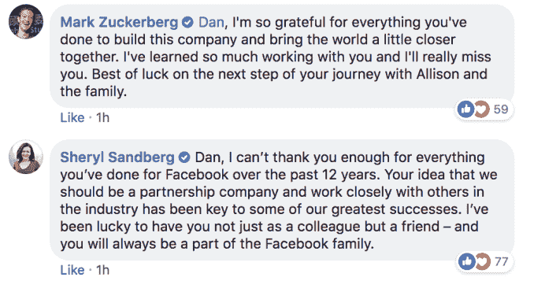

# 脸书合作伙伴副总裁 Dan Rose 即将离开公司 

> 原文：<https://web.archive.org/web/https://techcrunch.com/2018/08/22/facebook-dan-rose-leaving/>

# 脸书合作伙伴副总裁丹·罗斯即将离开公司

脸书负责伙伴关系的副总裁丹·罗斯将于明年初离开公司。罗斯在他的[脸书公共页面](https://web.archive.org/web/20221208144351/https://www.facebook.com/photo.php?fbid=10105190295068871&set=a.788172843141&type=3&theater)上宣布了这一举动，表明他将继续留在二月份的世界移动通信大会上。

在该公司的长期任职期间，罗斯监督了脸书向媒体巨头的转变，引导其与电视网络和传统新闻出版商建立伙伴关系。

在评论他的声明时，脸书·首席运营官·雪莉·桑德伯格总结了罗斯多年来对脸书方向的影响。

桑德伯格说:“你认为我们应该成为一家合伙公司，并与业内其他公司密切合作，这是我们取得一些最大成功的关键。”“我很幸运拥有你，不仅是同事，还是朋友——你将永远是脸书大家庭的一员。”

据《脸书邮报》报道，罗斯将卸任，以便有更多时间陪伴一年前搬到夏威夷的妻子和孩子。

“马克和谢丽尔改变了我的生活和事业。我会为他们赴汤蹈火，或者定期飞越海洋，”罗斯说。“但他们需要像我这样的人，每天都参与到未来的许多机遇和挑战中来。”

罗斯听起来像是他将参与寻找他的替代者和过渡，为继续参与和“从远处帮助脸书”敞开大门

在脸书工作之前，罗斯在亚马逊工作了七年，在 Kindle 早期担任业务开发总监。罗斯是近几个月来脸书最新的重大离职公告，此前首席法律官科林·斯特朗和首席安全官亚历克斯·斯塔莫斯分别计划离职。

你可以阅读 Rose 的完整声明，嵌入在下面。

> 我有一些关于我个人情况的消息要分享。我将搬到夏威夷，并从目前在……
> 
> 由[丹·罗斯](https://web.archive.org/web/20221208144351/https://www.facebook.com/drose)发布于[2018 年 8 月 22 日星期三](https://web.archive.org/web/20221208144351/https://www.facebook.com/photo.php?fbid=10105190295068871&set=a.788172843141&type=3)