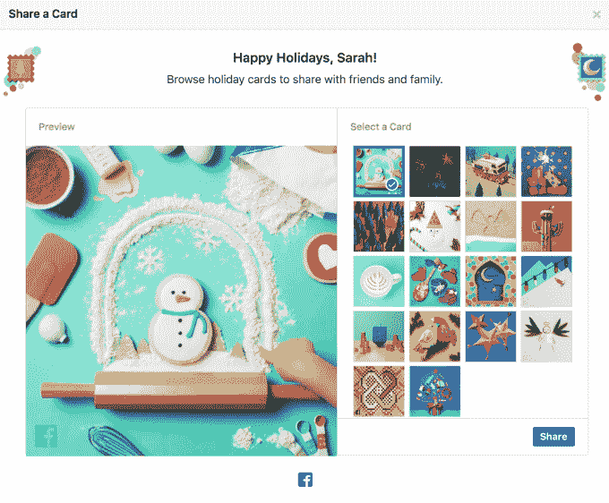

# 脸书首次将可分享的“时刻”放在新闻提要的顶部，从节日贺卡开始 

> 原文：<https://web.archive.org/web/https://techcrunch.com/2016/12/20/facebook-debuts-shareable-moments-at-the-top-of-the-news-feed-starting-with-holiday-cards/>

今天，脸书推出了一个新的程序，将消息放在你的新闻提要的顶部，提示用户讨论和分享世界上正在发生的时刻，包括假期，以及其他历史和文化时刻。最近几周，你可能已经在你的新闻提要顶部看到过这些巨大的彩色卡片，它们祝愿你感恩节快乐，或者提醒你不要错过超级月亮。脸书的声明指出，现在，这种卡片将会更经常地到达。

你可以把这些卡片想象成脸书版的谷歌涂鸦。

搜索引擎主页上的谷歌标志会定期更新，以反映一些值得注意的事件——有时是当前的节日，或者通常是重要的历史时刻，当点击时，会带你到关于该事件的谷歌搜索结果。

同样，脸书的“新时刻”旨在增加社交网络的参与度。该公司表示，它们将帮助人们发现重要的历史时刻、文化事件，或者为人们提供一种在假期和其他时间与朋友联系的方式。

当然，这项功能将在美国假期前推出，并以你可以与家人和朋友分享的节日贺卡开始。

今天，在新闻提要的顶部，你会看到从 18 种定制设计的节日贺卡中选择一种的选项，包括庆祝圣诞节、光明节、宽扎节的贺卡，以及庆祝冬季的贺卡，例如，显示雪人饼干的贺卡。

选择卡片后，您可以选择添加自己的消息，然后标记朋友和家人，以便在他们的订阅源中共享。

脸书说，在这次首次发射后，更多的时刻和事件将及时推出。

[gallery ids="1430216，1430215，1430214，1430210，1430212"]

这项新功能的有趣之处在于，它是由脸书的 CMO Gary Briggs 宣布的，并被描述为一个新的“营销计划”这可能意味着社交网络认为这一功能不仅仅是给用户一个分享的理由——它可能在未来成为一个新的优质广告空间。

然而，该公司否认了这一点。脸书公司的公关经理斯蒂芬·罗迪说:“广告商不能赞助这些信息。”。“这是一个品牌和营销举措。”

这些卡从当地时间今天上午 9 点开始对所有用户开放。

[vimeo 196342427 w=640 h=360]